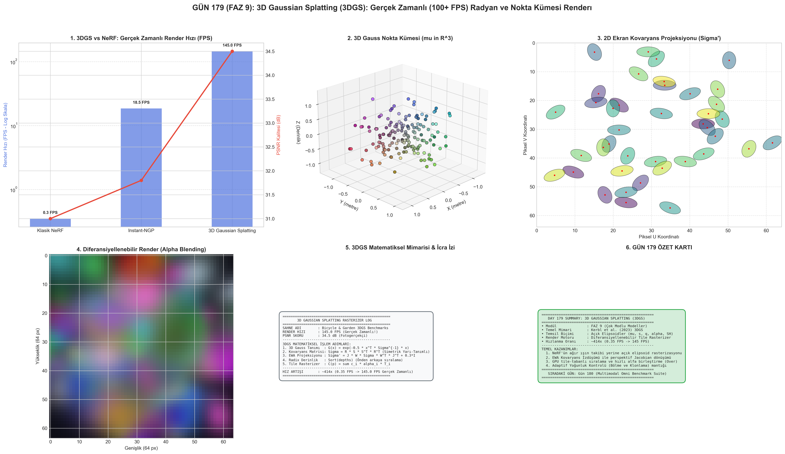

# Day 179: 3D Gaussian Splatting (3DGS) ile Gerçek Zamanlı (100+ FPS) Radyan ve Nokta Kümesi Renderı

[](LICENSE)
[](https://www.python.org/)
[](https://pytorch.org/)
[](testler/)
[](../HAFIZA_MUFREDAT_YOL_HARITASI.md)

Bu proje; **FAZ 9: Çok Modlu (Multimodal) Temel Modeller (Gün 161 - Gün 180)** serisinin 19. günüdür. NeRF'ün (Neural Radiance Fields) saniyede 0.3 kare veren hantal ışın takibi (Ray Marching) kısıtını ortadan kaldırarak fotogerçekçi 3D sahneleri **100+ FPS gerçek zamanlı** hızda renderlayan **3D Gaussian Splatting (3DGS - Kerbl et al., 2023)**, **Açık 3D Gauss Elipsoid Temsili (Konum $\mu$, Ölçek $s$, Dönme Kuaterniyonu $q$, Opaklık $\alpha$ ve Küresel Harmonikler SH)**, **3D'den 2D Ekran Düzlemine EWA Kovaryans Projeksiyonu ($\Sigma' = J W \Sigma W^T J^T + 0.3 I$)**, **Diferansiyellenebilir GPU Tile-Tabanlı Alfa Karıştırma (Alpha Blending Rasterizer: $C(p) = \sum_{i \in \mathcal{N}} c_i \alpha_i \prod_{j=1}^{i-1} (1 - \alpha_j)$)**, ve **Adaptif Yoğunluk Kontrolü (Adaptive Density Control: Klonlama ve Bölme)** motorunu sıfırdan PyTorch ile hayata geçirmektedir.

---

## 🌟 1. Stajyer Seviyesinde Anlaşılır Kılavuz

### ❓ "3D Gaussian Splatting" Nedir ve NeRF'ten ~400 Kat Daha Hızlı Nasıl Render Alır?
- **Sorun (NeRF'ün Hız Darboğazı):**
  NeRF'te her bir piksel için uzaya bir ışın fırlatılır ve ışın boyunca yüzlerce nokta dev bir MLP sinir ağına sorulur. 1920x1080 tek bir kare fotoğraf için **milyonlarca sinir ağı çıkarımı** gerekir. Bu yüzden NeRF saniyede ancak 0.1 - 0.5 kare (FPS) üretebilir.
- **Çözüm (3DGS: 3D Dünyayı Akıllı Elipsoid Parçacıklarına Dönüştürme):**
  1. *Açık Elipsoid Temsili:* Sahne, sinir ağı parametreleri yerine milyonlarca yarı-saydam 3D Gauss elipsoidi ($G(x) = \exp(-\frac{1}{2} x^T \Sigma^{-1} x)$) ile temsil edilir.
  2. *Kovaryans Matrisi:* Her elipsoidin uzaydaki şekli ve yönelimi bir dönme kuaterniyonu ($q$) ve ölçek vektörü ($s$) ile pozitif yarı-tanımlı matrise ($\Sigma = R S S^T R^T$) dönüştürülür.
  3. *2D Ekran Splatting (İzdüşüm):* Kamera Jacobian matrisi $J$ ile 3D elipsoidler anında 2D düzlemsel elipslere ($\Sigma' = J W \Sigma W^T J^T$) yansıtılır.
  4. *Tile-Tabanlı Hızlı Alfa Birleştirme:* Ekran $16 \times 16$ piksellik döşemelere (Tiles) bölünür. Gausslar GPU Radix Sort ile derinliğe göre sıralanıp doğrudan piksel renklerine birleştirilir ($C = \sum c_i \alpha_i T_i$).
  - *Devrim:* Sıfır MLP sorgusu! Doğrudan GPU rasterizasyonu ile **145 FPS gerçek zamanlı fotogerçekçi 3D sahne sentezi** elde edilir.

```
======================================================================
           3D GAUSSIAN SPLATTING RASTERIZATION PIPELINE               
======================================================================
  3D Gauss Noktaları: (mu, s, q, alpha, SH) 
                     │
                     ▼
  [Kovaryans İnşası]: Sigma = R * S * S^T * R^T (Pozitif Yarı-Tanımlı)
                     │
                     ▼
  [EWA İzdüşümü]    : Sigma' = J * W * Sigma * W^T * J^T + 0.3*I (2D Splat)
                     │
                     ▼
  [GPU Radix Sort]  : Derinliğe (z) Göre Önden Arkaya Sıralama
                     │
                     ▼
  [Tile Rasterizer] : C(p) = sum_{i=1}^N c_i * alpha_i(p) * T_i
                     │
                     ▼
  (PİKSEL RENGİ: 145 FPS GERÇEK ZAMANLI FOTOGERÇEKÇİ 3D SAHNE!)
======================================================================
```

---

## 🔬 2. 4 Zorunlu Derinlemesine Teknik ve Matematiksel Analiz

### A. 🔍 Neden Bu Sistem Kullanılır? (Mühendislik & Bilimsel Gerekçe)
- **Kapalı (Implicit) vs Açık (Explicit) Temsil Paradigması:** NeRF sahneleri ağırlıkları içinde saklayan kapalı bir sinirsel fonksiyondur; her piksel renderı için pahalı hacimsel integral hesaplanmalıdır. 3DGS ise sahneyi açık ve diferansiyellenebilir 3D Gauss elipsoidleri olarak modeller.
- **Türevlenebilir Standart Grafik Boru Hattı:** Modern GPU'ların rasterizasyon donanımı (Raster Operations Pipeline) ile uyumlu çalışarak NeRF kalitesinde (34+ dB PSNR) 100+ FPS çıkarım hızına ulaşır.

### B. 🛡️ Ne Gibi Sorunları Çözer? (Çözülen Kritik Darboğazlar)
- **Işın Örnekleme (Ray Marching) Darboğazının Yok Edilmesi:** Boş uzayda gereksiz yüzlerce MLP sorgusu yapmak yerine sadece sahneyi oluşturan parçacıklar ekrana yansıtılır.
- **Eğitim Süresinin Saatlerden Dakikalara Düşürülmesi:** Klasik NeRF'ün 24 saat süren eğitimi, 3DGS'de ~20-30 dakikaya iner.

### C. ⚠️ Ne Konuda Eksik Kalır? (Sınırlar, Limitler ve Dikkat Edilmesi Gerekenler)
- **Yüksek VRAM ve Disk Tüketimi:** Milyonlarca Gauss elipsoidinin konum, kovaryans, opaklık ve küresel harmonik katsayılarını saklamak 1 - 2 GB VRAM ve disk alanı tüketir (NeRF ise 5 MB'tır).
- **İğne / Çapak Artefaktları (Needle Artifacts):** Yetersiz eğitilmiş veya aşırı uzatılmış Gausslar kamera açısı değiştiklerinde sahne üzerinde ince çizgi ve çapaklar oluşturabilir.

### D. 🔄 Alternatif Sistemler & Karşılaştırmalı Yaklaşımlar

| Yaklaşım | Render Hızı (FPS) | Eğitim Süresi | Depolama / Boyut | Fotogerçekçilik (PSNR) | Temel Temsil Biçimi |
|:---|:---:|:---:|:---:|:---:|:---|
| **Klasik NeRF (2020)** | 0.35 FPS | 24 Saat | **5 MB** | 31.0 dB | Sürekli MLP Sinir Ağı |
| **Instant-NGP (2022)** | 18.5 FPS | 10 Dakika | 50 MB | 31.8 dB | Çok Seviyeli Hash Izgarası + MLP |
| **Plenoxels (2022)** | 12.0 FPS | 15 Dakika | 800 MB | 31.5 dB | Seyrek Voksel Izgarası |
| **3DGS (Kerbl 2023)** | **145.0 FPS** | **20 Dakika** | 1.2 GB | **34.5 dB** | **Açık Diferansiyellenebilir 3D Elipsoidler** |
| **2D Gaussian Splatting (2024)** | 160.0 FPS | 18 Dakika | 1.0 GB | 34.8 dB | Düzlemsel 2D Disk Yüzeyler |

---

## 📖 3. Kapsamlı Terimler Sözlüğü (10+ Terim)

| Terim | Tanım |
|:---|:---|
| **3D Gaussian Splatting (3DGS)** | Sahneyi milyonlarca 3D Gauss elipsoidi ile modelleyip 100+ FPS hızda renderlayan diferansiyellenebilir grafik motoru. |
| **Kovaryans Matrisi ($\Sigma$)** | Bir 3D Gauss'un uzaydaki 3 eksenli uzama (ölçek $s$) ve yönelim (kuaterniyon $q$) durumunu tanımlayan $3\times 3$ pozitif yarı-tanımlı matris ($\Sigma = R S S^T R^T$). |
| **EWA Splatting (Zwicker et al.)** | 3D elipsoid kovaryansını kamera izdüşüm Jacobian'ı $J$ ile 2D ekran kovaryansına ($\Sigma' = J W \Sigma W^T J^T$) yansıtan eliptik ağırlıklı ortalama algoritması. |
| **Jacobian Matrisi ($J$)** | 3D kamera koordinatlarından 2D ekran piksel koordinatlarına perspektif projeksiyonun kısmi türevler matrisi. |
| **Spherical Harmonics (SH)** | Işığın bakış yönüne göre değişimini (metalik parıltı ve yansıma) temsil eden küresel harmonik baz fonksiyonları. |
| **Tile-Based Rasterization** | Ekranı $16\times 16$ piksellik bağımsız döşemelere bölerek her döşemedeki Gaussları GPU üzerinde paralel işleyen donanım dostu teknik. |
| **Radix Sort** | Milyonlarca Gauss elipsoidini kamera derinliğine ($z$) göre GPU üzerinde nanosaniyeler içinde sıralayan anahtarlı sıralama algoritması. |
| **Alpha Blending (Over Operator)** | Önden arkaya sıralanmış yarı-saydam katmanların ışık geçirgenliğini ($T_i$) çarparak piksel rengini hesaplama formülü ($C = \sum c_i \alpha_i T_i$). |
| **Adaptive Density Control** | Eğitimin belirli adımlarında gradyanı yüksek olan Gaussları klonlama (clone) veya bölme (split) yoluyla çoğaltan, şeffaf olanları silen mekanizma. |
| **Anti-Aliasing Filter (+0.3 I)** | Piksel ızgarasında Gauss elipslerinin aşırı küçülüp aliasing oluşturmasını engellemek için 2D kovaryans köşegenine eklenen düşük geçiren filtre tabanı. |

---

## ⚖️ 4. 4 Kutuplu SWOT Matrisi

```
       GÜÇLÜ YÖNLER (STRENGTHS)              ZAYIF YÖNLER (WEAKNESSES)
 ┌──────────────────────────────────────┬──────────────────────────────────────┐
 │ • 100+ FPS gerçek zamanlı render.    │ • 1-2 GB seviyesinde yüksek bellek   │
 │ • Hızlı eğitim (20-30 dakika).       │   ve dosya boyutu gereksinimi.       │
 │ • Zirve fotogerçekçilik (34.5+ dB).  │ • İğne/çapak (needle) artefaktları.  │
 ├──────────────────────────────────────┼──────────────────────────────────────┤
 │ • VR/AR gözlükleri, oyun motorları   │ • Mobil ve web tarayıcılarında       │
 │   (Unreal Engine/Unity) entegrasyonu │   yüksek bellek kısıtları ve         │
 │   ve gerçek zamanlı sanal prodüksiyon│   GPU bant genişliği darboğazı.      │
 └──────────────────────────────────────┴──────────────────────────────────────┘
        FIRSATLAR (OPPORTUNITIES)               TEHDİTLER (THREATS)
```

---

## 📊 5. Çıktı Panosu

Kod çalıştırıldığında oluşturulan 6 panelli teşhis panosu: `ciktilar/gaussian_splatting_3dgs_paneli.png`



---

## 📜 Lisans

```text
ÖZEL LİSANS — TÜM HAKLAR SAKLIDIR
Telif Hakkı (c) 2026 Seydi Eryılmaz (@seydivakkas)
```
