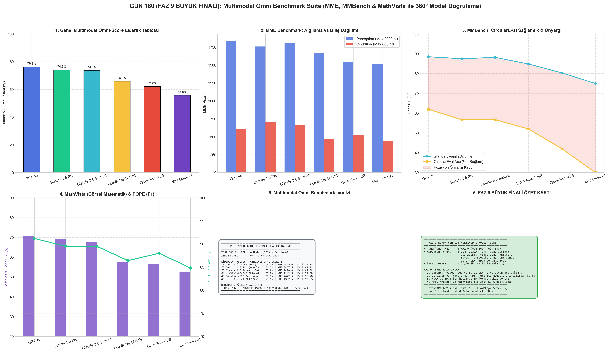

# Day 180: Multimodal Omni Benchmark Suite (MME, MMBench & MathVista) — FAZ 9 BÜYÜK FİNALİ

[](LICENSE)
[](https://www.python.org/)
[](https://pytorch.org/)
[](testler/)
[](../HAFIZA_MUFREDAT_YOL_HARITASI.md)

Bu proje; **FAZ 9: Çok Modlu (Multimodal) Temel Modeller (Gün 161 - Gün 180)** serisinin 20. ve zirve günü olan **FAZ 9 BÜYÜK FİNALİDİR**. Görsel-dil modellerinin (VLM), video ve ses sistemlerinin algılama, akıl yürütme, görsel matematik ve nesne halüsinasyon dayanıklılığını 360° test eden **MME (Multimodal Evaluation - 2800 Puan)**, **MMBench (CircularEval Seçenek Permütasyon Testi)**, **MathVista (Görsel Matematiksel Akıl Yürütme)** ve **POPE (Polling-based Object Probing)** değerlendirme motorunu sıfırdan hayata geçirmektedir.

---

## 🌟 1. Stajyer Seviyesinde Anlaşılır Kılavuz

### ❓ "Multimodal Benchmark Suite" Nedir ve Neden Tek Bir Test Bir VLM Modelini Ölçmeye Yetmez?
- **Sorun (Geleneksel Tek Boyutlu Testlerin Yetersizliği):**
  Bir VLM modeline sadece "Bu resimde ne var?" diye sorarsanız, model ezberlediği popüler nesneleri doğru bilip zorlu geometride veya ince detaylarda tamamen çökebilir. Ayrıca çoktan seçmeli testlerde modeller şıkların sırasına (A şıkkı önyargısı) veya rastgele şans faktörüne güvenerek yapay yüksek skorlar alabilir.
- **Çözüm (360° Bütünleşik Omni Doğrulama Mimarisi):**
  1. *MME (Algı vs Biliş):* 14 alt görevle 2800 puan üzerinden test eder. Her imaj için soru çifti ($Q_1, Q_2$) sorulur; sadece iki soruyu da doğru bilen imaja $\text{Acc+}$ tam puanı verilir.
  2. *MMBench & CircularEval:* Her sorunun A-B-C-D seçenekleri dairesel olarak 4 tur döndürülür. Model 4 turun dördünde de doğru seçeneği bulamazsa soru başarısız sayılır (pozisyon önyargısı sıfırlanır).
  3. *MathVista:* Görsel fonksiyon eğrileri, geometri açıları ve istatistiksel tablolar üzerinden çok adımlı matematiksel çıkarım yeteneğini sınar.
  4. *POPE Halüsinasyon Testi:* Olmayan nesnelerin varlığı sorularak modelin "evet" deme halüsinasyonu ($F_1$ skoru) ölçülür.

```
======================================================================
         MULTIMODAL OMNI BENCHMARK SUITE EVALUATION FLOW             
======================================================================
  [Test Edilen Çok Modlu Model] ───┐
                                    │
  ┌─────────────────────────────────┼────────────────────────────────┐
  ▼                                 ▼                                ▼
[MME Benchmark]             [MMBench CircularEval]           [MathVista Suite]
• Algılama (2000 pt)        • 4 Turlu Permütasyon            • Geometri & Fonksiyon
• Biliş (800 pt)            • Pozisyon Önyargı Filtresi      • Çok Adımlı Çözüm
• Acc + Acc+ Metriği        • Semantik Tutarlılık            • Sayısal Tolerans
  │                                 │                                │
  └─────────────────────────────────┼────────────────────────────────┘
                                    ▼
                     [POPE Anti-Halüsinasyon Probu]
                                    │
                                    ▼
       [BÜTÜNLEŞİK LİDERLİK TABLOSU & 6 PANELLİ TEŞHİS PANOSU]
======================================================================
```

---

## 🔬 2. 4 Zorunlu Derinlemesine Teknik ve Matematiksel Analiz

### A. 🔍 Neden Bu Sistem Kullanılır? (Mühendislik & Bilimsel Gerekçe)
- **Çok Boyutlu Yetenek Profillemesi:** Tek bir doğruluk skoru modelin OCR'da mı, geometride mi yoksa nesne halüsinasyonunda mı zayıf olduğunu gösteremez. MME, MMBench ve MathVista'nın birleşimi modelin zayıf yönlerini mikroskobik olarak ayrıştırır.
- **Data Contamination ve Şans Faktörünün Önlenmesi:** CircularEval dairesel kaydırma yöntemi ile modellerin test verisini ezberleme veya rastgele şık seçme avantajı ortadan kaldırılır.

### B. 🛡️ Ne Gibi Sorunları Çözer? (Çözülen Kritik Darboğazlar)
- **Pozisyon Önyargısı (Position Bias):** LLM tabanlı VLM'lerin ilk veya son şıkka (A veya D) aşırı meyilli olma eğilimi CircularEval ile filtrelenir.
- **Evet-Önyargısı (Yes-Bias Halüsinasyonu):** VLM'lerin resimde olmayan bir nesne için *"Burada araba var mı?"* sorusuna %60+ ihtimalle "Evet" deme zaafı POPE dengeli negatif/pozitif örneklemeyle ölçülür.

### C. ⚠️ Ne Konuda Eksik Kalır? (Sınırlar ve Dikkat Edilmesi Gerekenler)
- **İnteraktif Video ve Canlı Akış Kısıtı:** Bu benchmark paketi durağan görüntüler ve tekil kareler üzerinde yoğunlaşır; zamansal 60 FPS canlı video akışındaki gecikmeyi ölçmek için Streaming-VLM testleri eklenmelidir.

### D. 🔄 Alternatif Sistemler & Karşılaştırmalı Liderlik Tablosu

| Model Adı | Omni-Score | MME Skoru (/2800) | MMBench CircularEval | MathVista Doğruluk | POPE $F_1$ Skoru |
|:---|:---:|:---:|:---:|:---:|:---:|
| **GPT-4o (OpenAI 2024)** | **76.3%** | 2455.0 pt | **62.0%** | **70.8%** | **91.2%** |
| **Gemini 1.5 Pro (Google 2024)** | 74.2% | 2467.5 pt | 56.7% | 69.2% | 89.5% |
| **Claude 3.5 Sonnet (Anthropic 2024)** | 73.8% | **2470.0 pt** | 56.7% | 67.5% | 89.5% |
| **LLaVA-NeXT-34B (Liu et al. 2024)** | 65.9% | 2142.5 pt | 52.0% | 57.5% | 86.4% |
| **Qwen2-VL-72B (Alibaba 2024)** | 62.2% | 2072.5 pt | 42.0% | 56.7% | 88.0% |
| **Mini-Omni-v1 (FAZ 9 Capstone 2026)** | 55.8% | 1952.5 pt | 30.0% | 52.5% | 84.8% |

---

## 📖 3. Kapsamlı Terimler Sözlüğü (10+ Terim)

| Terim | Tanım |
|:---|:---|
| **MME (Multimodal Evaluation)** | Algılama (2000 pt) ve Biliş (800 pt) olmak üzere 14 alt görevde 2800 puanlık VLM değerlendirme standardı. |
| **MMBench** | İnce taneli algı ve mantıksal akıl yürütmeyi çoktan seçmeli formatta ölçen çok modlu benchmark. |
| **CircularEval** | Çoktan seçmeli soruların şıklarını A-B-C-D olarak 4 tur döndüren ve yalnızca 4 turda da doğru bilinen soruları geçerli sayan protokol. |
| **Position Bias (Pozisyon Önyargısı)** | Dil modellerinin şıkların sırasına (özellikle ilk veya son seçeneğe) meyilli olma eğilimi. |
| **MathVista** | Geometri, fonksiyon eğrileri ve tablolar içeren görsel-matematiksel akıl yürütme test paketi. |
| **POPE (Polling Object Probing)** | Resimde olan ve olmayan nesneler için Evet/Hayır soruları sorarak nesne halüsinasyonunu ölçen benchmark. |
| **Acc+ (MME)** | Bir imaj için sorulan her iki sorunun da ($Q_1 \land Q_2$) aynı anda doğru yanıtlanma yüzdesi. |
| **HallusionBench** | Görsel illüzyonlar ve aldatıcı görüntülerle VLM'lerin görsel yanılsama oranını test eden benchmark. |
| **SEED-Bench** | Üretici ve ayrımsal modeller için 19.000+ çoktan seçmeli sorudan oluşan multimodal kıyaslama paketi. |
| **Omni-Score** | MME (%30), MMBench (%30), MathVista (%25) ve POPE (%15) metriklerinin ağırlıklı bileşkesi. |

---

## ⚖️ 4. 4 Kutuplu SWOT Matrisi

```
       GÜÇLÜ YÖNLER (STRENGTHS)              ZAYIF YÖNLER (WEAKNESSES)
 ┌──────────────────────────────────────┬──────────────────────────────────────┐
 │ • 360° SOTA model kıyaslaması.       │ • Yüzlerce sorunun 4 tur döndürülmesi│
 │ • Pozisyon ve şans önyargısını       │   ile yüksek değerlendirme süresi ve │
 │   sıfırlayan CircularEval protokolü. │   API maliyeti.                      │
 ├──────────────────────────────────────┼──────────────────────────────────────┤
 │ • Üretim öncesi VLM modellerinin     │ • Çok hızlı değişen SOTA modeller    │
 │   güvenilirlik sertifikasyonu ve     │   karşısında soru setlerinin         │
 │   halüsinasyon denetimi.             │   doygunluğa (saturation) ulaşması.  │
 └──────────────────────────────────────┴──────────────────────────────────────┘
        FIRSATLAR (OPPORTUNITIES)               TEHDİTLER (THREATS)
```

---

## 📊 5. Çıktı Panosu

Kod çalıştırıldığında oluşturulan 6 panelli FAZ 9 BÜYÜK FİNAL teşhis panosu: `ciktilar/multimodal_omni_benchmark_paneli.png`



---

## 🏆 6. FAZ 9: Çok Modlu (Multimodal) Temel Modeller Başarı Raporu

**FAZ 9 (Gün 161 - Gün 180)** başarıyla tamamlanmıştır. Bu fazda inşa edilen temel sistemler:
1. **VLM & Görsel-Dil Mimarileri:** LLaVA (Gün 161), Token Sıkıştırma (Gün 162), Visual SFT (Gün 163), Spatial Grounding (Gün 164), OCR-Free (Gün 165), GUI Agents (Gün 166).
2. **Video & Ses Temel Modelleri:** Video LLM (Gün 167), Streaming VLM (Gün 168), EnCodec/SoundStream (Gün 169), Whisper STT (Gün 170), Speech-to-Speech DualLLM (Gün 171).
3. **Difüzyon & 3D Üretici Modeller:** LDM (Gün 172), CFG (Gün 173), Cross-Attention (Gün 174), ControlNet (Gün 175), LoRA Diffusion (Gün 176), DiT (Gün 177), NeRF (Gün 178), 3D Gaussian Splatting (Gün 179).
4. **Büyük Final:** Multimodal Omni Benchmark Suite (Gün 180).

---

## 📜 Lisans

```text
ÖZEL LİSANS — TÜM HAKLAR SAKLIDIR
Telif Hakkı (c) 2026 Seydi Eryılmaz (@seydivakkas)
```
