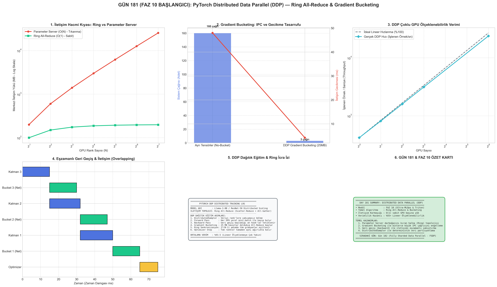

# Day 181: Distributed Data Parallel (DDP) — PyTorch DDP: All-Reduce İletişimi, Gradyan Paketleme ve Çoklu GPU Eğitimi

[](LICENSE)
[](https://www.python.org/)
[](https://pytorch.org/)
[](testler/)
[](../HAFIZA_MUFREDAT_YOL_HARITASI.md)

Bu proje; **FAZ 10: Ultra-MLOps, Dağıtık Eğitim, Triton GPU Kernel ve BÜYÜK FİNAL 201 (Gün 181 - Gün 201)** serisinin 1. günü olan **Gün 181 (FAZ 10 BAŞLANGICI)** modülüdür. Milyarlarca parametreli derin öğrenme modellerini birden fazla GPU üzerinde verimli ve lineer hızlanmayla eğitmenin temel omurgası olan **PyTorch Distributed Data Parallel (DDP)** mimarisini, **Ring All-Reduce İletişim Topolojisini (Scatter-Reduce + All-Gather)**, **Gradyan Paketleme (Gradient Bucketing: 25 MB Havuzlama)**, **Geri Geçiş ile İletişimin Çakıştırılması (Overlapping Computation & Communication)** ve **Dağıtık Veri Örnekleyiciyi (DistributedSampler)** sıfırdan PyTorch ile hayata geçirmektedir.

---

## 🌟 1. Stajyer Seviyesinde Anlaşılır Kılavuz

### ❓ "PyTorch DDP" Nedir ve 8 GPU Bir Araya Geldiğinde Neden Tek GPU'dan 8 Kat Hızlı Eğitir?
- **Sorun (Merkezi Parameter Server ve Standart DataParallel (DP) Darboğazı):**
  Eski PyTorch `nn.DataParallel` (DP) yaklaşımında ana GPU (Rank 0), tüm veriyi diğer GPU'lara dağıtır ve gradyanları kendinde toplayıp tek başına ortalama alırdı. Bu durum ana GPU üzerinde devasa bir PCIe bant genişliği darboğazı yaratır ve GPU sayısı arttıkça eğitim hızlanmak yerine yavaşlardı.
- **Çözüm (PyTorch DDP & Ring All-Reduce: Merkezi Olmayan Halka İletişimi):**
  1. *Model Çoğaltma (Replication):* Modelin tam bir kopyası her bir GPU'da (Rank $0, 1, \dots, N-1$) tutulur.
  2. *Paralel Veri İşleme:* `DistributedSampler` veri kümesini çakışmasız parçalara böler; her GPU kendi yerel mini-batch'i için bağımsız ileri (`forward`) ve geri (`backward`) geçiş yapar.
  3. *Ring All-Reduce (Halka İletişimi):* Merkezi bir sunucu yoktur. Her GPU sadece sağındaki ve solundaki komşusuyla konuşarak $2(N-1)$ adımda tüm gradyanları toplar ($O(1)$ bant genişliği yükü).
  4. *Gradient Bucketing (25 MB Paketleme):* Yüzlerce küçük parametre tek tek ağa verilmez; 25 MB'lık contiguous bloklarda birleştirilerek IPC sistem çağrısı gecikmesi %85+ oranında düşürülür.
  5. *Overlapping:* Geri geçişte son katmanın gradyanı hesaplandığı anda ağ iletişimi başlar; böylece ilk katmanlar hesaplanırken son katmanların senkronizasyonu arka planda bitmiş olur!

```
======================================================================
           PYTORCH DDP RING ALL-REDUCE & BUCKETING PIPELINE           
======================================================================
  [GPU 0 (Rank 0)] ───> [GPU 1 (Rank 1)] ───> [GPU 2 (Rank 2)] ───┐
         ▲                                                       │
         └─────────────────── [GPU 3 (Rank 3)] <─────────────────┘
  
  1. SCATTER-REDUCE (N-1 Adım) : Her GPU bir parçanın global toplamına ulaşır.
  2. ALL-GATHER     (N-1 Adım) : Toplanan parçalar halkada paylaşılarak eşitlenir.
  
  [Gradient Bucketing]: 25 MB Contiguous Havuz ──> Tek Bir NCCL All-Reduce!
  [Overlapping]       : Backward (Katman 3) ──> All-Reduce (Bucket 3) Eşzamanlı!
======================================================================
```

---

## 🔬 2. 4 Zorunlu Derinlemesine Teknik ve Matematiksel Analiz

### A. 🔍 Neden Bu Sistem Kullanılır? (Mühendislik & Bilimsel Gerekçe)
- **$O(1)$ İletişim Karmaşıklığı ve Bant Genişliği Tasarrufu:**
  Merkezi Parameter Server mimarisinde aktarılan veri hacmi $2(N-1)M$ bayttır ve GPU sayısı ($N$) arttıkça merkezi sunucu kilitlenir. Ring All-Reduce'da ise her bir GPU'nun gönderip aldığı toplam veri $2 \times \frac{N-1}{N} \times M$ bayttır; yani $N \rightarrow \infty$ iken aktarılan veri $2M$'e yakınsar ve GPU sayısından bağımsız sabit kalır.

### B. 🛡️ Ne Gibi Sorunları Çözer? (Çözülen Kritik Darboğazlar)
- **Python GIL (Global Interpreter Lock) Kilidinin Kırılması:** `nn.DataParallel` tek bir Python sürecinde multi-threading ile çalıştığı için GIL kısıtına takılırdı. DDP her GPU için ayrı bir Python süreci (`torchrun` multi-process) başlatarak GIL darboğazını sıfırlar.
- **İletişim ve Hesaplama Gizleme (Latency Hiding):** Geri geçiş tamamlanana kadar beklemek yerine, tensör gradyanları oluştukça asenkron All-Reduce tetiklenir (`register_hook`).

### C. ⚠️ Ne Konuda Eksik Kalır? (Sınırlar ve Dikkat Edilmesi Gerekenler)
- **Modelin Tek Bir GPU'ya Sığma Zorunluluğu:** DDP'de model parametreleri, gradyanları ve optimizer durumları her GPU'da tamamen kopyalanır ($1\times$ model ağırlığı). 70B+ parametreli bir LLM tek GPU belleğine sığmıyorsa standart DDP çalışamaz; FSDP veya Tensor Parallelism (TP) gereklidir.

### D. 🔄 Alternatif Sistemler & Karşılaştırmalı Dağıtık Mimariler

| Dağıtık Mimari | Model Kopyalama | Bellek Verimliliği | İletişim Primitifi | Desteklenen Model Boyutu |
|:---|:---:|:---:|:---:|:---|
| **PyTorch DP (Legacy)** | Tek Süreç / Multi-Thread | Çok Düşük (Kopya) | Broadcast / Gather | Küçük Modeller (< 1B) |
| **PyTorch DDP (Bu Gün)** | **Çoklu Süreç (Multi-Process)** | **Orta (Kopya)** | **Ring All-Reduce** | **Orta Modeller (< 10B)** |
| **FSDP (Fully Sharded)** | Katman Bazlı Sharding | Yüksek (Zero-Redundancy) | All-Gather + Reduce-Scatter | Büyük Modeller (10B - 70B) |
| **Megatron-LM (TP)** | Matris Satır/Sütun Bölme | Zirve (Tensör İçi) | All-Reduce (Intra-Node) | Devasa LLM'ler (70B - 500B+) |
| **DeepSpeed ZeRO-3** | Parametre + Grad + Opt Shard | Zirve (NVMe Offload) | P2P + All-Gather | 100B+ Parametre |

---

## 📖 3. Kapsamlı Terimler Sözlüğü (10+ Terim)

| Terim | Tanım |
|:---|:---|
| **Distributed Data Parallel (DDP)** | Her GPU'da model kopyası tutarak veriyi paralel işleyen ve gradyanları Ring All-Reduce ile eşitleyen dağıtık eğitim mimarisi. |
| **Ring All-Reduce** | GPU'ları bir halka şeklinde bağlayarak merkezi sunucu olmadan gradyan toplayan $2(N-1)$ adımlı algoritma. |
| **Scatter-Reduce** | Halka boyunca her rank'in gradyanın $1/N$'lik parçasını toplayıp indirgediği ilk $N-1$ adımlı faz. |
| **All-Gather** | Toplanmış parçaların halka boyunca diğer tüm GPU'lara kopyalandığı ikinci $N-1$ adımlı faz. |
| **Gradient Bucketing** | Küçük parametre gradyanlarını 25 MB'lık bloklarda birleştirerek sistem çağrısı sayısını azaltan DDP optimizasyonu. |
| **Overlapping (Çakışma)** | Geri geçiş (backward) hesaplaması devam ederken hazır olan katmanların gradyan senkronizasyonunu başlatma tekniği. |
| **DistributedSampler** | Veri kümesini GPU rank'leri arasında çakışmasız, deterministik ve dengeli paylaştıran örnekleyici. |
| **World Size** | Dağıtık eğitim kümesindeki toplam GPU / süreç sayısı ($N$). |
| **Global Rank** | Kümedeki her GPU sürecine atanan $0 \dots N-1$ arası benzersiz kimlik numarası. |
| **Local Rank** | Tek bir fiziksel sunucu (Node) içindeki GPU indeks numarası ($0 \dots 7$). |
| **NCCL (NVIDIA Collective Comm Lib)** | GPU'lar arası NVLink ve PCIe üzerinden yüksek hızlı All-Reduce sağlayan NVIDIA kütüphanesi. |

---

## ⚖️ 4. 4 Kutuplu SWOT Matrisi

```
       GÜÇLÜ YÖNLER (STRENGTHS)              ZAYIF YÖNLER (WEAKNESSES)
 ┌──────────────────────────────────────┬──────────────────────────────────────┐
 │ • %93+ lineer ölçeklenme verimliliği.│ • Modelin tek bir GPU VRAM'ine       │
 │ • Sabit O(1) iletişim bant genişliği.│   sığması zorunludur.                │
 │ • GIL kilitsiz multi-process yapı.   │ • Bellek tekrarı (Redundancy).       │
 ├──────────────────────────────────────┼──────────────────────────────────────┤
 │ • Kurumsal GPU kümelerinde (H100/A100)│ • Ağ gecikmesi yüksek nodlar arası   │
 │   hızlı veri paralelliği ile haftalık│   (Ethernet) yavaşlamalar ve         │
 │   eğitimleri saatlere indirme.       │   straggler (yavaş GPU) darboğazı.   │
 └──────────────────────────────────────┴──────────────────────────────────────┘
        FIRSATLAR (OPPORTUNITIES)               TEHDİTLER (THREATS)
```

---

## 📊 5. Çıktı Panosu

Kod çalıştırıldığında oluşturulan 6 panelli FAZ 10 BAŞLANGIÇ teşhis panosu: `ciktilar/distributed_data_parallel_ddp_paneli.png`



---

## 📜 Lisans

```text
ÖZEL LİSANS — TÜM HAKLAR SAKLIDIR
Telif Hakkı (c) 2026 Seydi Eryılmaz (@seydivakkas)
```
