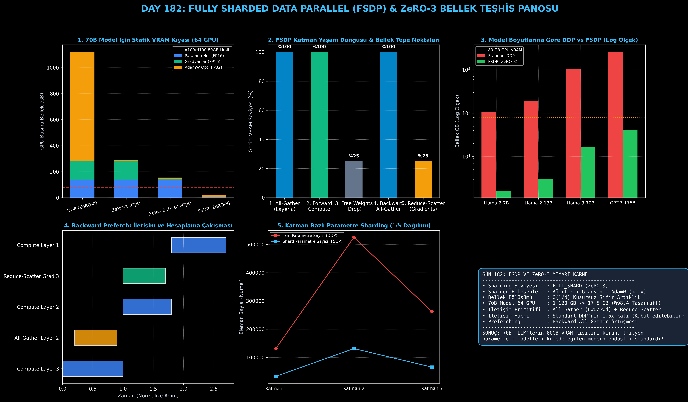

# Day 182: Fully Sharded Data Parallel (FSDP) — Ağırlık, Gradyan ve Optimizer Durumlarını Bölme

[](LICENSE)
[](https://www.python.org/)
[](https://pytorch.org/)
[](testler/)
[](../HAFIZA_MUFREDAT_YOL_HARITASI.md)

Bu proje; **FAZ 10: Ultra-MLOps, Dağıtık Eğitim, Triton GPU Kernel ve BÜYÜK FİNAL 201 (Gün 181 - Gün 201)** serisinin 2. günü olan **Gün 182** modülüdür. 70B+ ve 175B+ milyarlarca parametreli devasa Büyük Dil Modellerini (LLM) tek bir GPU'nun VRAM sınırına takılmadan eğitmenin modern endüstri standardı olan **PyTorch Fully Sharded Data Parallel (FSDP - Zhao et al., 2023 / ZeRO-3)** mimarisini, **Parametre, Gradyan ve AdamW Optimizer Sharding ($1/N$ Bellek Bölüşümü)**, **Katman Bazlı All-Gather & Reduce-Scatter İletişim Döngüsü**, **Dinamik Bellek Boşaltma (Free / Drop Unshared Weights)** ve **Backward Prefetching** mekanizmasını sıfırdan PyTorch ile inşa etmektedir.

---

## 🌟 1. Stajyer Seviyesinde Anlaşılır Kılavuz

### ❓ "PyTorch FSDP" Nedir ve 70 Milyar Parametreli Bir Modeli 80 GB'lık GPU'lara Nasıl Sığdırır?
- **Sorun (Standart DDP'nin 1× Model Kopyalama ve OOM Kısıtı):**
  DDP'de her bir GPU, modelin tam bir kopyasını tutmak zorundadır. 70 milyar parametreli bir model karma hassasiyetle (FP16 parametre + FP16 gradyan + FP32 AdamW durumları) eğitildiğinde her bir parametre 16 bayt yer kaplar:
  $$70 \times 10^9 \times 16 \text{ bayt} \approx 1,120 \text{ GB (1.12 TB VRAM / GPU!)}$$
  Piyasadaki en güçlü NVIDIA H100 GPU bile 80 GB VRAM'e sahiptir. Dolayısıyla tek bir H100 bu modelin 14'te birini bile belleğine sığdıramaz ve Out-Of-Memory (OOM) hatasıyla çöker.
- **Çözüm (FSDP / ZeRO-3: Sıfır Artıklıkla $1/N$ Dilimleme):**
  1. *Parametre, Gradyan ve Optimizer Sharding:* Model parametreleri ($W$), gradyanları ($G$) ve AdamW moment tensörleri ($m, v$) $N$ adet GPU arasında eşit olarak $1/N$ dilimlere bölünür. Dinlenme anında her GPU sadece kendi küçük dilimini saklar.
  2. *İhtiyaç Anında All-Gather (On-Demand):* İleri geçişte Katman $L$ hesaplanacağı anda tüm GPU'lar geçici bir `All-Gather` yaparak sadece o katmanın tam ağırlığını oluşturur.
  3. *Anında Belleği Boşaltma (Free/Drop):* Katman $L$'nin çıktısı hesaplanır hesaplanmaz tam ağırlık bellekten anında silinir!
  4. *Geri Geçişte Reduce-Scatter:* Geri geçişte gradyanlar hesaplandığında `Reduce-Scatter` ile her GPU sadece kendi $1/N$'lik gradyan dilimini alır ve kendi $1/N$'lik optimizer durumunu günceller.
  5. *Sonuç:* 64 adet GPU ile 70B modelin GPU başına bellek yükü $1,120 \text{ GB}$'tan **16.3 GB**'a düşer (%98.4 bellek tasarrufu!).

```
========================================================================================
                 FSDP (FULLY SHARDED DATA PARALLEL) KATMAN YAŞAM DÖNGÜSÜ                
========================================================================================
  [Dinlenme Durumu] : GPU 0: Shard 0 (25%) | GPU 1: Shard 1 (25%) | GPU 2: Shard 2 (25%)
                                     │
                                     ▼
  [İleri Geçiş]     : ALL-GATHER (Katman L) ──> Tam Katman Ağırlığı (100%)
                                     │
                                     ▼ Compute Forward (Y = WX)
                                     │
                                     ▼ FREE / DROP WEIGHTS (Anında Sil!)
  [Ara Bellek]      : Sadece Aktivasyonlar ve Shard'lar Kalır (25%)
                                     │
                                     ▼
  [Geri Geçiş]      : ALL-GATHER (Katman L) ──> Compute dW ──> REDUCE-SCATTER Gradients!
  [Optimizer Step]  : Her GPU Sadece Kendi %25'lik Shard'ını Günceller!
========================================================================================
```

---

## 🔬 2. 4 Zorunlu Derinlemesine Teknik ve Matematiksel Analiz

### A. 🔍 Neden Bu Sistem Kullanılır? (Mühendislik & Bilimsel Gerekçe)
- **$16P / N$ Statik Bellek Ölçeklenmesi (Zero Memory Redundancy):**
  Standart DDP'de bellek tüketimi $O(P)$ iken (GPU sayısından bağımsız sabit $16P$), FSDP / ZeRO-3'te statik bellek tüketimi $O(P/N)$'e iner. Kümedeki GPU sayısı ($N$) arttıkça GPU başına düşen ağırlık, gradyan ve optimizer bellek yükü hiperbolik olarak azalır.

### B. 🛡️ Ne Gibi Sorunları Çözer? (Çözülen Kritik Darboğazlar)
- **Donanım Kısıtının Kırılması:** Model paralelliği (Tensor Parallelism) gerektirmeden, yalnızca veri paralelliği mantığıyla 70B - 175B parametreli modellerin standart bulut kümelerinde eğitilmesini sağlar.
- **AdamW Optimizer Durumlarının Bellek Hâkimiyetini Yok Etme:** AdamW optimizer'ı parametre başına 12 bayt ($4\text{B master weight} + 4\text{B momentum} + 4\text{B variance}$) tüketir (toplam statik belleğin %75'i). FSDP bu devasa yükü doğrudan $N$ parçaya böler.

### C. ⚠️ Ne Konuda Eksik Kalır? (Sınırlar ve Dikkat Edilmesi Gerekenler)
- **İletişim Hacminde %50 Artış (1.5× İletişim Maliyeti):** Standart DDP'de her iterasyonda sadece 1 kez `All-Reduce` ($2M$ bayt) yapılır. FSDP'de ise ileri geçişte `All-Gather` ($M$ bayt) + geri geçişte `All-Gather` ($M$ bayt) + `Reduce-Scatter` ($M$ bayt) olmak üzere toplam $3M$ bayt veri aktarılır ($1.5\times$ DDP iletişimi). Bu nedenle FSDP, yüksek hızlı NVLink ve InfiniBand ağlarında en yüksek verime ulaşır.

### D. 🔄 Alternatif Sistemler & Karşılaştırmalı Dağıtık Mimariler

| Dağıtık Mimari | Parametre Sharding | Gradyan Sharding | Optimizer Sharding | GPU Başına Bellek Formülü | İletişim Primitifleri |
|:---|:---:|:---:|:---:|:---:|:---|
| **DDP (ZeRO-0)** | ❌ Hayır (Kopya) | ❌ Hayır (Kopya) | ❌ Hayır (Kopya) | $2P + 2P + 12P = 16P$ | All-Reduce |
| **ZeRO-1** | ❌ Hayır (Kopya) | ❌ Hayır (Kopya) | ✅ Evet ($1/N$) | $2P + 2P + 12P/N$ | Reduce-Scatter + All-Gather |
| **ZeRO-2** | ❌ Hayır (Kopya) | ✅ Evet ($1/N$) | ✅ Evet ($1/N$) | $2P + 14P/N$ | Reduce-Scatter + All-Gather |
| **FSDP (ZeRO-3)** | **✅ Evet ($1/N$)** | **✅ Evet ($1/N$)** | **✅ Evet ($1/N$)** | **$16P / N$** | **All-Gather + Reduce-Scatter** |
| **Tensor Parallelism (TP)** | ✅ Matris İçi Bölme | ✅ Matris İçi | ✅ Matris İçi | $16P / N$ (Layer İçi) | All-Reduce (Intra-Node) |

---

## 📖 3. Kapsamlı Terimler Sözlüğü (10+ Terim)

| Terim | Tanım |
|:---|:---|
| **Fully Sharded Data Parallel (FSDP)** | Parametreleri, gradyanları ve optimizer durumlarını GPU'lar arasında sharding ile paylaştırıp katman bazlı All-Gather/Reduce-Scatter ile eğiten mimari. |
| **ZeRO-1 (Optimizer Sharding)** | Model parametreleri ve gradyanları kopyalanırken yalnızca AdamW optimizer durumlarını $1/N$ bölen seviye. |
| **ZeRO-2 (Grad + Opt Sharding)** | Hem optimizer durumlarını hem de gradyanları $1/N$ bölerek ara bellekleri hafifleten seviye. |
| **ZeRO-3 / Full Shard** | Model parametrelerini de $1/N$ bölerek tam Zero-Redundancy sağlayan FSDP seviyesi. |
| **All-Gather** | Farklı GPU'larda tutulan $1/N$'lik parametre dilimlerini birleştirerek ilgili katmanın tam ağırlığını oluşturan kolektif iletişim işlemi. |
| **Reduce-Scatter** | Katmanın tam gradyanlarını toplayıp (reduce) her GPU'ya sadece kendi $1/N$'lik dilimini dağıtan (scatter) işlem. |
| **Reshard / Weight Dropping** | İleri veya geri geçiş biter bitmez unshared tam ağırlık tensörünü VRAM'den silip belleği anında boşa çıkarma eylemi. |
| **Backward Prefetch** | Bir önceki katmanın gradyanı hesaplanırken, sıradaki katmanın ağırlıklarını önceden arka planda All-Gather ile çekme optimizasyonu. |
| **Activation Checkpointing** | İleri geçiş aktivasyonlarını VRAM'de saklamak yerine geri geçişte yeniden hesaplayarak bellek tasarrufu sağlayan teknik. |
| **Mixed Precision (FP16 / BF16)** | İleri ve geri hesaplamayı 16-bit tensörlerle yapıp master ağırlıkları 32-bit saklayarak VRAM'i %50 düşüren yöntem. |

---

## ⚖️ 4. 4 Kutuplu SWOT Matrisi

```
       GÜÇLÜ YÖNLER (STRENGTHS)              ZAYIF YÖNLER (WEAKNESSES)
 ┌──────────────────────────────────────┬──────────────────────────────────────┐
 │ • 70B+ modelleri tek GPU OOM'u       │ • Standart DDP'ye kıyasla 1.5x daha  │
 │   olmadan eğitebilme (%98+ tasarruf).│   fazla iletişim hacmi (3M bayt).    │
 │ • Kusursuz O(1/N) statik bellek.     │ • Ağ gecikmesi yüksek nodlarda       │
 │ • Dinamik bellek boşaltma (Drop).    │   All-Gather bekleme darboğazı.      │
 ├──────────────────────────────────────┼──────────────────────────────────────┤
 │ • 100B - 500B parametreli temel      │ • Yavaş PCIe/Ethernet bağlantılarında│
 │   modelleri kurumsal H100 kümelerinde│   iletişim süresinin hesaplama       │
 │   hızla fine-tune etme ve eğitme.    │   süresini aşması (Comm-Bound).      │
 └──────────────────────────────────────┴──────────────────────────────────────┘
        FIRSATLAR (OPPORTUNITIES)               TEHDİTLER (THREATS)
```

---

## 📊 5. Çıktı Panosu

Kod çalıştırıldığında oluşturulan 6 panelli FSDP & ZeRO-3 teşhis panosu: `ciktilar/fsdp_fully_sharded_data_parallel_paneli.png`



---

## 📜 Lisans

```text
ÖZEL LİSANS — TÜM HAKLAR SAKLIDIR
Telif Hakkı (c) 2026 Seydi Eryılmaz (@seydivakkas)
```
