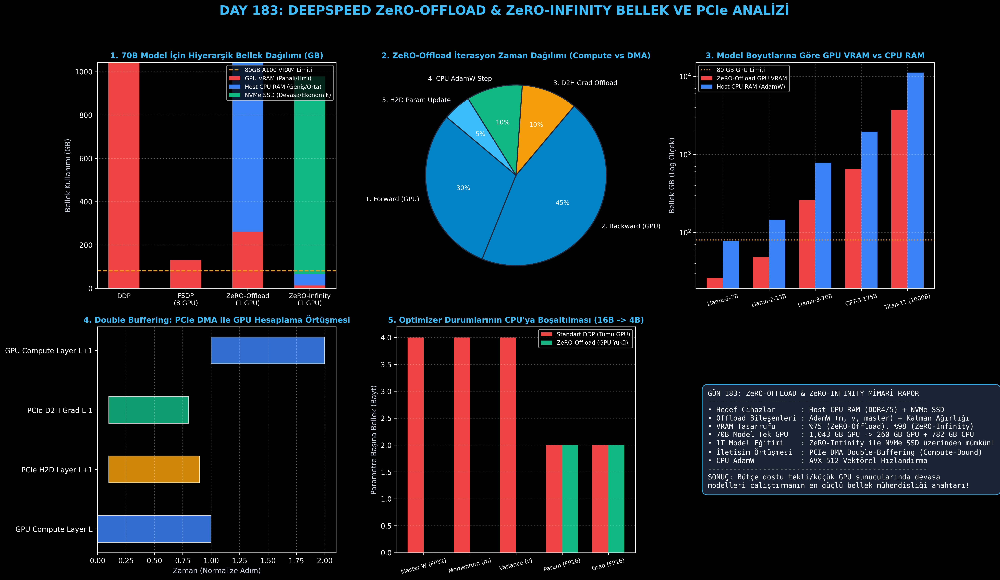

# Day 183: DeepSpeed ZeRO-1/2/3 ve CPU/NVMe Bellek Boşaltma Mekanizması (ZeRO-Offload & ZeRO-Infinity)

[](LICENSE)
[](https://www.python.org/)
[](https://pytorch.org/)
[](testler/)
[](../HAFIZA_MUFREDAT_YOL_HARITASI.md)

Bu proje; **FAZ 10: Ultra-MLOps, Dağıtık Eğitim, Triton GPU Kernel ve BÜYÜK FİNAL 201 (Gün 181 - Gün 201)** serisinin 3. günü olan **Gün 183** modülüdür. 70B+ ve 1 Trilyon (1T) parametreli devasa modelleri tek veya az sayıda GPU üzerinde çalıştırırken pahalı ve sınırlı GPU VRAM kısıtını tamamen aşmak için 10x-50x daha ekonomik ve geniş olan **Host CPU RAM (DDR4/DDR5)** ve **NVMe SSD** depolama alanına akıllı bellek boşaltımı sağlayan **DeepSpeed ZeRO-Offload (Rajbhandari et al., 2021)** ve **ZeRO-Infinity** mimarisini, **Host CPU AdamW Optimizer Motorunu**, **PCIe DMA Çift Tamponlama (Double Buffering Overlap)** ve **Dinamik Bellek Dağıtıcısını** sıfırdan PyTorch ile inşa etmektedir.

---

## 🌟 1. Stajyer Seviyesinde Anlaşılır Kılavuz

### ❓ "ZeRO-Offload" Nedir ve 70 Milyar Parametreli Modeli Tek Bir GPU Sunucusunda Nasıl Eğitir?
- **Sorun (AdamW Optimizer Durumlarının VRAM Hâkimiyeti):**
  Bir derin öğrenme modelinde parametreler ($W$) 2 bayt (FP16), gradyanlar ($G$) 2 bayt (FP16) yer tutarken, AdamW optimizer'ı master FP32 ağırlıkları ($4\text{B}$), momentum momentini ($4\text{B}$) ve varyans momentini ($4\text{B}$) saklamak için toplam **12 bayt / parametre** harcar! Yani statik VRAM'in **%75'i sadece optimizer durumlarına aittir**.
- **Çözüm (ZeRO-Offload: Optimizer'ı CPU RAM'e, Hesaplamayı GPU'ya Vermek):**
  1. *GPU'da İleri-Geri Hesaplama:* Matris çarpımları ve tensör çekirdeği hesaplamaları yüksek hızlı GPU'da (Tensor Cores) yapılır.
  2. *Gradyanları CPU'ya Boşaltma (D2H):* Geri geçiş bittiğinde FP16 gradyanlar PCIe DMA üzerinden doğrudan Host CPU RAM'ine aktarılır.
  3. *CPU AdamW Motoru:* 12 baytlık devasa AdamW durumları CPU RAM'inde (ör. 512 GB DDR5 RAM) saklanır ve CPU çekirdekleri üzerinde AVX-512 vektör talimatlarıyla güncellenir.
  4. *Güncellenmiş Ağırlıkları GPU'ya Yazma (H2D):* Güncellenen yeni FP16 ağırlıklar PCIe üzerinden GPU'ya aktarılır.
  5. *ZeRO-Infinity (NVMe SSD):* Trilyon parametreli modellerde dinlenme halindeki ağırlıklar NVMe SSD'ye yazılır ve katman katman çift tamponlama (Double Buffering) ile GPU'ya çekilir.

```
========================================================================================
             DEEPSPEED ZeRO-OFFLOAD & ZeRO-INFINITY HİYERARŞİK MİMARİ                   
========================================================================================
  [GPU VRAM (Hızlı/Kısıtlı: 24GB-80GB)]
      ├── İleri Geçiş (Forward Compute - Tensor Cores)
      ├── Geri Geçiş (Backward Gradients)
      └── Aktif Katman Ağırlıkları (~25% Statik VRAM)
            │  ▲ (PCIe DMA High-Speed Transfer: 32-64 GB/s)
            ▼  │
  [HOST CPU RAM (Geniş/Ekonomik: 512GB - 2TB)]
      ├── ZeRO-Offload CPU AdamW Optimizer (FP32 Master, Momentum m, Variance v)
      └── Aktivasyon & Transfer Tamponları (Pinned Memory)
            │  ▲ (NVMe DMA Stream: 7-14 GB/s)
            ▼  │
  [NVMe SSD (Devasa: 4TB - 16TB)]
      └── ZeRO-Infinity Dinlenme Durumundaki Model Ağırlıkları (1 Trilyon Parametre!)
========================================================================================
```

---

## 🔬 2. 4 Zorunlu Derinlemesine Teknik ve Matematiksel Analiz

### A. 🔍 Neden Bu Sistem Kullanılır? (Mühendislik & Bilimsel Gerekçe)
- **10x-50x Donanım Maliyeti Tasarrufu:**
  80 GB VRAM'e sahip 8 adet NVIDIA H100 GPU'dan oluşan bir sunucunun maliyeti yüz binlerce dolardır. Oysa 1-2 TB Host CPU RAM ve 8 TB NVMe SSD eklemek çok düşük maliyetlidir. ZeRO-Offload, VRAM'in %75'ini oluşturan AdamW durumlarını CPU'ya devrederek tek veya birkaç GPU ile 70B+ modellerin eğitilmesini sağlar.

### B. 🛡️ Ne Gibi Sorunları Çözer? (Çözülen Kritik Darboğazlar)
- **Tekil GPU'da 70B Fine-Tuning İmkânı:** Standart DDP'de 70B model 1,120 GB VRAM isterken, ZeRO-Offload ile GPU VRAM yükü 260 GB'a düşer; FSDP ile birleştirildiğinde tek bir 24GB/40GB GPU dahi devasa modelleri fine-tune edebilir.
- **Trilyon Parametreli Modellerin Sınırının Aşılması:** ZeRO-Infinity ile 1T (1000B) parametreli modeller NVMe SSD üzerinden çalıştırılabilir.

### C. ⚠️ Ne Konuda Eksik Kalır? (Sınırlar ve Dikkat Edilmesi Gerekenler)
- **PCIe Bant Genişliği Darboğazı (PCIe Bound):** PCIe Gen4 (32 GB/s) veya Gen5 (64 GB/s) aktarım hızı, GPU VRAM bant genişliğinden (HBM3: 3.35 TB/s) yaklaşık 50-100 kat daha yavaştır. Eğer modelin aritmetik yoğunluğu (Arithmetic Intensity) düşükse, GPU PCIe transferini bekleyerek boşta kalabilir (straggler).

### D. 🔄 Alternatif Sistemler & Karşılaştırmalı Dağıtık Mimariler

| Dağıtık Mimari | Optimizer Konumu | Parametre Konumu | GPU VRAM Yükü (70B Model) | Donanım Gereksinimi |
|:---|:---:|:---:|:---:|:---|
| **Standart DDP** | GPU VRAM | GPU VRAM | 1,043 GB | Çoklu 80GB GPU Kümesi |
| **FSDP (ZeRO-3)** | $1/N$ GPU VRAM | $1/N$ GPU VRAM | 16.3 GB (64 GPU) | 64x GPU Kümesi |
| **ZeRO-Offload** | **Host CPU RAM** | **GPU VRAM** | **260.8 GB (Tek GPU)** | **Tek GPU + 1TB CPU RAM** |
| **ZeRO-Infinity** | **NVMe SSD / CPU** | **NVMe SSD / Katman** | **13.0 GB (Aktif Katman)** | **Tek GPU + NVMe SSD** |

---

## 📖 3. Kapsamlı Terimler Sözlüğü (10+ Terim)

| Terim | Tanım |
|:---|:---|
| **ZeRO-Offload** | AdamW optimizer durumlarını ve hesaplamalarını Host CPU RAM'ine boşaltarak GPU VRAM'inden %75 tasarruf sağlayan mimari. |
| **ZeRO-Infinity** | Model ağırlıklarını ve optimizer durumlarını NVMe SSD'ye kadar boşaltarak trilyon parametreli modelleri eğiten mimari. |
| **CPU AdamW** | Host CPU çekirdekleri üzerinde AVX-512 vektörel talimatlarıyla optimize edilmiş FP32 optimizer motoru. |
| **Host-to-Device (H2D)** | Verilerin CPU RAM'inden PCIe yoluyla GPU belleğine aktarılması işlemi. |
| **Device-to-Host (D2H)** | GPU'da hesaplanan gradyanların PCIe yoluyla CPU RAM'ine aktarılması işlemi. |
| **DMA (Direct Memory Access)** | CPU çekirdeklerini meşgul etmeden GPU ile RAM arasında doğrudan yüksek hızlı veri transferi. |
| **Pinned Memory (Page-Locked)** | İşletim sisteminin diske takas etmesini engelleyerek PCIe DMA transfer hızını 2x artıran kilitli bellek. |
| **Double Buffering** | Bir katman GPU'da hesaplanırken sıradaki katmanın ağırlıklarını arka planda PCIe üzerinden çekme tekniği. |
| **PCIe Gen4 / Gen5** | GPU ile Anakart/CPU arasındaki 32 GB/s - 64 GB/s teorik bant genişliğine sahip veri yolu. |
| **NVMe Storage Offload** | Flash bellek tabanlı PCIe NVMe SSD'lerin model ağırlık deposu olarak kullanılması. |

---

## ⚖️ 4. 4 Kutuplu SWOT Matrisi

```
       GÜÇLÜ YÖNLER (STRENGTHS)              ZAYIF YÖNLER (WEAKNESSES)
 ┌──────────────────────────────────────┬──────────────────────────────────────┐
 │ • %75 - %98 VRAM tasarrufu.          │ • PCIe veri aktarım gecikmesi        │
 │ • Tek GPU'da 70B model çalıştırabilme│   (32-64 GB/s vs 3.35 TB/s HBM).     │
 │ • 1 Trilyon parametre NVMe desteği.  │ • CPU AdamW'nun GPU kadar hızlı      │
 │ • Ucuz Host RAM / SSD kullanımı.     │   olmaması.                          │
 ├──────────────────────────────────────┼──────────────────────────────────────┤
 │ • Kısıtlı bütçeli Ar-Ge ekiplerinin  │ • Küçük batch boyutlarında PCIe      │
 │   devasa LLM'leri tek iş istasyonunda│   darboğazının eğitimi yavaşlatması  │
 │   fine-tune etmesi.                  │   (I/O Bound).                       │
 └──────────────────────────────────────┴──────────────────────────────────────┘
        FIRSATLAR (OPPORTUNITIES)               TEHDİTLER (THREATS)
```

---

## 📊 5. Çıktı Panosu

Kod çalıştırıldığında oluşturulan 6 panelli ZeRO-Offload & ZeRO-Infinity teşhis panosu: `ciktilar/deepspeed_zero123_offload_paneli.png`



---

## 📜 Lisans

```text
ÖZEL LİSANS — TÜM HAKLAR SAKLIDIR
Telif Hakkı (c) 2026 Seydi Eryılmaz (@seydivakkas)
```
