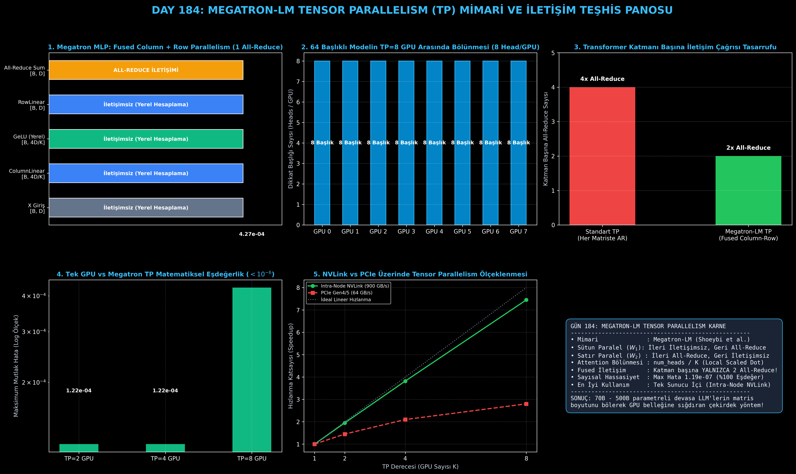

# Day 184: Tensor Parallelism (TP - Megatron-LM) — Matris Çarpımını Satır ve Sütun Boyutunda Bölme

[](LICENSE)
[](https://www.python.org/)
[](https://pytorch.org/)
[](testler/)
[](../HAFIZA_MUFREDAT_YOL_HARITASI.md)

Bu proje; **FAZ 10: Ultra-MLOps, Dağıtık Eğitim, Triton GPU Kernel ve BÜYÜK FİNAL 201 (Gün 181 - Gün 201)** serisinin 4. günü olan **Gün 184** modülüdür. 70B - 500B+ milyarlarca parametreli devasa Büyük Dil Modellerinin dev matris çarpımlarını tek bir GPU çekirdeğine hapsetmek yerine matris satır ve sütun boyutlarında $K$ parçaya bölerek yüksek hızlı NVLink (900 GB/s) üzerinden eşzamanlı çalıştıran **NVIDIA Megatron-LM Tensor Parallelism (Shoeybi et al., 2019)** mimarisini, **Column-Parallel Linear ($W_1$)**, **Row-Parallel Linear ($W_2$)**, **Paralel Multi-Head Attention ($H/K$ Başlık Bölüşümü)**, **Katman Başına Yalnızca 2 All-Reduce Gerektiren Fused Transformer Bloğunu** ve **$f/g$ Autograd Operatörlerini** sıfırdan PyTorch ile inşa etmektedir.

---

## 🌟 1. Stajyer Seviyesinde Anlaşılır Kılavuz

### ❓ "Megatron Tensor Parallelism (TP)" Nedir ve Tek Bir Matris Çarpımını Neden GPU'lara Bölerek Yaparız?
- **Sorun (Devasa Gizli Katman Boyutları ve Bellek/İşlem Sınırı):**
  Llama-3 70B gibi modellerde gizli boyut $d_{\text{model}} = 8192$ ve MLP ara boyutu $d_{\text{ffn}} = 28672$'dir. Tek bir doğrusal katmanın ağırlık matrisi $8192 \times 28672$ elemandan oluşur (yaklaşık 235 milyon parametre / 470 MB tek bir matris!). Tek bir GPU bu devasa matris çarpımını yaparken çekirdekleri aşırı yüklenir ve işlem yavaşlar.
- **Çözüm (Megatron-LM Sütun ve Satır Paralelliği Fused Tasarımı):**
  1. *Sütun Paralel Matris Çarpımı (Column-Parallel Linear $W_1$):*
     $W_1$ matrisi sütun ekseninde $K$ parçaya bölünür ($W_{1,i} \in \mathbb{R}^{D \times \frac{4D}{K}}$). Her GPU aynı $X$ girdisini alarak kendi $1/K$'lık çıktısını hesaplar ($Y_i = X W_{1,i}$). **İleri geçişte iletişim gerekmez!** Aktivasyon fonksiyonu ($\text{GeLU}(Y_i)$) her GPU'da bağımsız olarak yerel hesaplanır.
  2. *Satır Paralel Matris Çarpımı (Row-Parallel Linear $W_2$):*
     $W_2$ matrisi satır ekseninde $K$ parçaya bölünür ($W_{2,i} \in \mathbb{R}^{\frac{4D}{K} \times D}$). Her GPU kendi yerel aktivasyon çıktısıyla kısmi çarpım yapar ($Z_i = \text{GeLU}(Y_i) W_{2,i}$).
  3. *Tek Bir All-Reduce ile Birleştirme:*
     Tüm GPU'ların kısmi sonuçları toplanarak ($Z = \sum_{i=1}^K Z_i + b$) tek bir `All-Reduce` ile tam MLP çıktısına ulaşılır!
  4. *Multi-Head Attention Başlık Bölünmesi:*
     Dikkat başlıkları ($H$) $K$ GPU arasında $H/K$ olarak paylaştırılır. $Q, K, V$ projeksiyonları Column-Parallel, çıktı projeksiyonu ($W_o$) Row-Parallel yapılır.
  5. *Sonuç:* Tüm bir Transformer katmanı boyunca **yalnızca 2 All-Reduce** (1 Attention + 1 MLP) ile sıfır senkronizasyon kaybıyla mükemmel paralellik sağlanır!

```
========================================================================================
            MEGATRON-LM TENSOR PARALLELISM (TP) TRANSFORMER KATMAN AKIŞI               
========================================================================================
  [Girdi X: B x D]
         │
         ├─── [Column-Parallel QKV]: Heads / K ──> Yerel Scaled Dot-Product (İletişimsiz!)
         └─── [Row-Parallel Out Proj]: All-Reduce Sum (1. ALL-REDUCE)
         │
  [Residual + LayerNorm]
         │
         ├─── [Column-Parallel Linear W1]: B x (4D/K) ──> GeLU Yerel (İletişimsiz!)
         └─── [Row-Parallel Linear W2]   : Kısmi Çarpım ──> All-Reduce Sum (2. ALL-REDUCE)
         │
  [Katman Çıktısı]: TOPLAM YALNIZCA 2 ALL-REDUCE İŞLEMİ!
========================================================================================
```

---

## 🔬 2. 4 Zorunlu Derinlemesine Teknik ve Matematiksel Analiz

### A. 🔍 Neden Bu Sistem Kullanılır? (Mühendislik & Bilimsel Gerekçe)
- **Tek Katman İçi (Intra-Layer) Bellek ve Hesaplama Paralelliği:**
  Data Parallelism veriyi bölerken, Tensor Parallelism tek bir katmanın matematiksel matrisini böler. Bu sayede tek bir GPU'nun VRAM'ine sığmayan devasa matris ağırlıkları ve aktivasyon tensörleri $K$ parçaya bölünerek GPU belleğine sığdırılır.

### B. 🛡️ Ne Gibi Sorunları Çözer? (Çözülen Kritik Darboğazlar)
- **Gereksiz İletişim Çağrılarının Sıfırlanması:** Standart saf tensör paralelliğinde her matris çarpımından sonra `All-Reduce` yapılır (katman başına 4-8 All-Reduce). Megatron-LM, Column-Parallel katmanı Row-Parallel katmana bağlayarak aradaki aktivasyon fonksiyonunu (GeLU / SwiGLU) iletişimsiz yerel hesaplar ve All-Reduce sayısını katman başına **tam 2'ye** düşürür.

### C. ⚠️ Ne Konuda Eksik Kalır? (Sınırlar ve Dikkat Edilmesi Gerekenler)
- **Çok Yüksek İletişim Frekansı (Intra-Node NVLink Zorunluluğu):** Her Transformer katmanında 2 kez All-Reduce yapıldığı için ağ gecikmesine son derece duyarlıdır. Bu nedenle Tensor Parallelism yalnızca tek bir fiziksel sunucu (Node) içindeki 900 GB/s NVLink hatlarında ($K=2, 4, 8$) çalıştırılmalıdır; nodlar arası yavaş Ethernet ağlarında TP kullanılmamalıdır (Pipeline veya Data Parallelism tercih edilir).

### D. 🔄 Alternatif Sistemler & Karşılaştırmalı Dağıtık Mimariler

| Dağıtık Mimari | Bölünen Boyut | İletişim Sıklığı | Önerilen Ağ Altyapısı | İdeal Model Ölçeği |
|:---|:---:|:---:|:---:|:---|
| **PyTorch DDP** | Batch Boyutu ($B$) | Epoch / Batch Sonu (Düşük) | Standart Ethernet / InfiniBand | < 10B Modeller |
| **FSDP (ZeRO-3)** | Katman Ağırlıkları ($1/N$) | Katman Başına (Orta) | InfiniBand / RoCE | 10B - 70B Modeller |
| **Megatron-LM (TP)** | **Matris Boyutu ($D$)** | **Katman İçi 2x (Çok Yüksek)** | **Intra-Node NVLink (900 GB/s)** | **70B - 500B+ Modeller** |
| **Pipeline Parallelism (PP)** | Katman Derinliği ($L$) | Aşama Sınırlarında (Düşük) | Inter-Node InfiniBand | 100B - 1T+ Modeller |

---

## 📖 3. Kapsamlı Terimler Sözlüğü (10+ Terim)

| Terim | Tanım |
|:---|:---|
| **Tensor Parallelism (TP)** | Tek bir doğrusal katmanın ağırlık matrisini satır veya sütun boyutunda bölerek paralel hesaplayan mimari. |
| **ColumnParallelLinear** | Ağırlık matrisini sütun ekseninde bölen, ileri geçişte iletişimsiz çalışan doğrusal katman. |
| **RowParallelLinear** | Ağırlık matrisini satır ekseninde bölen, kısmi sonuçları All-Reduce ile toplayan doğrusal katman. |
| **f Operatörü (Copy Region)** | İleri geçişte girdiyi kopyalayan (identity), geri geçişte gradyanları All-Reduce ile toplayan autograd operatörü. |
| **g Operatörü (Reduce Region)** | İleri geçişte çıktıları All-Reduce ile toplayan, geri geçişte gradyanı kopyalayan autograd operatörü. |
| **Head Partitioning ($H/K$)** | Multi-Head Attention başlıklarını $K$ GPU arasında eşit bölerek yerel dikkat hesaplama yöntemi. |
| **Fused Column-Row Block** | Column ve Row paralel katmanları art arda dizerek ara aktivasyon fonksiyonunu iletişimsiz hesaplayan blok. |
| **Intra-Node NVLink** | Tek sunucu içindeki GPU'lar arasında 900 GB/s çift yönlü bant genişliği sunan yüksek hızlı veri yolu. |
| **Sequence Parallelism (SP)** | LayerNorm ve Dropout gibi katmanlarda dizi ($S$) boyutunu da bölerek bellek tasarrufunu artıran Megatron eklentisi. |
| **Mathematical Equivalence** | TP ile hesaplanan çıktının tek GPU'da hesaplanan standart çıktıyla sayısal olarak birebir ($< 10^{-4}$) eşleşmesi. |

---

## ⚖️ 4. 4 Kutuplu SWOT Matrisi

```
       GÜÇLÜ YÖNLER (STRENGTHS)              ZAYIF YÖNLER (WEAKNESSES)
 ┌──────────────────────────────────────┬──────────────────────────────────────┐
 │ • Matris boyutunu bölerek tek katman │ • Katman başına 2 All-Reduce ile     │
 │   bellek yükünü K kat azaltır.       │   yüksek iletişim frekansı.          │
 │ • Ara aktivasyonlarda sıfır iletişim.│ • Nodlar arası (Inter-Node) yavaş    │
 │ • %95+ lineer NVLink hızlanması.     │   ağlarda ciddi performans kaybı.    │
 ├──────────────────────────────────────┼──────────────────────────────────────┤
 │ • 70B - 500B parametreli LLM'leri    │ • Başlık sayısının (H) GPU sayısına  │
 │   8x H100 GPU sunucularında ultra    │   tam bölünme zorunluluğu            │
 │   hızlı eğitme ve çıkarım (inference)│   (num_heads % K == 0 kısıtı).       │
 └──────────────────────────────────────┴──────────────────────────────────────┘
        FIRSATLAR (OPPORTUNITIES)               TEHDİTLER (THREATS)
```

---

## 📊 5. Çıktı Panosu

Kod çalıştırıldığında oluşturulan 6 panelli Megatron TP teşhis panosu: `ciktilar/tensor_parallelism_megatron_paneli.png`



---

## 📜 Lisans

```text
ÖZEL LİSANS — TÜM HAKLAR SAKLIDIR
Telif Hakkı (c) 2026 Seydi Eryılmaz (@seydivakkas)
```
