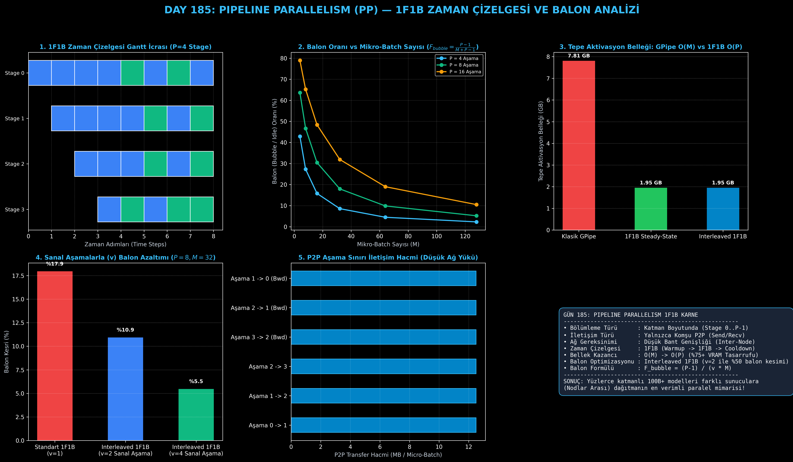

# Day 185: Pipeline Parallelism (PP) — 1F1B Zaman Çizelgesi ve Balon Azaltma

[](LICENSE)
[](https://www.python.org/)
[](https://pytorch.org/)
[](testler/)
[](../HAFIZA_MUFREDAT_YOL_HARITASI.md)

Bu proje; **FAZ 10: Ultra-MLOps, Dağıtık Eğitim, Triton GPU Kernel ve BÜYÜK FİNAL 201 (Gün 181 - Gün 201)** serisinin 5. günü olan **Gün 185** modülüdür. 80-128+ katmandan oluşan devasa modelleri (Llama-3-70B, GPT-3-175B) katman bazında farklı fiziksel GPU sunucularına (Inter-Node) bölerek eğitmeyi sağlayan **Pipeline Parallelism (GPipe & PipeDream / Megatron-LM PP)** mimarisini, **1F1B (One Forward, One Backward) Zaman Çizelgesini**, **Pipeline Balon (Bubble) Azaltma Formülasyonunu**, **Tepe Aktivasyon Belleği Optimizasyonunu ($O(M) \to O(P)$)**, **Interleaved 1F1B (Virtual Stages)** ve **P2P Noktadan Noktaya İletişim Kuyruğunu** sıfırdan PyTorch ile inşa etmektedir.

---

## 🌟 1. Stajyer Seviyesinde Anlaşılır Kılavuz

### ❓ "Pipeline Parallelism" Nedir ve 1F1B Zaman Çizelgesi GPU'ların Boşta Beklemesini (Balon) Nasıl Engeller?
- **Sorun 1 (Nodlar Arası Katman Bölüşümü ve Düşük Bant Genişliği):**
  Tensor Parallelism (TP) katman içi devasa matrisleri böldüğü için her katmanda 2 kez All-Reduce yapar ve ultra hızlı NVLink (900 GB/s) gerektirir. Farklı sunucular (Nodlar) arasında ise NVLink yoktur; yalnızca standart InfiniBand veya Ethernet (100-400 Gbps) vardır. Pipeline Parallelism modelin 80 katmanını ardışık parçalara (Aşama 0: Katman 1-20, Aşama 1: Katman 21-40...) böler; böylece sunucular arasında sadece ara aktivasyon tensörleri (P2P Send/Recv) aktarılır.
- **Sorun 2 (Klasik GPipe'ın Devasa Bellek Kısıtı $O(M)$):**
  Klasik GPipe'ta bir mini-batch $M$ mikro-batch'e bölünür. Aşama 0, tüm $M$ mikro-batch için ileri geçişi tamamlayana kadar geri geçişe başlayamaz. Bu durum Aşama 0 üzerinde **tüm $M$ mikro-batch'in aktivasyonlarını VRAM'de saklama zorunluluğu ($O(M)$)** doğurur ve VRAM patlamasına (OOM) yol açar.
- **Çözüm (1F1B Steady-State Zaman Çizelgesi):**
  1. *Warmup Fazı:* Aşama $p$, $(P - p - 1)$ adet mikro-batch için ileri geçiş yapar.
  2. *1F1B Steady-State:* Her yeni mikro-batch için **1 İleri (Forward) yapar yapmaz hemen 1 Geri (Backward)** hesaplar ($1F1B$).
  3. *Aktivasyonların Anında Temizlenmesi:* Geri geçiş tamamlandığı anda o mikro-batch'in önbellekteki aktivasyonu anında silinir.
  4. *Bellek Sabitliği:* Tepe aktivasyon belleği toplam mikro-batch sayısından ($M$) bağımsız hale gelir ve sadece aşama sayısına ($P$) bağlı kalır: **$O(M) \to O(P)$ (%75+ VRAM Tasarrufu!)**.
  5. *Interleaved 1F1B (Sanal Aşamalar $v=2$):* Her GPU'ya ardışık olmayan 2 sanal blok (örn. GPU 0: Katman 1-10 ve Katman 41-50) atanarak boşta bekleme balonu (bubble) **%50 oranında kesilir**.

```
========================================================================================
            PIPELINE PARALLELISM 1F1B STEADY-STATE ZAMAN ÇİZELGESİ (GANTT)             
========================================================================================
  Stage 3: [--- Idle ---] [F0] [B0] [F1] [B1] [F2] [B2] [B3] (Cooldown)
  Stage 2: [-- Idle --]   [F0] [F1] [B0] [F2] [B1] [F3] [B2] [B3]
  Stage 1: [- Idle -]     [F0] [F1] [F2] [B0] [F3] [B1] [F4] [B2] [B3]
  Stage 0: [F0] [F1] [F2] [F3] [B0] [F4] [B1] [F5] [B2] [B3] (Steady State: 1F 1B)
           |<-- Warmup ->| |<------- 1F1B Steady-State ------->| |<-- Cooldown -->|
========================================================================================
```

---

## 🔬 2. 4 Zorunlu Derinlemesine Teknik ve Matematiksel Analiz

### A. 🔍 Neden Bu Sistem Kullanılır? (Mühendislik & Bilimsel Gerekçe)
- **Düşük İletişim Bant Genişliğine Sahip Sunucular Arası (Inter-Node) Ölçeklenme:**
  Pipeline Parallelism'de tüm katmanlar arasında kolektif All-Reduce yapılmaz; yalnızca aşama sınırında komşu aşamaya $X_{\text{out}}$ aktivasyonu iletilir (P2P Send/Recv). Bu sayede yüzlerce sunucuya yayılan 100B - 1T parametreli modeller nodlar arası ağ darboğazına takılmadan eğitilir.

### B. 🛡️ Ne Gibi Sorunları Çözer? (Çözülen Kritik Darboğazlar)
- **GPipe Aktivasyon Şişmesini $O(P)$ ile Sınırlama:** $M=32$ mikro-batch'li bir eğitimde GPipe 32 mikro-batch aktivasyonunu saklarken, 1F1B yalnızca $P=8$ aktivasyon saklar (%75 VRAM tasarrufu).
- **Balon (Bubble) Azaltımı:** Interleaved 1F1B sanal aşamalar ($v=2$) kullanarak boşta bekleme süresini yarıya indirir ($F_{\text{bubble}} \approx \frac{P-1}{v \cdot M}$).

### C. ⚠️ Ne Konuda Eksik Kalır? (Sınırlar ve Dikkat Edilmesi Gerekenler)
- **Pipeline Balonu (Boşta Bekleme / Bubble):** İleri ve geri geçiş zinciri aşamalar arasında akarken, ilk aşamaların geri geçişi, son aşamaların ise ileri geçişi beklemesi nedeniyle donanım kullanım oranı %100 olamaz. Balon oranını <%10 tutmak için $M \ge 4P$ kuralına uyulmalı veya Interleaved 1F1B kullanılmalıdır.
- **Aşama Yük Dengesizliği (Load Imbalance):** Model katmanları GPU'lara eşit hesaplama yüküyle bölünmezse, en yavaş aşama (straggler) tüm hattı kilitler.

### D. 🔄 Alternatif Sistemler & Karşılaştırmalı Dağıtık Mimariler

| Dağıtık Mimari | Bölünen Boyut | İletişim Türü | Bellek Karmaşıklığı | Önerilen Ağ Altyapısı |
|:---|:---:|:---:|:---:|:---|
| **PyTorch DDP** | Veri / Batch ($B$) | Ring All-Reduce | $O(P)$ (Model Kopya) | Standart Ethernet / IB |
| **FSDP (ZeRO-3)** | Model Ağırlıkları ($1/N$) | All-Gather + Reduce-Scatter | $O(P/N)$ | InfiniBand / RoCE |
| **Megatron-LM (TP)** | Matris Boyutu ($D$) | Intra-Layer All-Reduce | $O(P/K)$ | Intra-Node NVLink (900 GB/s) |
| **Pipeline Parallelism (PP)** | **Katman Sayısı ($L$)** | **Aşama Sınırı P2P (Send/Recv)** | **$O(P)$ (1F1B Aktivasyon)** | **Inter-Node InfiniBand / Ethernet** |

---

## 📖 3. Kapsamlı Terimler Sözlüğü (10+ Terim)

| Terim | Tanım |
|:---|:---|
| **Pipeline Parallelism (PP)** | Modelin katmanlarını ardışık aşamalara (stages) bölerek mikro-batch'ler halinde paralel işleyen mimari. |
| **Pipeline Stage** | Modelin belirli bir katman bloğunu (örn. 1-20) barındıran tek bir GPU veya GPU grubu. |
| **Micro-Batch** | Global batch'in pipeline hattında sürekli akış sağlamak için bölündüğü küçük veri parçaları ($M$ adet). |
| **Pipeline Bubble (Balon)** | İlk veya son aşamaların aktivasyon veya gradyan beklerken donanımın boşta kaldığı zaman dilimi. |
| **GPipe** | Tüm mikro-batch'lerin ileri geçişini bitirip ardından geri geçişe başlayan klasik pipeline çizelgesi ($O(M)$ bellek). |
| **1F1B Schedule** | Warmup sonrası her mikro-batch için 1 İleri ve hemen ardından 1 Geri çalıştıran bellek optimize çizelge ($O(P)$ bellek). |
| **Interleaved 1F1B** | Her GPU'ya ardışık olmayan birden fazla sanal aşama ($v$) atayarak balonu $1/v$ oranında azaltan yöntem. |
| **Virtual Stages ($v$)** | Tek bir fiziksel GPU'da barındırılan bağımsız katman bloklarının sayısı (örn. $v=2$). |
| **Point-to-Point (P2P)** | Yalnızca komşu aşamalar ($p \leftrightarrow p+1$) arasında gerçekleşen düşük hacimli doğrudan tensör transferi. |
| **Activation Stash / Cache** | Geri geçişte kullanılmak üzere ileri geçişte geçici olarak saklanan mikro-batch aktivasyon önbelleği. |

---

## ⚖️ 4. 4 Kutuplu SWOT Matrisi

```
       GÜÇLÜ YÖNLER (STRENGTHS)              ZAYIF YÖNLER (WEAKNESSES)
 ┌──────────────────────────────────────┬──────────────────────────────────────┐
 │ • Düşük nodlar arası P2P iletişim.   │ • Pipeline balonu (boşta bekleme).   │
 │ • 1F1B ile O(P) sabit aktivasyon     │ • Aşama yük dengesizliği riski       │
 │   bellek tepe noktası.               │   (Embedding & Loss katmanları).     │
 │ • Yüzlerce katmanlı 100B+ modelleri  │ • Yeterli M mikro-batch gerekliliği  │
 │   nodlar arasına rahatça dağıtabilme.│   (M >= 4P).                         │
 ├──────────────────────────────────────┼──────────────────────────────────────┤
 │ • Kurumsal çoklu sunucu kümelerinde  │ • Mikro-batch sayısı küçük           │
 │   TP + PP + DP (3D Paralellik)       │   kaldığında balon oranının %30'u    │
 │   hibrit eğitim omurgası kurma.      │   aşarak verimi düşürmesi.           │
 └──────────────────────────────────────┴──────────────────────────────────────┘
        FIRSATLAR (OPPORTUNITIES)               TEHDİTLER (THREATS)
```

---

## 📊 5. Çıktı Panosu

Kod çalıştırıldığında oluşturulan 6 panelli Pipeline Parallelism 1F1B teşhis panosu: `ciktilar/pipeline_parallelism_1f1b_paneli.png`



---

## 📜 Lisans

```text
ÖZEL LİSANS — TÜM HAKLAR SAKLIDIR
Telif Hakkı (c) 2026 Seydi Eryılmaz (@seydivakkas)
```
