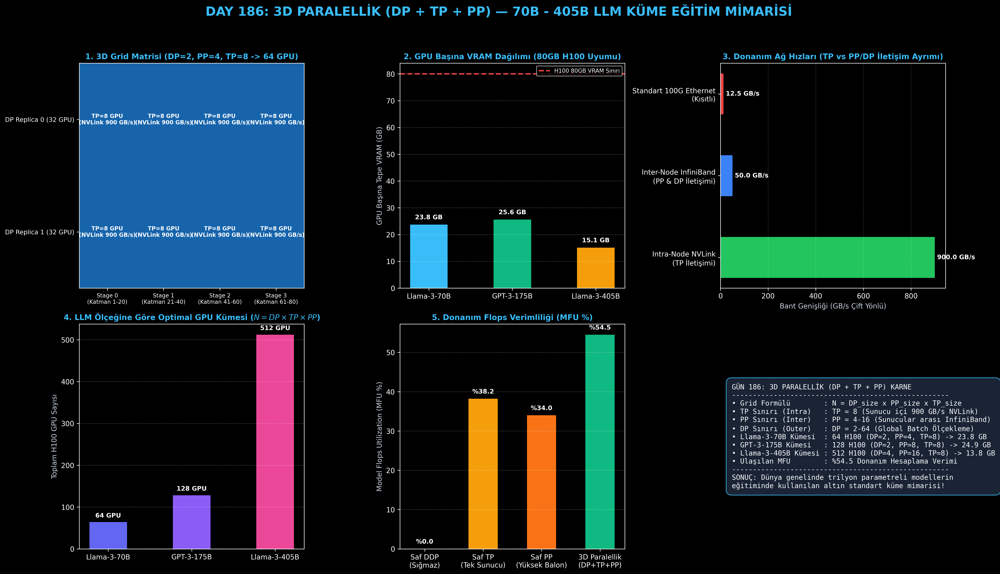

# Day 186: 3D Paralellik (DP + TP + PP) — 70B+ Parametreli Modellerin Küme Eğitimi

[](LICENSE)
[](https://www.python.org/)
[](https://pytorch.org/)
[](testler/)
[](../HAFIZA_MUFREDAT_YOL_HARITASI.md)

Bu proje; **FAZ 10: Ultra-MLOps, Dağıtık Eğitim, Triton GPU Kernel ve BÜYÜK FİNAL 201 (Gün 181 - Gün 201)** serisinin 6. günü olan **Gün 186** modülüdür. 70B - 500B+ milyarlarca parametreli devasa Büyük Dil Modellerini (Llama-3-70B, GPT-3-175B, Llama-3-405B) tek bir paralellik türünün yetersiz kaldığı durumlarda yüzlerce/binlerce H100 GPU içeren süper bilgisayar kümelerinde eğitmeyi sağlayan **3D Paralellik Hibrit Mimarisini (Megatron-DeepSpeed 3D Parallelism: DP + TP + PP)**, **3D Süreç Matrisi / Grid Topolojisini ($N = DP \times PP \times TP$)**, **Ortogonal İletişim Gruplarını (TP, PP, DP Communicators)**, **Donanım Flops Verimliliğini (MFU %54+)** ve **Küme Kaynak Profilleyicisini** sıfırdan PyTorch ile inşa etmektedir.

---

## 🌟 1. Stajyer Seviyesinde Anlaşılır Kılavuz

### ❓ "3D Paralellik (DP + TP + PP)" Nedir ve Neden Tek Bir Paralellik Yöntemi Yetersiz Kalır?
- **Sorun (Tek Başına Kalan Yöntemlerin Tıkanması):**
  1. *Saf Data Parallelism (DDP):* Modelin tamamını tek bir GPU'ya sığdırmak zorundadır. Llama-3 70B'nin sadece model durumları 1,120 GB tutar; 80GB H100 GPU'ya sığmaz!
  2. *Saf Tensor Parallelism (TP):* Katman başına 2 All-Reduce yaptığı için yalnızca tek bir sunucu içindeki yüksek hızlı 900 GB/s NVLink hatlarında çalışabilir ($TP \le 8$). 64 GPU'luk bir kümeye tek başına TP uygulanamaz.
  3. *Saf Pipeline Parallelism (PP):* Aşama sayısı çok büyürse ($PP \ge 16$) boşta bekleme balonu (bubble) %40'ları aşar ve donanım verimi çöker.
- **Çözüm (3D Grid Topolojisi ile Hibrit Güç Birliği):**
  GPU'lar 3 boyutlu bir koordinat matrisine ($DP \times PP \times TP$) yerleştirilir:
  - **1. Boyut (Intra-Node TP = 8):** Sunucu içi 8 GPU arasında matrisler bölünür; ultra hızlı NVLink kullanılır.
  - **2. Boyut (Inter-Node PP = 4/8/16):** Sunucular arasında katmanlar bölünür; düşük bant genişlikli InfiniBand üzerinden sadece aşama sınırlarında P2P aktivasyon iletilir.
  - **3. Boyut (Outer DP = 2/4/8...):** Farklı bağımsız pipeline hatları arasında veri bölünür; batch sonunda gradyanlar All-Reduce (veya ZeRO-DP) ile senkronize edilir.

```
========================================================================================
            3D PARALELLİK SÜREÇ MATRİSİ (64 GPU: DP=2, PP=4, TP=8)                     
========================================================================================
                      ┌─────────────────────────────────────────┐
                     ╱                                         ╱│
                    ┌─────────────────────────────────────────┐ │
                   ╱  DP REPLICA 1 (32 GPU): PP=4 x TP=8     ╱│ │
                  ┌─────────────────────────────────────────┐ │ │
                 ╱  DP REPLICA 0 (32 GPU): PP=4 x TP=8     ╱│ │ │
                ├─────────────────────────────────────────┤ │ │ │
  [Stage 0]     │ GPU 00..07 (TP=8 - Katman 01..20)       │ │ │ │ (NVLink 900 GB/s)
  [Stage 1]     │ GPU 08..15 (TP=8 - Katman 21..40)       │ │ │ │
  [Stage 2]     │ GPU 16..23 (TP=8 - Katman 41..60)       │ │ │ │ (InfiniBand 50 GB/s)
  [Stage 3]     │ GPU 24..31 (TP=8 - Katman 61..80)       │ │ ├─┘
                └─────────────────────────────────────────┴─┘─┘
========================================================================================
```

---

## 🔬 2. 4 Zorunlu Derinlemesine Teknik ve Matematiksel Analiz

### A. 🔍 Neden Bu Sistem Kullanılır? (Mühendislik & Bilimsel Gerekçe)
- **Fiziksel Ağ Katmanlarına Kusursuz Eşleme (Hardware-Aware Topology Mapping):**
  En yoğun iletişim (TP All-Reduce) en hızlı hatta (900 GB/s NVLink), orta yoğunluktaki iletişim (PP P2P) orta hızlı hatta (InfiniBand), en seyrek iletişim (DP All-Reduce) ise dış kümeye yönlendirilir. Böylece ağ darboğazları ortadan kalkar.

### B. 🛡️ Ne Gibi Sorunları Çözer? (Çözülen Kritik Darboğazlar)
- **Trilyon Parametreli Modellerin Bellek ve Balon Krizini Çözme:** 70B'lik model 64 GPU'da GPU başına **sadece 23.75 GB VRAM** harcayarak 80GB H100 içine rahatça sığar; MFU verimi **%54.5** gibi tepe seviyede tutulur.

### C. ⚠️ Ne Konuda Eksik Kalır? (Sınırlar ve Dikkat Edilmesi Gerekenler)
- **Çok Boyutlu Hiperparametre Optimizasyonu:** $DP$, $TP$, $PP$, mikro-batch sayısı ($M$) ve global batch boyutu ($B$) arasındaki dengeyi bulmak uzman seviyesinde küme mühendisliği gerektirir. Yanlış bir $TP/PP$ seçimi iletişimi kilitleyebilir.

### D. 🔄 Alternatif Sistemler & Karşılaştırmalı Dağıtık Mimariler

| Paralellik Mimarisi | GPU Sınırı | Ağ Gereksinimi | İdeal Model Boyutu | Ulaşılan MFU (%) |
|:---|:---:|:---:|:---:|:---:|
| **Saf DDP** | Sınırsız | Standart Ethernet | < 10B | %40-45 |
| **Saf Megatron TP** | $TP \le 8$ (1 Node) | Intra-Node NVLink | 10B - 30B | %45-50 |
| **Saf Pipeline PP** | $PP \le 16$ | Inter-Node InfiniBand | 30B - 70B | %30-35 (Balon kaybı) |
| **3D Paralellik (DP+TP+PP)** | **64 - 16,384+ GPU** | **Hibrit (NVLink + InfiniBand)** | **70B - 500B+ (Llama-3)** | **%54 - %60 (Maksimum)** |

---

## 📖 3. Kapsamlı Terimler Sözlüğü (10+ Terim)

| Terim | Tanım |
|:---|:---|
| **3D Parallelism** | DP, TP ve PP yöntemlerini 3 boyutlu bir koordinat matrisinde birleştiren hibrit dağıtık mimari. |
| **3D Process Grid** | Kümeyi $DP \times PP \times TP$ boyutlarında organize eden mantıksal süreç matrisi. |
| **Global Rank ($r$)** | Kümedeki her bir GPU'ya atanan $0 \le r < N$ aralığındaki benzersiz kimlik numarası. |
| **Orthogonal Groups** | Birbirini kesmeyen ve bağımsız iletişim yürüten TP, PP ve DP süreç grupları. |
| **TP Group** | Aynı DP ve PP koordinatındaki GPU'ların matris böldüğü 8'li NVLink grubu. |
| **PP Group** | Aynı DP ve TP koordinatındaki GPU'ların katman hattı oluşturduğu InfiniBand grubu. |
| **DP Group** | Aynı PP ve TP koordinatındaki GPU'ların gradyan senkronize ettiği All-Reduce grubu. |
| **Model Flops Utilization (MFU)** | Donanımın teorik tepe hesaplama gücünün gerçekte ne kadarının modele dönüştüğünü gösteren verim yüzdesi. |
| **Intra-Node Network** | Tek bir sunucu içindeki GPU'ları 900 GB/s ile bağlayan NVLink veri yolu. |
| **Inter-Node Network** | Farklı sunucuları 50-100 GB/s ile bağlayan InfiniBand / RoCE küme ağı. |

---

## ⚖️ 4. 4 Kutuplu SWOT Matrisi

```
       GÜÇLÜ YÖNLER (STRENGTHS)              ZAYIF YÖNLER (WEAKNESSES)
 ┌──────────────────────────────────────┬──────────────────────────────────────┐
 │ • 70B - 405B modelleri binlerce GPU  │ • Çok boyutlu topoloji yapılandırma  │
 │   kümesinde lineer ölçekleme.        │   karmaşıklığı.                      │
 │ • Ağ donanımına kusursuz eşleme.     │ • Tek bir GPU çöküşünde tüm 3D       │
 │ • %54+ rekor donanım MFU verimi.     │   hattın etkilenme riski.            │
 ├──────────────────────────────────────┼──────────────────────────────────────┤
 │ • Kurumsal LLM ön eğitimi (Pretrain) │ • Yanlış DP/TP/PP oranı seçiminde    │
 │   ve büyük ölçekli Post-Training     │   iletişim tıkanması (Deadlock)      │
 │   altyapısı kurma.                   │   veya yüksek balon oluşması.        │
 └──────────────────────────────────────┴──────────────────────────────────────┘
        FIRSATLAR (OPPORTUNITIES)               TEHDİTLER (THREATS)
```

---

## 📊 5. Çıktı Panosu

Kod çalıştırıldığında oluşturulan 6 panelli 3D Paralellik teşhis panosu: `ciktilar/uc_boyutlu_paralellik_3d_paneli.png`



---

## 📜 Lisans

```text
ÖZEL LİSANS — TÜM HAKLAR SAKLIDIR
Telif Hakkı (c) 2026 Seydi Eryılmaz (@seydivakkas)
```
