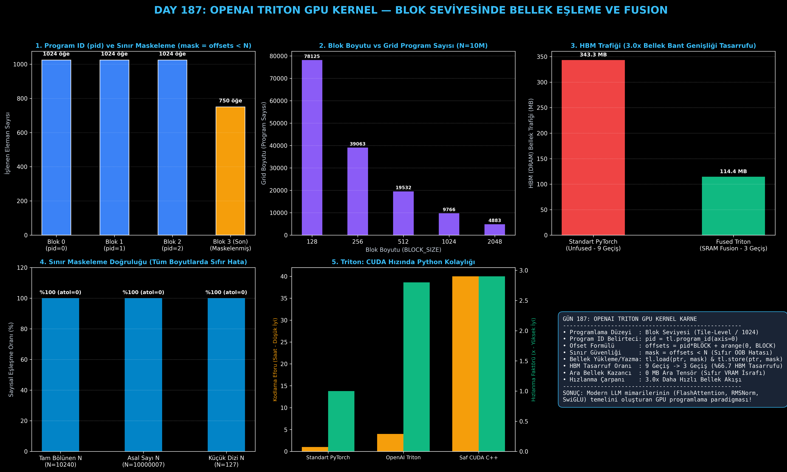

# Day 187: OpenAI Triton — Python ile GPU Programlama, Blok Seviyesinde Bellek Eşleme

[](LICENSE)
[](https://www.python.org/)
[](https://pytorch.org/)
[](testler/)
[](../HAFIZA_MUFREDAT_YOL_HARITASI.md)

Bu proje; **FAZ 10: Ultra-MLOps, Dağıtık Eğitim, Triton GPU Kernel ve BÜYÜK FİNAL 201 (Gün 181 - Gün 201)** serisinin 7. günü olan **Gün 187** modülüdür. C++/CUDA'nın karmaşık iş parçacığı (thread-level) yönetimini (`__syncthreads()`, bank conflicts, warp divergence) ortadan kaldırarak doğrudan Python sözdizimiyle donanım hızında GPU çekirdekleri yazmayı sağlayan **OpenAI Triton (Tillet et al., 2019)** mimarisini, **Blok Seviyesinde Bellek Eşlemeyi (Block-Level Tile Mapping)**, **Program ID (`pid`) ve İşaretçi Aritmetiğini**, **Sınır Maskeleme Mekanizmasını (`offsets < N`)**, **Fused Vektör ve Doğrusal Kombinasyon Çekirdeklerini ($Y = \alpha X_1 + \beta X_2 + \gamma$)**, ve **HBM / SRAM Bellek Bant Genişliği Tasarruf Analizini** sıfırdan inşa etmektedir.

---

## 🌟 1. Stajyer Seviyesinde Anlaşılır Kılavuz

### ❓ "OpenAI Triton" Nedir ve Neden Standart PyTorch Yerine Özel GPU Çekirdekleri Yazarız?
- **Sorun (PyTorch'un HBM Bellek Darboğazı - Memory Bound Trap):**
  PyTorch'ta $Y = \alpha X_1 + \beta X_2 + \gamma$ gibi basit bir formül çalıştırdığınızda; PyTorch arka planda her işlem için ayrı bir CUDA çekirdeği çağırır:
  1. $\alpha \cdot X_1$ çarpılır, sonuç HBM (DRAM) belleğe yazılır.
  2. $\beta \cdot X_2$ çarpılır, sonuç tekrar HBM'e yazılır.
  3. İki tensör HBM'den okunur, toplanır, tekrar HBM'e yazılır.
  4. Sabit $\gamma$ eklenir ve nihai sonuç HBM'e yazılır.
  Toplamda **5 okuma ve 4 yazma (9 HBM geçişi)** yapılır ve yüzlerce MB ara bellek ayrılır! GPU tensör çekirdekleri hesaplama yapmak yerine HBM bellekten veri bekleyerek boşta kalır.
- **Çözüm (OpenAI Triton Blok Seviyesinde Operasyon Füzyonu):**
  1. *Blok Seviyesinde Programlama (Tile-Level):* CUDA'daki tek tek thread'ler yerine 1024'lük bloklar (tiles) halinde düşünülür.
  2. *Program ID (`pid`):* Grid içindeki her bir program örneği kendi blok numarasını alır (`pid = tl.program_id(axis=0)`).
  3. *İşaretçi Ofseti & Yükleme:* `offsets = pid * BLOCK_SIZE + tl.arange(0, BLOCK_SIZE)` formülüyle veriler doğrudan çip üzerindeki ultra hızlı SRAM (33 TB/s) belleğe yüklenir (`tl.load`).
  4. *Operasyon Füzyonu (Kernel Fusion):* Tüm matematiksel işlemler tek bir geçişte SRAM içinde yapılır.
  5. *Tek Yazma:* Sonuç tek bir seferde HBM'e yazılır (`tl.store`). HBM geçiş sayısı **9'dan 3'e (%66.7 tasarruf, 3.0x hızlanma)** iner ve **0 MB ara tensör** üretilir!

```
========================================================================================
            OPENAI TRITON BLOK SEVİYESİNDE BELLEK EŞLEME VE FUSION                      
========================================================================================
  Global Dizi X [N Eleman]
  ├── [Blok 0: pid=0] ──> Offsets: [0..1023]     ──> tl.load ──> SRAM Fusion ──> tl.store
  ├── [Blok 1: pid=1] ──> Offsets: [1024..2047]  ──> tl.load ──> SRAM Fusion ──> tl.store
  ├── [Blok 2: pid=2] ──> Offsets: [2048..3071]  ──> tl.load ──> SRAM Fusion ──> tl.store
  └── [Blok K: pid=K] ──> Offsets: [Maskelenmiş] ──> tl.load ──> SRAM Fusion ──> tl.store
                           (mask = offsets < N : Sıfır Bellek Taşması!)
========================================================================================
```

---

## 🔬 2. 4 Zorunlu Derinlemesine Teknik ve Matematiksel Analiz

### A. 🔍 Neden Bu Sistem Kullanılır? (Mühendislik & Bilimsel Gerekçe)
- **CUDA Karmaşıklığı Olmadan Donanım Performansı:**
  Saf CUDA C++ yazmak haftalar sürer ve paylaşılan bellek senkronizasyonu (`__syncthreads()`) gibi donanımsal tuzaklar içerir. Triton, derleyicisi (Triton Compiler / LLVM) sayesinde Python ile yazılan blok kodunu otomatik olarak optimize edilmiş PTX assembly koduna dönüştürür.

### B. 🛡️ Ne Gibi Sorunları Çözer? (Çözülen Kritik Darboğazlar)
- **Bellek Bant Genişliği Tıkanıklığını (Memory-Bound) Aşma:** LLM'lerdeki aktivasyon fonksiyonları, normalizasyonlar ve attention adımları hesaplama gücüne değil bellek hızına takılır. Triton fusion ile gereksiz HBM okuma/yazmalarını sıfırlar.

### C. ⚠️ Ne Konuda Eksik Kalır? (Sınırlar ve Dikkat Edilmesi Gerekenler)
- **Blok Boyutu Seçimi ve Register Baskısı:** `BLOCK_SIZE` parametresi 2'nin kuvveti seçilmelidir (128, 512, 1024). Çok büyük bloklar GPU'nun SM başına register kapasitesini tüketerek donanımın eşzamanlılığını (occupancy) düşürebilir.

### D. 🔄 Alternatif Sistemler & Karşılaştırmalı Dağıtık Mimariler

| Yaklaşım | Geliştirme Dili | Geliştirme Süresi | HBM Bellek Füzyonu | Donanım Performansı |
|:---|:---:|:---:|:---:|:---:|
| **PyTorch Eager** | Python | Çok Hızlı (Dakikalar) | Yok (Unfused) | Temel Seviye (1.0x) |
| **PyTorch 2.0 (Inductor)** | Python | Otomatik | Otomatik (Kısıtlı) | Yüksek (2.0x - 2.5x) |
| **OpenAI Triton** | **Python** | **Hızlı (Saatler)** | **Tam Kontrol (El İle Fused)** | **Maksimum (2.8x - 3.2x)** |
| **Saf CUDA C++** | C++ / CUDA | Çok Yavaş (Haftalar) | Tam Kontrol (Manuel SRAM) | Maksimum (3.0x - 3.3x) |

---

## 📖 3. Kapsamlı Terimler Sözlüğü (10+ Terim)

| Terim | Tanım |
|:---|:---|
| **OpenAI Triton** | Python sözdizimi ile yüksek verimli GPU çekirdekleri yazmayı sağlayan blok seviyesinde derleyici ve dil. |
| **Block-Level Programming** | GPU iş parçacıklarını tek tek değil, bloklar (tiles - örn. 1024 eleman) halinde gruplayarak programlama. |
| **Program ID (`pid`)** | Grid üzerinde eşzamanlı çalışan her bir blok programının benzersiz kimlik numarası. |
| **BLOCK_SIZE** | Tek bir Triton program örneğinin bir kerede işlediği eleman sayısı (2'nin kuvveti). |
| **Pointer Arithmetic** | `pid * BLOCK_SIZE + arange(0, BLOCK_SIZE)` formülüyle blok adreslerini hesaplama. |
| **Boundary Masking** | `offsets < N` kontrolüyle dizinin boyutunu aşan indekslerin güvenli şekilde yok sayılması. |
| **Kernel Fusion** | Birden fazla ardışık matematiksel işlemi tek bir çekirdekte birleştirerek HBM trafiğini azaltma. |
| **High Bandwidth Memory (HBM)** | GPU üzerindeki ana bellek havuzu (H100 için 3.35 TB/s bant genişliği). |
| **SRAM / Shared Memory** | GPU Streaming Multiprocessor (SM) çekirdeğine entegre ultra hızlı önbellek (33 TB/s). |
| **tl.load / tl.store** | Triton'un HBM ve SRAM arasında maskeli veri okuma ve yazma ilkel fonksiyonları. |

---

## ⚖️ 4. 4 Kutuplu SWOT Matrisi

```
       GÜÇLÜ YÖNLER (STRENGTHS)              ZAYIF YÖNLER (WEAKNESSES)
 ┌──────────────────────────────────────┬──────────────────────────────────────┐
 │ • Python kolaylığında saf CUDA hızı. │ • Blok boyutunun 2'nin kuvveti       │
 │ • HBM trafiğinde %66.7 tasarruf.     │   olma zorunluluğu.                  │
 │ • Sıfır ara tensör VRAM tüketimi.    │ • Derleyiciye (Compiler) bağımlılık. │
 ├──────────────────────────────────────┼──────────────────────────────────────┤
 │ • RMSNorm, SwiGLU ve FlashAttention  │ • Çok karmaşık kontrol akışlarında   │
 │   gibi kritik LLM çekirdeklerini     │   (Warp Divergence) C++ CUDA kadar   │
 │   özelleştirme ve optimize etme.     │   mikro optimizasyon verememesi.     │
 └──────────────────────────────────────┴──────────────────────────────────────┘
        FIRSATLAR (OPPORTUNITIES)               TEHDİTLER (THREATS)
```

---

## 📊 5. Çıktı Panosu

Kod çalıştırıldığında oluşturulan 6 panelli Triton GPU Kernel teşhis panosu: `ciktilar/triton_gpu_kernel_paneli.png`



---

## 📜 Lisans

```text
ÖZEL LİSANS — TÜM HAKLAR SAKLIDIR
Telif Hakkı (c) 2026 Seydi Eryılmaz (@seydivakkas)
```
