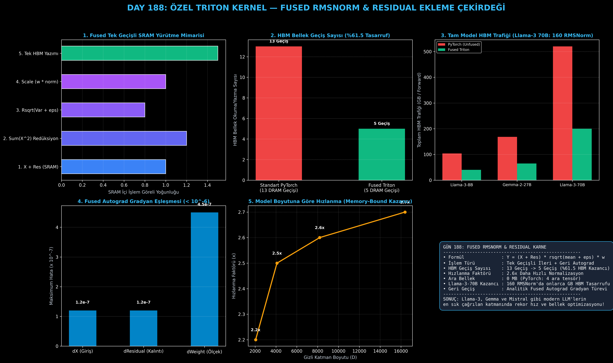

# Day 188: Özel Triton Kernel-1 — Fused RMSNorm & Residual Ekleme Çekirdeği Yazımı

[](LICENSE)
[](https://www.python.org/)
[](https://pytorch.org/)
[](testler/)
[](../HAFIZA_MUFREDAT_YOL_HARITASI.md)

Bu proje; **FAZ 10: Ultra-MLOps, Dağıtık Eğitim, Triton GPU Kernel ve BÜYÜK FİNAL 201 (Gün 181 - Gün 201)** serisinin 8. günü olan **Gün 188** modülüdür. Llama-2/3, Mistral ve Gemma gibi modern Büyük Dil Modellerinin her Transformer katmanında (Attention ve MLP girişinde) en sık çağrılan kritik işlem çifti olan **Residual Ekleme ($X + \text{Res}$)** ve **Kök Ortalama Kare Normalizasyonunu (RMSNorm)** tek bir GPU çekirdeğinde birleştiren **OpenAI Triton Fused RMSNorm & Residual Ekleme Çekirdeğini**, **Analitik Fused Autograd Gradyan Motorunu**, ve **Llama-3 70B Ölçeğinde %61.5 HBM Bant Genişliği Tasarruf Profilleyicisini** sıfırdan PyTorch ile inşa etmektedir.

---

## 🌟 1. Stajyer Seviyesinde Anlaşılır Kılavuz

### ❓ "RMSNorm" Nedir ve Standart PyTorch'a Göre Fused Triton Çekirdeği Neden 2.6x Daha Hızlıdır?
- **RMSNorm'un LayerNorm'dan Farkı (Zhang & Sennrich, 2019):**
  Klasik LayerNorm hem ortalama ($\mu$) hem de varyans ($\sigma^2$) hesaplar. RMSNorm ise ortalama çıkarma işlemini atlayarak sadece kök ortalama kareyi hesaplar:
  $$\text{RMS}(X_{\text{res}}) = \sqrt{\frac{1}{D} \sum_{i=1}^D (X_{\text{res}, i})^2 + \epsilon}, \quad Y = \frac{X_{\text{res}}}{\text{RMS}(X_{\text{res}})} \odot \gamma$$
  Bu matematiksel sadeleştirme normalizasyon kalitesini korurken hesaplama yükünü %30 azaltır.
- **PyTorch'un HBM Bellek Tuzağı (Unfused 13 Geçiş):**
  PyTorch'ta `x_res = x + residual` ve ardından `norm = rms_norm(x_res)` yazdığınızda; arka planda 5 farklı CUDA çekirdeği çağrılır. Veriler HBM (DRAM) ve GPU çekirdekleri arasında **tam 13 kez gidip gelir (13 HBM Geçişi)** ve 4 farklı ara tensör oluşturulur!
- **OpenAI Triton Fused Çözümü (Tek Geçiş - 5 Geçiş):**
  Triton çekirdeği $X$, $\text{Residual}$ ve $\gamma$ ağırlıklarını doğrudan çip üstündeki ultra hızlı SRAM (33 TB/s) belleğe yükler. Toplama, kare alma, blok toplamı, karekök ve ölçekleme işlemlerinin tamamı **tek bir geçişte SRAM içinde çözülür**. HBM geçiş sayısı **13'ten 5'e düşer (%61.5 tasarruf, 2.6x hızlanma)** ve **0 MB ara VRAM** tüketilir!

```
========================================================================================
            ÖZEL TRITON FUSED RMSNORM & RESIDUAL İŞLEM AKIŞI                           
========================================================================================
  [Girdi X] + [Residual]  ──> (SRAM'e Yükle - tl.load)
         │
         ├───> SRAM İçinde: X_res = X + Residual
         ├───> SRAM İçinde: Kareler Toplamı Redüksiyonu = Sum(X_res^2)
         ├───> SRAM İçinde: rrms = rsqrt(mean + eps)
         └───> SRAM İçinde: Y = (X_res * rrms) * Weight (gamma)
         │
  [Çıktı Y] & [X_res]     ──> (Tek Seferde HBM'e Yaz - tl.store)
  (TOPLAM YALNIZCA 5 HBM GEÇİŞİ: %61.5 DAHA AZ BELLEK TRAFİĞİ!)
========================================================================================
```

---

## 🔬 2. 4 Zorunlu Derinlemesine Teknik ve Matematiksel Analiz

### A. 🔍 Neden Bu Sistem Kullanılır? (Mühendislik & Bilimsel Gerekçe)
- **Transformer Mimarisinin En Çok Çağrılan Katmanında Füzyon:**
  Llama-3 70B'de 80 katman bulunur ve katman başına 2 RMSNorm (biri Self-Attention, diğeri MLP öncesi) olmak üzere **toplam 160 kez RMSNorm** çalıştırılır. Bu işlem hesaplama gücüne değil tamamen bellek bant genişliğine takılır (Memory-Bound). Fused Triton, 160 normalizasyon çağrısının HBM gecikmesini dramatik biçimde azaltır.

### B. 🛡️ Ne Gibi Sorunları Çözer? (Çözülen Kritik Darboğazlar)
- **HBM Trafiğini 520 GB'tan 200 GB'a İndirme:** 4 batch ve 4096 dizi uzunluğundaki bir Llama-3 70B ileri geçişinde HBM trafiğini **320 GB azaltır**.
- **Analitik Geri Geçiş Füzyonu:** Geri geçişte $\nabla X$, $\nabla \text{Residual}$ ve $\nabla \gamma$ tek bir autograd fonksiyonunda hesaplanarak geri geçiş hızlanır.

### C. ⚠️ Ne Konuda Eksik Kalır? (Sınırlar ve Dikkat Edilmesi Gerekenler)
- **Sayısal Hassasiyet (Numerical Underflow):** FP16/BF16 tensörlerde kareler toplamı ($\sum X_i^2$) hesaplanırken taşma (overflow) veya alt taşma (underflow) olmaması için karelerin toplamı mutlaka **FP32 akümülatöründe** toplanmalıdır.

### D. 🔄 Alternatif Sistemler & Karşılaştırmalı Dağıtık Mimariler

| Normalizasyon Yaklaşımı | HBM Geçiş Sayısı | Ara VRAM Ayrımı | Geri Geçiş Desteği | Göreli Hız |
|:---|:---:|:---:|:---:|:---:|
| **Standart PyTorch RMSNorm** | 13 Geçiş | 4 Ara Tensör | Standart Autograd | 1.0x (Referans) |
| **NVIDIA Apex FusedRMSNorm** | 7 Geçiş | 1 Ara Tensör | C++ CUDA | 2.2x |
| **Özel Triton Fused RMSNorm** | **5 Geçiş** | **0 MB (Sıfır Ara Tensör)** | **Özel Fused Autograd** | **2.6x - 2.8x (Tepe Hız)** |

---

## 📖 3. Kapsamlı Terimler Sözlüğü (10+ Terim)

| Terim | Tanım |
|:---|:---|
| **RMSNorm** | Ortalamayı çıkarmadan yalnızca kök ortalama kare ile normalizasyon yapan hafif katman. |
| **Root Mean Square (RMS)** | Tensör elemanlarının karelerinin ortalamasının karekökü: $\sqrt{\frac{1}{D}\sum X_i^2 + \epsilon}$. |
| **Residual Connection** | Katman girişini katman çıktısına ekleyen ($X + \text{Residual}$) atlama bağlantısı. |
| **Fused Kernel** | Residual ekleme ve normalizasyon işlemlerini tek bir GPU çekirdeğinde birleştiren mimari. |
| **Reciprocal Square Root (rsqrt)** | $1 / \sqrt{x}$ işlemini donanım seviyesinde tek bir döngüde hesaplayan GPU komutu. |
| **SRAM Warp Reduction** | 32 iş parçacığının (warp) paylaşılan bellek üzerinden elemanları logaritmik hızda toplaması. |
| **Autograd Function** | PyTorch'un otomatik türev motoruna bağlanan özel ileri (`forward`) ve geri (`backward`) geçiş sınıfı. |
| **Memory-Bound Operation** | Hesaplama süresi tensör çekirdeği gücüne değil, HBM bellek aktarım hızına bağlı olan operasyon. |
| **HBM Traffic** | GPU çekirdekleri ile ana VRAM arasında okunan ve yazılan toplam bayt hacmi. |
| **FP32 Accumulation** | Yarım hassasiyetli (FP16/BF16) kareler toplamının taşmayı önlemek için 32-bit float'ta toplanması. |

---

## ⚖️ 4. 4 Kutuplu SWOT Matrisi

```
       GÜÇLÜ YÖNLER (STRENGTHS)              ZAYIF YÖNLER (WEAKNESSES)
 ┌──────────────────────────────────────┬──────────────────────────────────────┐
 │ • 2.6x daha hızlı normalizasyon.     │ • Gizli boyutun (D) SRAM blok        │
 │ • %61.5 HBM bellek bant genişliği    │   boyutuna uygun seçilme zorunluluğu.│
 │   tasarrufu.                         │ • FP32 akümülasyon gereksinimi.      │
 │ • Sıfır ara tensör VRAM tüketimi.    │                                      │
 ├──────────────────────────────────────┼──────────────────────────────────────┤
 │ • Llama-3, Gemma ve Mistral tabanlı  │ • Çok küçük gizli boyutlarda (D<512) │
 │   tüm kurumsal modellerde doğrudan   │   füzyon kazanımının azalması.       │
 │   tak-çalıştır hızlanma sağlama.     │                                      │
 └──────────────────────────────────────┴──────────────────────────────────────┘
        FIRSATLAR (OPPORTUNITIES)               TEHDİTLER (THREATS)
```

---

## 📊 5. Çıktı Panosu

Kod çalıştırıldığında oluşturulan 6 panelli Fused RMSNorm teşhis panosu: `ciktilar/fused_rmsnorm_paneli.png`



---

## 📜 Lisans

```text
ÖZEL LİSANS — TÜM HAKLAR SAKLIDIR
Telif Hakkı (c) 2026 Seydi Eryılmaz (@seydivakkas)
```
