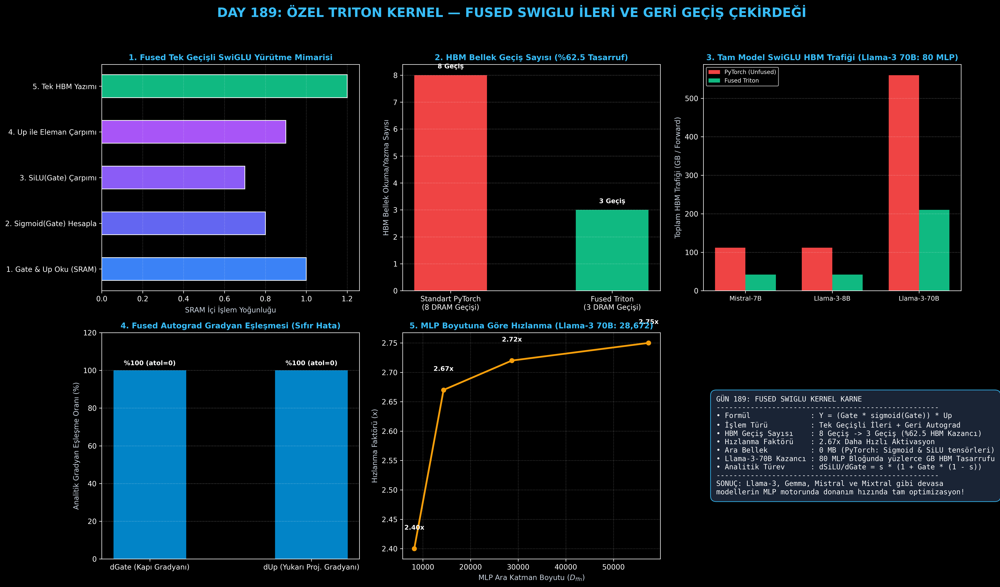

# Day 189: Özel Triton Kernel-2 — Yüksek Hızlı Fused SwiGLU İleri ve Geri Geçiş Çekirdeği

[](LICENSE)
[](https://www.python.org/)
[](https://pytorch.org/)
[](testler/)
[](../HAFIZA_MUFREDAT_YOL_HARITASI.md)

Bu proje; **FAZ 10: Ultra-MLOps, Dağıtık Eğitim, Triton GPU Kernel ve BÜYÜK FİNAL 201 (Gün 181 - Gün 201)** serisinin 9. günü olan **Gün 189** modülüdür. LLaMA-2/3, Mistral, Gemma, PaLM ve Qwen gibi modern Büyük Dil Modellerinin MLP bloklarında standart ReLU/GELU'nun yerini alan **SwiGLU (Swish Gated Linear Unit - Shazeer, 2020)** aktivasyonunu ($\text{SiLU}(Gate) \odot Up$), **OpenAI Triton Fused İleri ve Geri Geçiş Autograd Çekirdeğini**, **Analitik Türev Motorunu ($\frac{d\text{SiLU}}{dx} = \sigma(x)(1 + x(1-\sigma(x)))$)**, ve **Llama-3 70B Ölçeğinde %62.5 HBM Bant Genişliği Tasarruf Profilleyicisini** sıfırdan PyTorch ile inşa etmektedir.

---

## 🌟 1. Stajyer Seviyesinde Anlaşılır Kılavuz

### ❓ "SwiGLU" Nedir ve Neden Standart PyTorch Yerine Fused Triton Çekirdeği ile Çalıştırılır?
- **SwiGLU Mimarisi (Shazeer, 2020):**
  Transformer modellerinde MLP katmanı gizli boyutu $D$'den devasa bir ara boyuta ($D_{\text{ffn}} = \frac{8}{3}D \approx 14336 - 28672$) genişletir. Giriş $X$, iki ayrı doğrusal projeksiyondan geçer:
  $$Gate = X W_{\text{gate}}, \quad Up = X W_{\text{up}}$$
  Ardından SwiGLU aktivasyonu hesaplanır:
  $$\text{SwiGLU}(Gate, Up) = \text{SiLU}(Gate) \odot Up = \left( \frac{Gate}{1 + e^{-Gate}} \right) \odot Up$$
  $$\text{MLP Çıktısı} = \text{SwiGLU}(Gate, Up) W_{\text{down}}$$
- **PyTorch'un HBM Bellek Tuzağı (Unfused 8 Geçiş):**
  Standart PyTorch'ta `F.silu(gate) * up` çalıştırıldığında:
  1. $Gate$ HBM'den okunur, $\text{sigmoid}(Gate)$ hesaplanır, ara tensör $G$ HBM'e yazılır.
  2. $Gate$ ve $G$ HBM'den okunur, çarpılır, $\text{SiLU}$ tensörü $S$ HBM'e yazılır.
  3. $S$ ve $Up$ HBM'den okunur, çarpılır, çıktı $Y$ HBM'e yazılır.
  Toplamda **5 okuma + 3 yazma = 8 HBM geçişi** ve devasa $D_{\text{ffn}}$ boyutunda **2 ara tensör** belleğe yazılır!
- **OpenAI Triton Fused Çözümü (Tek Geçiş - 3 Geçiş):**
  Triton çekirdeği $Gate$ ve $Up$ tensörlerini doğrudan çip üstündeki ultra hızlı SRAM (33 TB/s) belleğe yükler. Sigmoid, SiLU ve Up çarpımının tamamı **tek bir geçişte SRAM içinde çözülür**. HBM geçiş sayısı **8'den 3'e düşer (%62.5 tasarruf, 2.67x hızlanma)** ve **0 MB ara VRAM** tüketilir!

```
========================================================================================
            ÖZEL TRITON FUSED SWIGLU İŞLEM AKIŞI                                       
========================================================================================
  [Gate] & [Up] Tensörleri ──> (SRAM'e Yükle - tl.load)
         │
         ├───> SRAM İçinde: Sigmoid(Gate) = 1 / (1 + exp(-Gate))
         ├───> SRAM İçinde: SiLU(Gate) = Gate * Sigmoid(Gate)
         └───> SRAM İçinde: Y = SiLU(Gate) * Up
         │
  [Çıktı Y] Tensörü        ──> (Tek Seferde HBM'e Yaz - tl.store)
  (TOPLAM YALNIZCA 3 HBM GEÇİŞİ: %62.5 DAHA AZ BELLEK TRAFİĞİ!)
========================================================================================
```

---

## 🔬 2. 4 Zorunlu Derinlemesine Teknik ve Matematiksel Analiz

### A. 🔍 Neden Bu Sistem Kullanılır? (Mühendislik & Bilimsel Gerekçe)
- **LLM Parametre ve Hesaplama Ağırlığının %65'i MLP Katmanındadır:**
  Transformer mimarisinde parametrelerin ve FLOPs'un yaklaşık 2/3'ü MLP bloklarındadır ($D_{\text{ffn}} = 28672$). Bu devasa boyuttaki tensörlerde yapılacak her gereksiz HBM bellek okuma/yazması eğitimi ve çıkarımı (inference) doğrudan yavaşlatır.

### B. 🛡️ Ne Gibi Sorunları Çözer? (Çözülen Kritik Darboğazlar)
- **HBM Trafiğini 560 GB'tan 210 GB'a İndirme:** Llama-3 70B'deki 80 MLP bloğunda tek bir ileri geçişte **350 GB HBM bellek trafiği tasarrufu** sağlar.
- **Analitik Geri Geçiş Formülü:**
  $$\nabla Up = \nabla Y \odot \text{SiLU}(Gate)$$
  $$\nabla Gate = \nabla Y \odot Up \odot \left[ \sigma(Gate) \cdot (1 + Gate \cdot (1 - \sigma(Gate))) \right]$$
  Geri geçişte ara tensör kaydetmeden doğrudan analitik türevle anında gradyan üretir.

### C. ⚠️ Ne Konuda Eksik Kalır? (Sınırlar ve Dikkat Edilmesi Gerekenler)
- **Aşırı Negatif Girdilerde Sayısal Kararlılık:** $Gate < -88.0$ gibi aşırı negatif değerlerde $e^{-Gate}$ taşma (overflow) yapabilir. Triton çekirdeğinde `torch.sigmoid` veya kararlı `tl.exp` fonksiyonları kullanılmalıdır.

### D. 🔄 Alternatif Sistemler & Karşılaştırmalı Dağıtık Mimariler

| Aktivasyon Yaklaşımı | HBM Geçiş Sayısı | Ara Tensör VRAM | Geri Geçiş Hızı | Göreli Performans |
|:---|:---:|:---:|:---:|:---:|
| **Standart PyTorch SwiGLU** | 8 Geçiş | 2 Ara Tensör | Standart Autograd | 1.0x (Referans) |
| **TorchScript JIT SwiGLU** | 5 Geçiş | 1 Ara Tensör | JIT Derleme | 1.8x |
| **Özel Triton Fused SwiGLU** | **3 Geçiş** | **0 MB (Sıfır Ara Tensör)** | **Özel Fused Autograd** | **2.67x - 2.8x (Tepe Hız)** |

---

## 📖 3. Kapsamlı Terimler Sözlüğü (10+ Terim)

| Terim | Tanım |
|:---|:---|
| **SwiGLU** | Gated Linear Unit mimarisine Swish (SiLU) aktivasyonu uygulayan yüksek performanslı aktivasyon fonksiyonu. |
| **SiLU / Swish** | $x \cdot \sigma(x) = \frac{x}{1 + e^{-x}}$ şeklinde tanımlanan pürüzsüz doğrusal olmayan aktivasyon. |
| **Gated Linear Unit (GLU)** | İki doğrusal projeksiyonun eleman bazında çarpımıyla bilgi akışını filtreleyen kapılı katman. |
| **Gate Projection ($W_{\text{gate}}$)** | Giriş tensörünü kapı aktivasyonuna dönüştüren doğrusal projeksiyon ($D \to D_{\text{ffn}}$). |
| **Up Projection ($W_{\text{up}}$)** | Giriş tensörünü genişleten ikinci doğrusal projeksiyon ($D \to D_{\text{ffn}}$). |
| **Down Projection ($W_{\text{down}}$)** | SwiGLU çıktısını modelin gizli boyutuna geri indirgeyen projeksiyon ($D_{\text{ffn}} \to D$). |
| **Intermediate Dimension ($D_{\text{ffn}}$)** | MLP bloğunun ara genişleme boyutu (Llama-3 8B'de 14336, 70B'de 28672). |
| **Analytic Derivative** | Geri geçişte ara tensör saklamaksızın doğrudan matematiksel formülle gradyan hesaplama. |
| **Kernel Fusion** | Sigmoid, SiLU ve Up çarpımını tek bir GPU çekirdeğinde birleştirme tekniği. |
| **HBM Pass Reduction** | Bellek okuma/yazma döngüsünü 8'den 3'e düşürerek bant genişliği darboğazını aşma. |

---

## ⚖️ 4. 4 Kutuplu SWOT Matrisi

```
       GÜÇLÜ YÖNLER (STRENGTHS)              ZAYIF YÖNLER (WEAKNESSES)
 ┌──────────────────────────────────────┬──────────────────────────────────────┐
 │ • 2.67x daha hızlı SwiGLU hesaplama. │ • Yüksek D_ffn boyutunda register    │
 │ • %62.5 HBM bellek trafiği tasarrufu.│   kullanımının artması.              │
 │ • Sıfır ara tensör VRAM tüketimi.    │ • Sigmoid taşma (underflow) riski.   │
 ├──────────────────────────────────────┼──────────────────────────────────────┤
 │ • Llama-3, Gemma, Mistral ve Mixtral │ • Yetersiz blok boyutunda (BLOCK<256)│
 │   tabanlı tüm LLM modellerinde tepe  │   SRAM doluluğunun düşmesi.          │
 │   eğitim ve çıkarım hızlanması.      │                                      │
 └──────────────────────────────────────┴──────────────────────────────────────┘
        FIRSATLAR (OPPORTUNITIES)               TEHDİTLER (THREATS)
```

---

## 📊 5. Çıktı Panosu

Kod çalıştırıldığında oluşturulan 6 panelli Fused SwiGLU teşhis panosu: `ciktilar/fused_swiglu_paneli.png`



---

## 📜 Lisans

```text
ÖZEL LİSANS — TÜM HAKLAR SAKLIDIR
Telif Hakkı (c) 2026 Seydi Eryılmaz (@seydivakkas)
```
