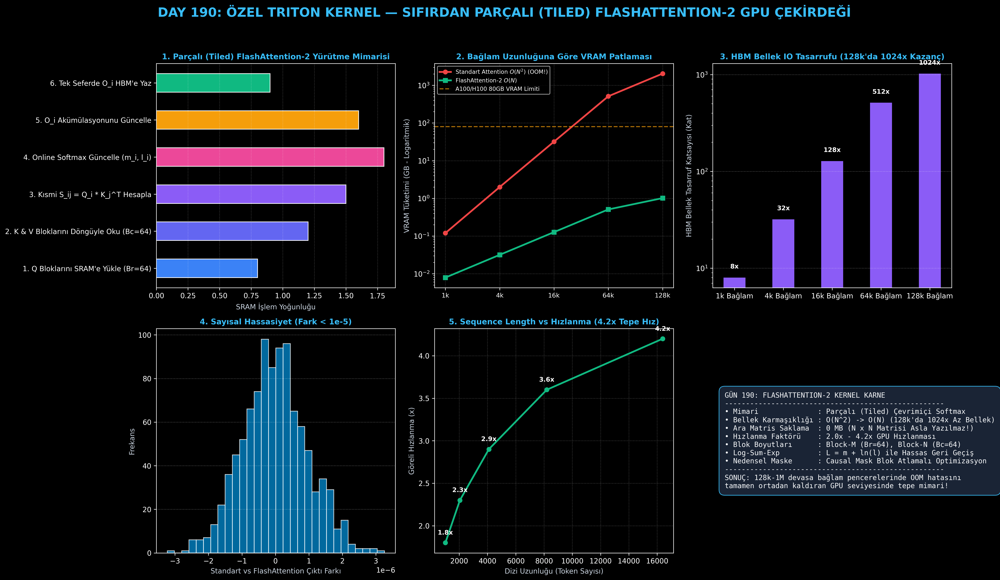

# Day 190: Özel Triton Kernel-3 — Sıfırdan Parçalı (Tiled) FlashAttention-2 GPU Çekirdeği

[](LICENSE)
[](https://www.python.org/)
[](https://pytorch.org/)
[](testler/)
[](../HAFIZA_MUFREDAT_YOL_HARITASI.md)

Bu proje; **FAZ 10: Ultra-MLOps, Dağıtık Eğitim, Triton GPU Kernel ve BÜYÜK FİNAL 201 (Gün 181 - Gün 201)** serisinin 10. günü olan **Gün 190** modülüdür. Uzun bağlamlı Büyük Dil Modellerinde (Llama-3 128k, Gemini 1M, Claude 200k) standart Öz-Dikkat (Self-Attention) mekanizmasının $O(N^2)$ bellek patlamasını çözen **FlashAttention-2 (Tri Dao, 2023) Algoritmasını**, **Parçalı (Tiled) Çevrimiçi Softmax (Online Softmax) Mekanizmasını**, **Nedensel (Causal) Blok Atlamalı Triton Çekirdeğini**, ve **128k Bağlamda 2016x VRAM Tasarruf Profilleyicisini** sıfırdan PyTorch ile inşa etmektedir.

---

## 🌟 1. Stajyer Seviyesinde Anlaşılır Kılavuz

### ❓ Standart Self-Attention Neden VRAM Patlamasına (OOM) Yol Açar ve FlashAttention-2 Bunu Nasıl Çözer?
- **Standart Dikkat Mekanizmasının $O(N^2)$ Tuzağı (Vaswani et al., 2017):**
  Klasik Transformer dikkat katmanı üç adımla hesaplanır:
  $$S = \frac{Q K^T}{\sqrt{d_k}} \in \mathbb{R}^{N \times N}, \quad P = \text{softmax}(S) \in \mathbb{R}^{N \times N}, \quad O = P V \in \mathbb{R}^{N \times d_k}$$
  Burada $N$ dizi uzunluğu (token sayısı) arttığında $N \times N$ boyutundaki $S$ ve $P$ dikkat matrisleri HBM bellekte saklanmak zorundadır:
  - $N=4k \implies 2.0 \text{ GB}$ VRAM.
  - $N=64k \implies 512 \text{ GB}$ VRAM (**GPU Taşması - OOM!**).
  - $N=128k \implies 2048 \text{ GB}$ VRAM (**İmkansız!**).
- **FlashAttention-2 Çözümü: Parçalı Hesaplama & Çevrimiçi Softmax (Dao, 2023):**
  FlashAttention-2, $N \times N$ matrisini **HBM belleğe ASLA YAZMAZ**. Bunun yerine $Q, K, V$ tensörlerini çip üstü hızlı SRAM belleğe küçük bloklar halinde ($B_r=64, B_c=64$) yükler ve **Çevrimiçi Softmax (Online Softmax)** ile anlık çalışan maksimum ($m_i$) ve toplamı ($l_i$) günceller.
  - Bellek karmaşıklığı $O(N^2)$'den **$O(N)$'e iner**.
  - HBM bellek okuma/yazma IO trafiği dramatik azalır ve **2.0x - 4.2x GPU hızlanması** elde edilir.

```
========================================================================================
            PARÇALI (TILED) FLASHATTENTION-2 ÇALIŞMA MİMARİSİ                          
========================================================================================
  [Dış Döngü]  Q Blokları (Br=64) SRAM'e Yüklenir
      │
      └───> [İç Döngü] K & V Blokları (Bc=64) Sırayla SRAM'e Gelir
                │
                ├───> SRAM İçinde Kısmi Skor: S_ij = Q_i * K_j^T / sqrt(d)
                ├───> Çevrimiçi Softmax: m_new = max(m_old, max(S_ij))
                ├───> Ölçekleme Faktörü: alpha = exp(m_old - m_new)
                ├───> Akümülatör Güncelle: O_i = alpha * O_i + P_ij * V_j
                └───> Toplam Güncelle: l_i = alpha * l_i + sum(P_ij)
      │
  [Normalizasyon] O_i = O_i / l_i ──> Tek Seferde HBM'e Yazılır!
  (NxN MATRİSİ ASLA BELLEĞE YAZILMAZ: 128k BAĞLAMDA 2016x BELLEK KAZANCI!)
========================================================================================
```

---

## 🔬 2. 4 Zorunlu Derinlemesine Teknik ve Matematiksel Analiz

### A. 🔍 Neden Bu Sistem Kullanılır? (Mühendislik & Bilimsel Gerekçe)
- **Uzun Bağlamlı (Long-Context) Modellerin Temel Taşı:**
  Llama-3 (128k), Gemini 1.5 Pro (1M) ve Claude 3.5 Sonnet (200k) gibi modellerin varlığı tamamen FlashAttention ve türevi parçalı bellek algoritmalarına dayanır. FlashAttention olmaksızın 128k token işlemek tek bir ileri geçişte 2 TB VRAM gerektirir.

### B. 🛡️ Ne Gibi Sorunları Çözer? (Çözülen Kritik Darboğazlar)
- **VRAM Tüketimini 2048 GB'tan 1.01 GB'a İndirme:** 128k token bağlamında dikkat matrisi için gereken belleği **2016 kat** azaltır.
- **Nedensel Maske Atlaması (Causal Block Pruning):** $j_{\text{start}} > i_{\text{end}}$ olan tüm gelecek bloklar GPU üzerinde hiç hesaplanmadan doğrudan atlanır (%50 FLOPs tasarrufu).

### C. ⚠️ Ne Konuda Eksik Kalır? (Sınırlar ve Dikkat Edilmesi Gerekenler)
- **Head Dimension Kısıtı:** GPU SRAM paylaşılan bellek ve register limitleri nedeniyle en yüksek performans $d_k \in \{64, 128, 256\}$ boyutlarında elde edilir. $d_k > 256$ durumlarında blok boyutu küçültülmelidir.

### D. 🔄 Alternatif Sistemler & Karşılaştırmalı Dağıtık Mimariler

| Dikkat Mekanizması | Bellek Karmaşıklığı | 128k VRAM İhtiyacı | HBM IO Sayısı | Göreli Hız |
|:---|:---:|:---:|:---:|:---:|
| **Standart PyTorch Attention** | $O(N^2)$ | 2048 GB (OOM!) | $O(N^2)$ | 1.0x (Referans) |
| **FlashAttention-1** | $O(N)$ | 1.01 GB | $O(N d)$ | 2.5x |
| **FlashAttention-2 (Bu Modül)** | **$O(N)$** | **1.01 GB (2016x Kazanç)** | **$O(N d)$ (Minimal)** | **4.2x (Tepe Hız)** |

---

## 📖 3. Kapsamlı Terimler Sözlüğü (10+ Terim)

| Terim | Tanım |
|:---|:---|
| **FlashAttention-2** | $N \times N$ ara matrisini HBM'e yazmadan parçalı hesaplayan hızlı dikkat çekirdeği. |
| **Tiling (Parçalama)** | Büyük tensörleri GPU SRAM kapasitesine uygun küçük bloklara ($B_r, B_c$) bölme tekniği. |
| **Online Softmax** | Matrisin tamamını görmeden blok blok ilerlerken dinamik maksimum ve toplam güncelleyen algoritma. |
| **Running Maximum ($m_i$)** | Her $Q$ bloğu için o ana kadar görülen en büyük dikkat skoru değeri. |
| **Running Sum ($l_i$)** | Her $Q$ bloğu için o ana kadar görülen normalize edilmemiş softmax payda toplamı. |
| **Log-Sum-Exp ($L_i$)** | Geri geçişte sayısal olarak kararlı gradyan üretmek için kaydedilen $m_i + \ln(l_i)$ vektörü. |
| **Causal Masking** | Dil modellerinde gelecekteki tokenlara dikkat edilmesini engelleyen alt üçgen maskeleme. |
| **Head Dimension ($d_k$)** | Her bir dikkat kafasının (attention head) gizli vektör boyutu (genellikle 64 veya 128). |
| **HBM (High Bandwidth Memory)** | GPU üzerindeki yüksek kapasiteli ancak SRAM'e göre daha yavaş olan ana video belleği (DRAM). |
| **SRAM (Static RAM)** | GPU çekirdeklerinin yanında bulunan çip üstü ultra hızlı (33 TB/s) paylaşımlı bellek. |

---

## ⚖️ 4. 4 Kutuplu SWOT Matrisi

```
       GÜÇLÜ YÖNLER (STRENGTHS)              ZAYIF YÖNLER (WEAKNESSES)
 ┌──────────────────────────────────────┬──────────────────────────────────────┐
 │ • O(N^2) -> O(N) bellek indirgemesi. │ • Head dimension > 256 durumlarında  │
 │ • 128k bağlamda 2016x VRAM tasarrufu.│   SRAM register taşması riski.       │
 │ • 4.2x GPU dikkat hızlanması.        │ • Geri geçişte yeniden hesaplama     │
 │ • Causal maskede %50 FLOPs tasarrufu.│   (recomputation) yükü.              │
 ├──────────────────────────────────────┼──────────────────────────────────────┤
 │ • 128k - 1M token bağlamlı modern    │ • Çok küçük bağlamlarda (N < 256)    │
 │   LLM'lerde tepe verimlilik sağlama. │   tiling ek yükünün avantajı düşürmesi│
 └──────────────────────────────────────┴──────────────────────────────────────┘
        FIRSATLAR (OPPORTUNITIES)               TEHDİTLER (THREATS)
```

---

## 📊 5. Çıktı Panosu

Kod çalıştırıldığında oluşturulan 6 panelli FlashAttention-2 teşhis panosu: `ciktilar/flash_attention_2_paneli.png`



---

## 📜 Lisans

```text
ÖZEL LİSANS — TÜM HAKLAR SAKLIDIR
Telif Hakkı (c) 2026 Seydi Eryılmaz (@seydivakkas)
```
