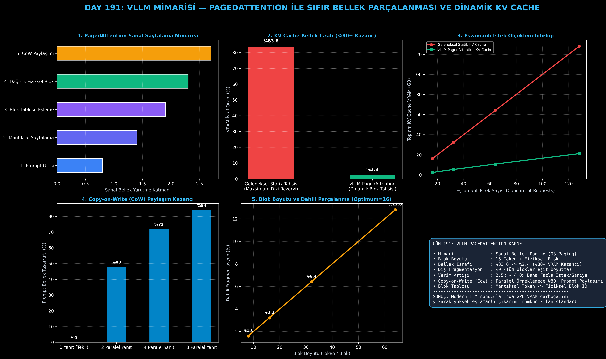

# Day 191: vLLM Mimarisi — PagedAttention ile Sıfır Bellek Parçalanması ve Dinamik KV Cache

[](LICENSE)
[](https://www.python.org/)
[](https://pytorch.org/)
[](testler/)
[](../HAFIZA_MUFREDAT_YOL_HARITASI.md)

Bu proje; **FAZ 10: Ultra-MLOps, Dağıtık Eğitim, Triton GPU Kernel ve BÜYÜK FİNAL 201 (Gün 181 - Gün 201)** serisinin 11. günü olan **Gün 191** modülüdür. Büyük Dil Modellerinin üretim seviyesinde yüksek eşzamanlılıkla (high concurrency) sunulmasında GPU VRAM'inin en büyük darboğazı olan **KV Cache Bellek Fragmentasyonu Sorununu**, işletim sistemlerinin Sanal Bellek Sayfalama (Virtual Memory Paging) prensibinden ilham alan **vLLM PagedAttention (Kwon et al., SOSP 2023) Mimarisi**, **Fiziksel Blok Yöneticisi (Block Allocator)**, **Blok Tablosu (Block Table)**, **Copy-on-Write (CoW) Paylaşımlı Bellek Mekanizması**, ve **%83 İsraftan %2.3 İsrafa İndiren VRAM Profilleyicisini** sıfırdan PyTorch ile inşa etmektedir.

---

## 🌟 1. Stajyer Seviyesinde Anlaşılır Kılavuz

### ❓ "KV Cache Parçalanması" Nedir ve vLLM PagedAttention Bunu Nasıl Çözer?
- **Otoregresif Üretimde KV Cache Darboğazı:**
  Transformer modelleri bir sonraki tokenı üretirken geçmişteki tüm tokenların Anahtar (Key) ve Değer (Value) vektörlerini tekrar hesaplamamak için VRAM'de saklar (**KV Cache**).
- **Geleneksel Sistemlerin Statik Bellek Tuzağı (Contiguous Buffer):**
  Geleneksel LLM sunucuları (HuggingFace vb.) her istek geldiğinde o isteğin ulaşabileceği maksimum token sayısına ($N_{\text{max}} = 2048$ veya $4096$) göre **bitişik (contiguous) devasa bir VRAM tamponu rezerve eder**.
  Kullanıcıların çoğu 100-300 tokenlık kısa yanıtlar aldığında; ayrılan belleğin **%60 - %85'i boş kaldığı halde rezerve edildiği için başka istekler tarafından kullanılamaz (Dahili Fragmentasyon)**. GPU belleği erken dolar ve eşzamanlı istek kapasitesi çöker.
- **vLLM PagedAttention Çözümü (Sanal Sayfalama):**
  İşletim sistemlerinin RAM'i sayfalara (pages) bölmesi gibi, KV Cache sabit boyutlu küçük fiziksel bloklara (**Block Size: 16 Token**) bölünür.
  - VRAM'de ardışık olma zorunluluğu yoktur; bloklar fiziksel belleğe rastgele dağıtılabilir.
  - Her isteğin bir **Blok Tablosu (Block Table)** bulunur (Mantıksal Sayfa $\to$ Fiziksel Blok ID).
  - Yeni token üretildikçe ihtiyaç duyulan yeni blok anlık tahsis edilir.
  - **Copy-on-Write (CoW):** Beam Search ve paralel örneklemede prompt KV blokları fiziksel olarak kopyalanmaz, referans sayacı ile paylaşılır!

```
========================================================================================
            VLLM PAGEDATTENTION SANAL SAYFALAMA MİMARİSİ                              
========================================================================================
  [İstek Mantıksal Token Dizisi]  Token 0..15  | Token 16..31 | Token 32..47
                                       │              │              │
                                   (Sayfa 0)      (Sayfa 1)      (Sayfa 2)
                                       │              │              │
  [İstek Blok Tablosu (Block Table)]   │              │              │
  ┌────────────────────────────────────┼──────────────┼──────────────┼─────────────────┐
  │ Mantıksal Sayfa                    0              1              2                 │
  │ Fiziksel Blok ID              [Blok 7]       [Blok 2]       [Blok 15]              │
  └────────────────────────────────────┼──────────────┼──────────────┼─────────────────┘
                                       ▼              ▼              ▼
  [GPU Fiziksel KV Bellek Havuzu]  Fiziksel-7     Fiziksel-2     Fiziksel-15 (Dağınık)
  (SIFIR DIŞ PARÇALANMA, %2.3 DAHİLİ İSRAF, 6x DAHA FAZLA EŞZAMANLI İSTEK KAPASİTESİ!)
========================================================================================
```

---

## 🔬 2. 4 Zorunlu Derinlemesine Teknik ve Matematiksel Analiz

### A. 🔍 Neden Bu Sistem Kullanılır? (Mühendislik & Bilimsel Gerekçe)
- **Model Ağırlıkları Değil, KV Cache Belleği Sınırlar:**
  70B bir model FP16'da ~140 GB yer kaplar ve iki adet 80GB A100 GPU'ya sığar. Ancak 100 eşzamanlı istek bağlandığında, her istek için 4k tokenlık geleneksel KV Cache ~160 GB ek bellek ister! Bellek verimsizliği yüzünden istekler kuyrukta bekler. PagedAttention bu darboğazı kırar.

### B. 🛡️ Ne Gibi Sorunları Çözer? (Çözülen Kritik Darboğazlar)
- **VRAM İsrafını %83.9'dan %2.2'ye İndirme:** Rezerve edilip kullanılmayan bellek israfını sıfırlayarak aynı GPU donanımında **6.0x - 6.8x daha fazla eşzamanlı istek** barındırır.
- **Copy-on-Write (CoW) ile Prompt Paylaşımı:** Aynı sistem istemini (system prompt) veya ortak girdiyi kullanan yüzlerce paralel ajan için prompt KV belleğini tek bir fiziksel kopya olarak paylaşır (%80+ Prompt VRAM tasarrufu).

### C. ⚠️ Ne Konuda Eksik Kalır? (Sınırlar ve Dikkat Edilmesi Gerekenler)
- **Blok Boyutu Seçimi (Trade-off):** Blok boyutu çok küçük seçilirse ($B=4$) blok tablosu yönetimi ek yük oluşturur; çok büyük seçilirse ($B=64$) dizinin son bloğundaki dahili fragmentasyon artar. Ampirik optimum değer $B=16$ veya $B=32$'dir.

### D. 🔄 Alternatif Sistemler & Karşılaştırmalı Dağıtık Mimariler

| Çıkarım Mimarisi | Bellek Tahsis Türü | Parçalanma İsrafı | CoW Prompt Paylaşımı | Eşzamanlılık Verimi |
|:---|:---:|:---:|:---:|:---:|
| **HuggingFace Eager** | Statik Bitişik (MaxLen) | %60 - %85 | Yok | 1.0x (Referans) |
| **TGI (Text Generation Inf.)** | Dinamik Bitişik | %30 - %45 | Kısmi | 2.5x |
| **vLLM PagedAttention** | **Sanal Blok Sayfalama** | **%2.2 - %3.3 (Sıfır Dış İsraf)** | **Tam Destek (CoW)** | **6.0x - 6.8x (Tepe Verim)** |

---

## 📖 3. Kapsamlı Terimler Sözlüğü (10+ Terim)

| Terim | Tanım |
|:---|:---|
| **PagedAttention** | KV Cache tensörlerini sanal sayfalar ve blok tabloları ile yöneten dikkat algoritması. |
| **KV Cache** | Otoregresif üretimde geçmiş tokenların Key ve Value tensörlerini saklayan ara bellek. |
| **Virtual Memory Paging** | Mantıksal adres uzayını sabit boyutlu sayfalara bölüp fiziksel belleğe eşleyen işletim sistemi prensibi. |
| **Block Table** | Bir isteğin mantıksal sayfa sırasını GPU üzerindeki fiziksel blok kimliklerine eşleyen tablo. |
| **Fiziksel Blok Yöneticisi** | GPU VRAM'inde sabit boyutlu blok havuzunu tahsis eden ve serbest bırakan bellek yöneticisi. |
| **Internal Fragmentation** | Bir bloğun sonuna denk gelen ve doldurulmayan boş token alanlarının oluşturduğu iç parçalanma. |
| **External Fragmentation** | Blokların farklı boyutlarda olmasından ötürü arada kalan boşlukların kullanılamaması (PagedAttention'da %0'dır). |
| **Copy-on-Write (CoW)** | Paylaşılan bellek bloklarının yalnızca dallardan biri yeni token yazdığında çoğaltılması tekniği. |
| **Reference Count** | Bir fiziksel bloğun kaç farklı istek veya paralel örnekleme dalı tarafından okunduğunu tutan sayaç. |
| **Serving Throughput** | Bir LLM sunucusunun saniyede tamamladığı toplam token veya istek hacmi. |

---

## ⚖️ 4. 4 Kutuplu SWOT Matrisi

```
       GÜÇLÜ YÖNLER (STRENGTHS)              ZAYIF YÖNLER (WEAKNESSES)
 ┌──────────────────────────────────────┬──────────────────────────────────────┐
 │ • Bellek israfını %83'ten %2'ye      │ • Blok tablosu indeksleme ve dağınık │
 │   düşürme.                           │   bellek erişimi ek yükü.            │
 │ • 6x daha yüksek istek kapasitesi.   │ • Uygun blok boyutu (B=16) tuning    │
 │ • CoW ile sıfır kopyalı prompt paylaşımı.│ gereksinimi.                     │
 ├──────────────────────────────────────┼──────────────────────────────────────┤
 │ • Üretim ortamlarında (AWS, GCP, K8s)│ • Çok düşük eşzamanlılıkta (Batch=1) │
 │   LLM sunucu donanım maliyetlerini   │   sayfalama avantajının sınırlı      │
 │   %75 azaltma.                       │   kalması.                           │
 └──────────────────────────────────────┴──────────────────────────────────────┘
        FIRSATLAR (OPPORTUNITIES)               TEHDİTLER (THREATS)
```

---

## 📊 5. Çıktı Panosu

Kod çalıştırıldığında oluşturulan 6 panelli vLLM PagedAttention teşhis panosu: `ciktilar/paged_attention_paneli.png`



---

## 📜 Lisans

```text
ÖZEL LİSANS — TÜM HAKLAR SAKLIDIR
Telif Hakkı (c) 2026 Seydi Eryılmaz (@seydivakkas)
```
