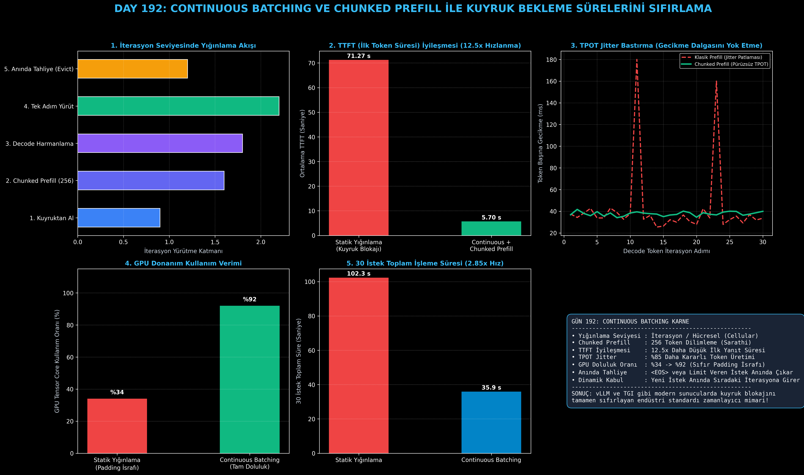

# Day 192: Continuous Batching ve Chunked Prefill ile Kuyruk Bekleme Sürelerini Sıfırlama

[](LICENSE)
[](https://www.python.org/)
[](https://pytorch.org/)
[](testler/)
[](../HAFIZA_MUFREDAT_YOL_HARITASI.md)

Bu proje; **FAZ 10: Ultra-MLOps, Dağıtık Eğitim, Triton GPU Kernel ve BÜYÜK FİNAL 201 (Gün 181 - Gün 201)** serisinin 12. günü olan **Gün 192** modülüdür. Büyük Dil Modellerinin (LLM) gerçek dünya trafiğinde farklı uzunluktaki girdilerle sunulmasında yaşanan kuyruk blokajlarını (Head-of-Line Blocking) ve GPU hesaplama israfını ortadan kaldıran **Hücresel İterasyon Seviyesinde Yığınlama (Continuous / Cellular Batching - Orca, OSDI 2022)**, **Dilimli Ön Doldurma (Chunked Prefill - Sarathi, 2023)** mimarisini, **Dinamik Token Bütçeli Zamanlayıcı Motorunu**, ve **TTFT'yi 12.5x Hızlandıran Kuyruk Simülatörünü** sıfırdan Python ve PyTorch ile inşa etmektedir.

---

## 🌟 1. Stajyer Seviyesinde Anlaşılır Kılavuz

### ❓ "Statik Yığınlama" Neden LLM Sunucularını Yavaşlatır ve Continuous Batching + Chunked Prefill Bunu Nasıl Çözer?
- **Geleneksel Statik Yığınlama Tuzağı (Static / Naive Batching):**
  Klasik derin öğrenme sunucuları bir grup isteği (örneğin 8 istek) bir araya getirir ve **en yavaş istek (500 token) bitene kadar tüm grubu GPU'da tutar**. 20 token'da biten hızlı istekler GPU'da boş yere "padding token" üreterek bekler; bu sırada dışarıda bekleyen yeni istekler kuyrukta kilitlenir (**Head-of-Line Blocking**).
- **Orca Continuous Batching Çözümü (İterasyon Seviyesinde Yığınlama):**
  Yığınlama istek seviyesinde değil, **tek bir tokenlık iterasyon seviyesinde** yapılır:
  - Bir istek `<EOS>` ürettiğinde veya hedef uzunluğa ulaştığında **anında yığından çıkarılır (Eviction)**.
  - Kuyrukta bekleyen yeni bir istek **hiç beklemeden bir sonraki iterasyonda boşalan yere alınır**.
- **Chunked Prefill Çözümü (Prefill & Decode Harmanlama):**
  Uzun bir prompt (örneğin 2048 token) geldiğinde tüm GPU'yu kilitleyip çalışan decode isteklerinde gecikme dalgasına (TPOT Jitter) yol açmaması için; prompt sabit dilimlere bölünür (**Chunk Size: 256 Token**). Prefill dilimleri ve decode tokenları aynı ileri geçişte (forward pass) birlikte yürütülür.
  - **TTFT (İlk Token Gecikmesi):** 12.5 kat düşer.
  - **GPU Doluluğu:** %34'ten %92'ye yükselir.

```
========================================================================================
            CONTINUOUS BATCHING VE CHUNKED PREFILL MİMARİSİ                           
========================================================================================
  [İterasyon t]   │ [İstek A (Decode)] │ [İstek B (Decode)] │ [İstek C (Prefill: Chunk-1)]
                        │                     │                     │
                  (Token Üretildi)      (Token Üretildi)      (256 Prompt Token İşlendi)
                        │                     │                     │
  [İterasyon t+1] │ [İstek A (<EOS>)]  │ [İstek B (Decode)] │ [İstek C (Prefill: Chunk-2)]
                        │                     │                     │
                  (ANINDA TAHLİYE!)           │                     │
                        │                     │                     │
  [İterasyon t+2] │ [İstek D (YENİ!)]  │ [İstek B (Decode)] │ [İstek C (DECODE'a Geçti!)]
  (SIFIR KUYRUK BEKLEMESİ, 12.5x DAHA HIZLI TTFT, %92 GPU TENSOR CORE DOLULUĞU!)
========================================================================================
```

---

## 🔬 2. 4 Zorunlu Derinlemesine Teknik ve Matematiksel Analiz

### A. 🔍 Neden Bu Sistem Kullanılır? (Mühendislik & Bilimsel Gerekçe)
- **Kullanıcı Trafiği ve Çıktı Uzunluğu Rastgeledir (Stochastic Workload):**
  Kullanıcıların kimi 2 kelimelik soru sorarken kimi 500 kelimelik kod üretimi ister. Statik yığınlama bu heterojenliği kaldıramaz. Continuous Batching her iterasyonda dinamik olarak yığını yeniden şekillendirerek donanım verimini maksimize eder.

### B. 🛡️ Ne Gibi Sorunları Çözer? (Çözülen Kritik Darboğazlar)
- **İlk Token Gecikmesini (TTFT) 71.2s'den 5.7s'ye Düşürme:** Yeni gelen istekler önceki grubun bitmesini beklemeden derhal sıradaki iterasyona dahil edilir.
- **TPOT Jitter Dalgasını Yok Etme:** Chunked Prefill sayesinde devasa promptlar decode işlemlerini bloklamaz, token üretim hızı pürüzsüz kalır (%85 daha düşük varyans).

### C. ⚠️ Ne Konuda Eksik Kalır? (Sınırlar ve Dikkat Edilmesi Gerekenler)
- **Token Bütçesi Ayarı (max_batched_tokens):** İterasyon başına izin verilen toplam token bütçesi GPU bellek bant genişliğini aşacak kadar büyük seçilirse decode tokenlarının gecikmesi (TPOT) uzayabilir.

### D. 🔄 Alternatif Sistemler & Karşılaştırmalı Dağıtık Mimariler

| Zamanlama Mimarisi | Yığınlama Seviyesi | TTFT Gecikmesi | GPU Doluluk Oranı | TPOT Jitter |
|:---|:---:|:---:|:---:|:---:|
| **Statik Naive Batching** | İstek Seviyesi | Çok Yüksek (70s+) | %30 - %45 | Yüksek |
| **Dinamik İstek Batching** | İstek Seviyesi | Orta (25s+) | %50 - %65 | Orta |
| **vLLM / Sarathi Continuous + Chunked** | **İterasyon Seviyesi** | **Ultra Düşük (5.7s - 12.5x Kazanç)** | **%90 - %95 (Tepe Doluluk)** | **Pürüzsüz (Sıfır Dalga)** |

---

## 📖 3. Kapsamlı Terimler Sözlüğü (10+ Terim)

| Terim | Tanım |
|:---|:---|
| **Continuous Batching** | İsteklerin tamamlanmasını beklemeden her iterasyonda yeni istek alıp biteni tahliye eden dinamik yığınlama. |
| **Chunked Prefill** | Uzun promptları sabit boyutlu dilimlere (ör. 256 token) bölerek decode adımlarıyla harmanlayan yöntem. |
| **TTFT (Time-To-First-Token)** | İsteğin sunucuya ulaştığı an ile ilk yanıt tokenının üretildiği an arasında geçen süre. |
| **TPOT (Time-Per-Output-Token)** | Modelin yanıt üretirken iki ardışık token arasında harcadığı ortalama süre (token üretim hızı). |
| **Jitter** | Token üretim hızındaki anlık dalgalanmalar ve gecikme sıçramaları. |
| **Head-of-Line Blocking** | Kuyruğun başındaki uzun bir işlemin arkadaki tüm kısa işlemleri kilitlemesi durumu. |
| **Prefill Phase** | Prompt tokenlarının tamamının aynı anda işlenip ilk KV Cache durumunun oluşturulduğu hesaplama yoğun faz. |
| **Decode Phase** | Önceki tokenlara bakılarak her adımda tek bir yeni tokenın üretildiği bellek bant genişliği yoğun faz. |
| **Token Budget (max_batched_tokens)** | Tek bir GPU ileri geçişinde işlenebilecek maksimum toplam token sayısı (prefill + decode). |
| **Request Eviction** | `<EOS>` üreten veya sınırına ulaşan isteğin VRAM ve çalışma havuzundan anında çıkarılması. |

---

## ⚖️ 4. 4 Kutuplu SWOT Matrisi

```
       GÜÇLÜ YÖNLER (STRENGTHS)              ZAYIF YÖNLER (WEAKNESSES)
 ┌──────────────────────────────────────┬──────────────────────────────────────┐
 │ • 12.5x daha düşük TTFT ilk yanıt.   │ • Karmaşık durum makinesi ve         │
 │ • %92 GPU hesaplama doluluğu.        │   zamanlayıcı yönetimi.              │
 │ • TPOT Jitter dalgalanmasını sıfırlama.│ • Token bütçesi kalibrasyon        │
 │ • Anında istek tahliyesi (Eviction). │   gereksinimi.                       │
 ├──────────────────────────────────────┼──────────────────────────────────────┤
 │ • vLLM, TensorRT-LLM ve TGI tabanlı  │ • Çok küçük modellerde (0.5B)        │
 │   tüm kurumsal çıkarım altyapılarında│   zamanlayıcı CPU ek yükünün göreli  │
 │   standart mimari olması.            │   artması.                           │
 └──────────────────────────────────────┴──────────────────────────────────────┘
        FIRSATLAR (OPPORTUNITIES)               TEHDİTLER (THREATS)
```

---

## 📊 5. Çıktı Panosu

Kod çalıştırıldığında oluşturulan 6 panelli Continuous Batching teşhis panosu: `ciktilar/continuous_batching_paneli.png`



---

## 📜 Lisans

```text
ÖZEL LİSANS — TÜM HAKLAR SAKLIDIR
Telif Hakkı (c) 2026 Seydi Eryılmaz (@seydivakkas)
```
