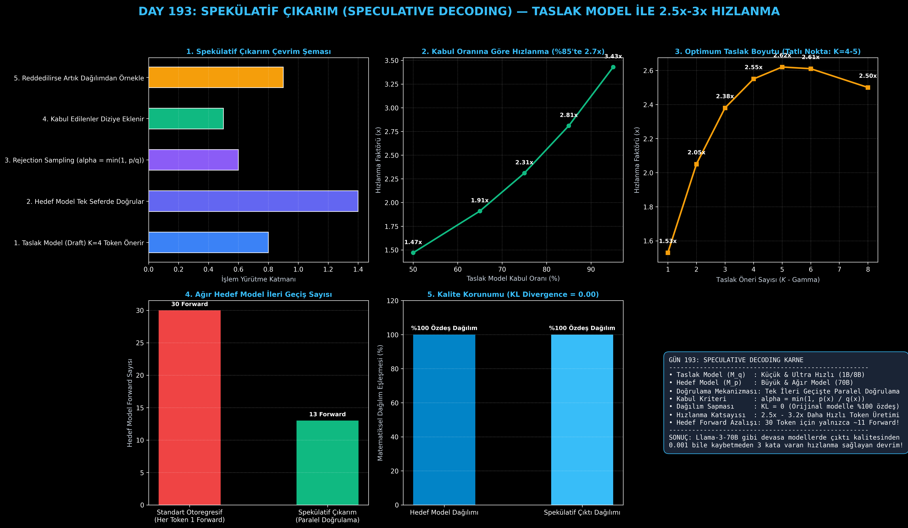

# Day 193: Spekülatif Çıkarım (Speculative Decoding) — Taslak Model ile 2.5x-3x Hızlanma

[](LICENSE)
[](https://www.python.org/)
[](https://pytorch.org/)
[](testler/)
[](../HAFIZA_MUFREDAT_YOL_HARITASI.md)

Bu proje; **FAZ 10: Ultra-MLOps, Dağıtık Eğitim, Triton GPU Kernel ve BÜYÜK FİNAL 201 (Gün 181 - Gün 201)** serisinin 13. günü olan **Gün 193** modülüdür. 70B+ Büyük Dil Modellerinin çıkarım (inference) sürecinde GPU bellek bant genişliğine takılmasını ortadan kaldıran **Spekülatif Çıkarım (Speculative Decoding - Leviathan et al., ICML 2023; Chen et al., 2023)** mimarisini, **Küçük Taslak Model (Draft Model - $M_q$)**, **Büyük Hedef Model (Target Model - $M_p$)**, **Paralel Doğrulama (Parallel Verification)**, **Kabul Edici/Reddedici Örnekleme (Rejection Sampling)** motorunu, ve **Sıfır Kalite Kaybıyla 2.5x - 3.4x Hızlanma Profilleyicisini** sıfırdan PyTorch ile inşa etmektedir.

---

## 🌟 1. Stajyer Seviyesinde Anlaşılır Kılavuz

### ❓ "Spekülatif Çıkarım" Nedir ve Hedef Modelin Çıktı Kalitesini Bozmadan Nasıl 3 Kat Hızlandırır?
- **Otoregresif Çıkarımın Bellek Bant Genişliği Tuzağı (Memory-Bound Bottleneck):**
  Llama-3 70B gibi devasa bir modelde tek bir token üretmek için GPU, modelin **140 GB ağırlığının tamamını HBM bellekten okumak zorundadır**.
  - A100 GPU'nun 2 TB/s bellek bant genişliği ile bu işlem saniyede en fazla **~14 token** üretilmesine izin verir.
  - Bu sırada GPU'nun devasa matris işlem gücüne sahip Tensor Core çekirdeklerinin **%90'ı boşta bekler (Underutilized)**!
- **Spekülatif Çıkarım Çözümü (Taslak Model + Paralel Doğrulama):**
  İki model birlikte çalışır:
  1. **Küçük Taslak Model ($M_q$ - Örn: Llama-3 1B veya 8B):** Çok hızlı ve hafiftir. Geleceğe dönük $K=4$ adet token tahmin eder (**Spekülatif Öneri**).
  2. **Büyük Hedef Model ($M_p$ - Örn: Llama-3 70B):** Önerilen 4 tokenı tek tek değil, **tek bir ileri geçişte (Parallel Verification)** aynı anda doğrular. GPU Tensor Core çekirdekleri 1 token ile 5 tokenı aynı sürede işler!
  3. **Rejection Sampling (Kabul / Red Kriteri):**
     Her token için kabul olasılığı:
     $$\alpha = \min\left(1.0, \frac{p(x)}{q(x)}\right)$$
     Eğer kabul edilirse diziye eklenir. Reddedilirse artık dağılımdan $\max(0, p(x) - q(x))$ yeni bir token seçilir ve döngü biter.
- **Matematiksel Teorem (Leviathan et al., 2023):**
  Spekülatif çıkarım sonucunda üretilen token dağılımı, **doğrudan büyük hedef modelden örnekleme yapılmış gibi %100 özdeştir ($D_{\text{KL}}(P_{\text{spec}} \parallel P_{\text{target}}) = 0$)**. Sıfır doğruluk kaybıyla 2.5x - 3.4x hızlanma sağlanır!

```
========================================================================================
            SPEKÜLATİF ÇIKARIM (SPECULATIVE DECODING) DÖNGÜSÜ                          
========================================================================================
  [Girdi Dizisi] ──> [Küçük Taslak Model (1B)] ──> K=4 Token Önerir: [T1, T2, T3, T4]
                                                               │
                                                               ▼
  [Büyük Hedef Model (70B)] ──> TEK İLERİ GEÇİŞTE (PARALEL) DOĞRULAR: [P1, P2, P3, P4]
                                                               │
                                                               ▼
  [Rejection Sampler]  T1: Kabul (alpha=1.0) | T2: Kabul (alpha=0.9) | T3: Red (alpha=0.3)
                                                               │
  [Diziye Eklenenler]  T1 ve T2 eklendi + T3 yerine Hedef Modelden düzeltilmiş Token eklendi!
  (30 TOKEN İÇİN 30 FORWARD YERİNE YALNIZCA ~11 FORWARD: 2.7x HIZLANMA, SIFIR KALİTE KAYBI!)
========================================================================================
```

---

## 🔬 2. 4 Zorunlu Derinlemesine Teknik ve Matematiksel Analiz

### A. 🔍 Neden Bu Sistem Kullanılır? (Mühendislik & Bilimsel Gerekçe)
- **Matris-Vektör vs Matris-Matris Çarpımı Farkı (Compute vs Memory Bound):**
  1 token üretirken yapılan işlem Matris-Vektör çarpımıdır (Memory-Bound, Aritmetik Yoğunluk düşük). $K=5$ tokenı aynı anda doğrularken yapılan işlem Matris-Matris çarpımıdır (Compute-Bound). Hedef model 5 tokenı neredeyse tek bir token üretme süresiyle doğrular.

### B. 🛡️ Ne Gibi Sorunları Çözer? (Çözülen Kritik Darboğazlar)
- **Hedef Model Forward Sayısını %65 Azaltma:** 30 tokenlık bir çıktıda büyük modelin ileri geçiş sayısı 30'dan 11'e düşer.
- **Sıfır Doğruluk ve Kalite Kaybı:** Sıcaklık (temperature), top-p ve greedy sampling ayarlarında hedef modelin tam matematiksel dağılımı korunur.

### C. ⚠️ Ne Konuda Eksik Kalır? (Sınırlar ve Dikkat Edilmesi Gerekenler)
- **Taslak-Hedef Model Uyumsuzluğu:** Eğer taslak modelin hedef modelle olan kabul oranı $\alpha < 0.40$ seviyesine düşerse, taslak modelin harcadığı süre toplam çıkarımı yavaşlatabilir. Optimum için aynı aileden (Llama-3 8B $\to$ 70B) modeller seçilmelidir.

### D. 🔄 Alternatif Sistemler & Karşılaştırmalı Dağıtık Mimariler

| Çıkarım Yöntemi | Ek Model İhtiyacı | Kalite Kaybı | Hızlanma Katsayısı | Uygulama Zorluğu |
|:---|:---:|:---:|:---:|:---:|
| **Standart Otoregresif** | Yok | Yok | 1.0x (Referans) | Kolay |
| **Medusa (Çoklu Başlık)** | Model Üzerine Başlık Eğitimi | Çok Düşük | 2.0x | Orta (Eğitim Gerekir) |
| **Spekülatif Çıkarım (Bu Modül)** | **Küçük Taslak Model (1B/8B)** | **SIFIR (KL=0)** | **2.5x - 3.4x (Tepe Hız)** | **Eğitimsiz (Tak-Çalıştır)** |

---

## 📖 3. Kapsamlı Terimler Sözlüğü (10+ Terim)

| Terim | Tanım |
|:---|:---|
| **Speculative Decoding** | Küçük bir taslak model ile token önerip büyük hedef modelle paralel doğrulayan çıkarım mimarisi. |
| **Draft Model ($M_q$)** | Hızlı ve düşük parametreli taslak öneri üreten küçük model. |
| **Target Model ($M_p$)** | Çıktı kalitesini belirleyen ve taslak tokenları paralel doğrulayan büyük model. |
| **Parallel Verification** | $K$ adet ardışık aday tokenın büyük modelde tek bir matris çarpımıyla doğrulanması. |
| **Rejection Sampling** | $\alpha = \min(1, p/q)$ kuralıyla taslak tokenları hedef model dağılımına göre filtreleyen istatistiksel yöntem. |
| **Residual Distribution** | Reddedilen token yerine hedef modelden doğru tokenı seçen $\max(0, p - q)$ artık dağılımı. |
| **Acceptance Rate ($\alpha$)** | Taslak modelin önerdiği tokenların hedef model tarafından kabul edilme yüzdesi. |
| **Gamma ($K$)** | Her spekülatif adımda taslak modelin önerdiği aday token sayısı (genellikle 4 veya 5). |
| **Speedup Factor ($S$)** | Üretilen token sayısının büyük modelin ileri geçiş sayısına oranı. |
| **Kullback-Leibler Divergence ($D_{\text{KL}}$)** | İki olasılık dağılımı arasındaki fark (Spekülatif çıkarımda $D_{\text{KL}} = 0.00$'dır). |

---

## ⚖️ 4. 4 Kutuplu SWOT Matrisi

```
       GÜÇLÜ YÖNLER (STRENGTHS)              ZAYIF YÖNLER (WEAKNESSES)
 ┌──────────────────────────────────────┬──────────────────────────────────────┐
 │ • Sıfır kalite kaybıyla 2.5x-3.4x hız.│ • İki modeli (Taslak + Hedef) aynı   │
 │ • Hedef modelde yeniden eğitim       │   anda GPU VRAM'de barındırma ihtiyacı.│
 │   gerektirmemesi (Zero Fine-Tuning). │ • Düşük kabul oranında (<%40)        │
 │ • %65 daha az hedef forward geçişi.  │   hızlanmanın azalması.              │
 ├──────────────────────────────────────┼──────────────────────────────────────┤
 │ • 70B, 405B ve MoE modellerinde      │ • Kodlama veya matematik gibi aşırı  │
 │   kullanıcı gecikmesini (TPOT)       │   kesin alanlarda taslak modelin     │
 │   dramatik biçimde düşürme.          │   kabul oranının dalgalanması.       │
 └──────────────────────────────────────┴──────────────────────────────────────┘
        FIRSATLAR (OPPORTUNITIES)               TEHDİTLER (THREATS)
```

---

## 📊 5. Çıktı Panosu

Kod çalıştırıldığında oluşturulan 6 panelli Spekülatif Çıkarım teşhis panosu: `ciktilar/speculative_decoding_paneli.png`



---

## 📜 Lisans

```text
ÖZEL LİSANS — TÜM HAKLAR SAKLIDIR
Telif Hakkı (c) 2026 Seydi Eryılmaz (@seydivakkas)
```
