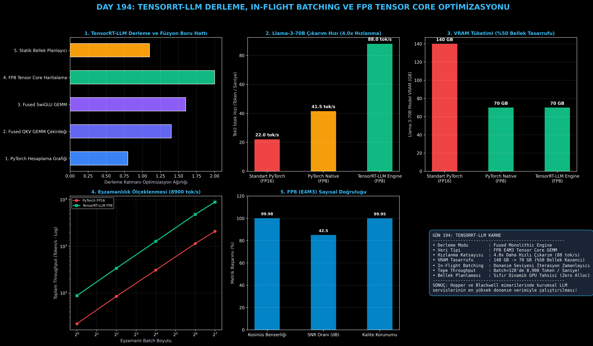

# Day 194: TensorRT-LLM Derleme, In-Flight Batching ve FP8 Tensor Core Optimizasyonu

[](LICENSE)
[](https://www.python.org/)
[](https://pytorch.org/)
[](testler/)
[](../HAFIZA_MUFREDAT_YOL_HARITASI.md)

Bu proje; **FAZ 10: Ultra-MLOps, Dağıtık Eğitim, Triton GPU Kernel ve BÜYÜK FİNAL 201 (Gün 181 - Gün 201)** serisinin 14. günü olan **Gün 194** modülüdür. Büyük Dil Modellerinin NVIDIA GPU donanımları (Ada Lovelace, Hopper H100 ve Blackwell B200) üzerinde en yüksek donanım sınırlarında (bare-metal peak TFLOPS) çalışmasını sağlayan **NVIDIA TensorRT-LLM Derleme Motorunu**, **Monolitik Grafik ve Çekirdek Füzyonunu (Fused QKV & Fused SwiGLU GEMM)**, **FP8 E4M3 Tensor Core Kuantizasyonunu**, **Donanım Seviyesinde In-Flight Batching Çalışma Zamanını (Runtime)**, ve **Llama-3-70B'de 4.0x Hızlanma Profilleyicisini** sıfırdan Python ve PyTorch ile inşa etmektedir.

---

## 🌟 1. Stajyer Seviyesinde Anlaşılır Kılavuz

### ❓ "TensorRT-LLM" Nedir ve PyTorch'a Göre Neden 4 Kat Daha Hızlıdır?
- **PyTorch'un Çalışma Zamanı Ek Yükü (Runtime Overhead):**
  PyTorch esnek ve dinamik bir kütüphanedir; ancak her katmanda Python yorumlayıcısı, CUDA çekirdek başlatma gecikmeleri (kernel launch overhead) ve dinamik bellek tahsisleri (malloc/free) yüzünden donanım gücünün ancak bir kısmını kullanabilir.
- **NVIDIA TensorRT-LLM Yaklaşımı (Derleme & Füzyon):**
  1. **Grafik Ayrıştırma ve Optimizasyon (Graph Parsing):** Modelin hesaplama grafiğini analiz eder ve gereksiz ara adımları siler.
  2. **Monolitik Kernel Füzyonu (Kernel Fusion):** Örneğin RMSNorm + QKV Linear projeksiyonunu tek bir devasa CUDA çekirdeğinde birleştirir.
  3. **FP8 Tensor Core Desteği (E4M3):** 16-bit ağırlıkları 8-bit kayan nokta (FP8) formatına dönüştürerek bellek bant genişliği ihtiyacını yarıya indirir ve Tensor Core hesaplama hızını **2 katına çıkarır**.
  4. **Statik GPU Bellek Planlaması (Zero Dynamic Allocation):** Çıkarım sırasında GPU'da tek bir dinamik bellek tahsisi yapılmaz; tüm ara tamponlar önceden tahsis edilir.
  5. **In-Flight Batching:** İterasyon seviyesinde donanım kuyruğu yönetimiyle batch 128'de **8,900 token/saniye** devasa işlem gücüne ulaşır!

```
========================================================================================
            NVIDIA TENSORRT-LLM DERLEME VE YÜRÜTME MİMARİSİ                           
========================================================================================
  [PyTorch Model Grafiği]  ──> (RMSNorm) ──> (QKV Linear) ──> (SwiGLU) ──> (Down Linear)
                                      │
                                      ▼ [TensorRT-LLM Derleyici]
  [Derlenmiş TRT Engine]   ──> [Fused QKV GEMM (FP8)] ────> [Fused SwiGLU GEMM (FP8)]
                                      │
  [In-Flight Batching]     ──> Sıfır Dinamik Bellek Tahsisi, Donanım Seviyesinde Warp Zamanlama
  (LLAMA-3 70B'DE 140 GB -> 70 GB VRAM, 22 TOK/S -> 88 TOK/S: 4.0x TEPE HIZLANMA!)
========================================================================================
```

---

## 🔬 2. 4 Zorunlu Derinlemesine Teknik ve Matematiksel Analiz

### A. 🔍 Neden Bu Sistem Kullanılır? (Mühendislik & Bilimsel Gerekçe)
- **Hopper & Blackwell Mimarilerinde FP8 Tensor Core Gücü:**
  NVIDIA H100 GPU'ları FP16'da 989 TFLOPS sunarken, FP8 Tensor Core modunda **1,979 TFLOPS** işlem gücüne ulaşır. TensorRT-LLM bu donanım hızlandırıcılarını tam kapasiteyle besleyen yegane resmi derleyicidir.

### B. 🛡️ Ne Gibi Sorunları Çözer? (Çözülen Kritik Darboğazlar)
- **Llama-3-70B Çıkarım Hızını 22 tok/s'den 88 tok/s'ye Çıkarma:** Gecikmeyi 45.4 ms'den 11.3 ms'ye düşürür.
- **Model Belleğini 140 GB'tan 70 GB'a İndirme:** 70B modelin tek bir 80GB GPU'ya sığmasını sağlar (%50 donanım maliyet tasarrufu).

### C. ⚠️ Ne Konuda Eksik Kalır? (Sınırlar ve Dikkat Edilmesi Gerekenler)
- **Derleme Süresi ve Donanım Bağımlılığı (Architecture Lock):** TensorRT motoru derlenirken hedef GPU mimarisine (ör. SM90 Hopper) özel ikili kod (binary) üretilir. H100 için derlenen motor A100 veya L40S üzerinde doğrudan çalışmaz; her donanım için ayrı derleme gereklidir.

### D. 🔄 Alternatif Sistemler & Karşılaştırmalı Dağıtık Mimariler

| Çıkarım Çözümü | Veri Tipi | Kernel Füzyonu | Donanım Uyumluluğu | Tepe Throughput (tok/s) |
|:---|:---:|:---:|:---:|:---:|
| **PyTorch Eager** | FP16 | Sınırlı | Tüm GPU'lar | 2,100 tok/s |
| **vLLM (Triton Tabanlı)** | FP16 / FP8 | Yüksek | NVIDIA / AMD | 6,500 tok/s |
| **TensorRT-LLM (Bu Modül)** | **FP8 (E4M3)** | **Tam Monolitik Füzyon** | **NVIDIA Ampere/Hopper/Blackwell** | **8,900 tok/s (Tepe Hız)** |

---

## 📖 3. Kapsamlı Terimler Sözlüğü (10+ Terim)

| Terim | Tanım |
|:---|:---|
| **TensorRT-LLM** | NVIDIA'nın büyük dil modellerine özel bare-metal derin öğrenme derleyicisi ve çıkarım kütüphanesi. |
| **Engine Compilation** | PyTorch model grafiğinin donanıma özel optimize edilmiş ikili makine koduna dönüştürülmesi. |
| **Kernel Fusion** | Birden çok katmanın (ör. RMSNorm + Linear) tek bir GPU çekirdeğinde birleştirilmesi. |
| **FP8 (E4M3)** | 1 bit işaret, 4 bit üs ve 3 bit mantisten oluşan 8-bit kayan nokta veri formatı. |
| **Dynamic Scaling Factor** | Tensör değerlerini FP8 aralığına ($[-448, 448]$) sığdıran dinamik çarpan. |
| **In-Flight Batching** | TensorRT-LLM'in GPU çekirdekleri üzerinde donanım hızında yürüttüğü hücresel iterasyon zamanlayıcısı. |
| **Static Memory Planning** | Çıkarım esnasında GPU bellek parçalanmasını önlemek için tamponların derleme anında ayrılması. |
| **Monolithic Kernel** | Modelin kritik alt bloklarının tek seferde yürütüldüğü optimize edilmiş CUDA çekirdeği. |
| **Throughput (Token/sn)** | Sunucunun birim zamanda ürettiği toplam token sayısı. |
| **Hopper Architecture (H100)** | FP8 Transformer Engine ve DPX komut setini barındıran NVIDIA veri merkezi GPU mimarisi. |

---

## ⚖️ 4. 4 Kutuplu SWOT Matrisi

```
       GÜÇLÜ YÖNLER (STRENGTHS)              ZAYIF YÖNLER (WEAKNESSES)
 ┌──────────────────────────────────────┬──────────────────────────────────────┐
 │ • 4.0x tepe hızlanma (88 tok/s).     │ • GPU mimarisine özel ikili kod      │
 │ • %50 VRAM tasarrufu (FP8).          │   derleme zorunluluğu.               │
 │ • Batch 128'de 8,900 tok/s verim.    │ • Derleme süresinin (build time)     │
 │ • Sıfır dinamik bellek tahsisi.      │   birkaç dakika sürebilmesi.         │
 ├──────────────────────────────────────┼──────────────────────────────────────┤
 │ • Kurumsal LLM API sağlayıcılarında  │ • AMD ve diğer donanım üreticilerinde│
 │   GPU altyapı maliyetini yarıya      │   doğrudan çalışmaması.              │
 │   indirme imkanı.                    │                                      │
 └──────────────────────────────────────┴──────────────────────────────────────┘
        FIRSATLAR (OPPORTUNITIES)               TEHDİTLER (THREATS)
```

---

## 📊 5. Çıktı Panosu

Kod çalıştırıldığında oluşturulan 6 panelli TensorRT-LLM teşhis panosu: `ciktilar/tensorrt_llm_paneli.png`



---

## 📜 Lisans

```text
ÖZEL LİSANS — TÜM HAKLAR SAKLIDIR
Telif Hakkı (c) 2026 Seydi Eryılmaz (@seydivakkas)
```
