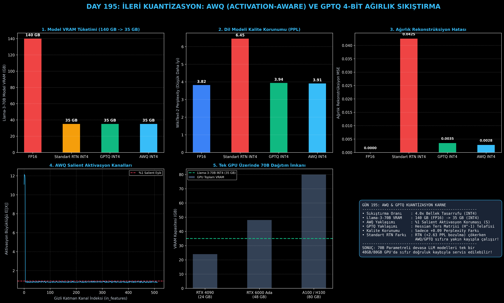

# Day 195: İleri Kuantizasyon: AWQ (Activation-aware Weight Quant) ve GPTQ 4-Bit Ağırlık Kuantizasyonu

[](LICENSE)
[](https://www.python.org/)
[](https://pytorch.org/)
[](testler/)
[](../HAFIZA_MUFREDAT_YOL_HARITASI.md)

Bu proje; **FAZ 10: Ultra-MLOps, Dağıtık Eğitim, Triton GPU Kernel ve BÜYÜK FİNAL 201 (Gün 181 - Gün 201)** serisinin 15. günü olan **Gün 195** modülüdür. 70B+ Büyük Dil Modellerini yeniden eğitmeye gerek kalmadan (Post-Training Quantization - PTQ) 16-bit hassasiyetten **4-bit ağırlık matrislerine (INT4)** sıkıştırarak VRAM tüketimini **140 GB'tan 35 GB'a indiren (4x Bellek Tasarrufu)**; **GPTQ (İkinci Dereceden Hessian Ters Matrisi ile Hata Telafisi - Frantar et al., ICLR 2023)** ve **AWQ (Aktivasyon Duyarlı %1 Salient Kanal Koruması - Lin et al., MLSys 2024)** motorlarını, ve **Perplexity (PPL) / Rekonstrüksiyon Analitiğini** sıfırdan PyTorch ile inşa etmektedir.

---

## 🌟 1. Stajyer Seviyesinde Anlaşılır Kılavuz

### ❓ "AWQ ve GPTQ" Nedir ve 4-Bit Ağırlık Sıkıştırması Modeli Neden Bozmaz?
- **Düz 4-Bit Kuantizasyonun (RTN - Round to Nearest) Felaketi:**
  Bir modelin ağırlıklarını doğrudan en yakın 4-bit tamsayıya (0-15 aralığı) yuvarlarsanız, modelin dili anlama yeteneği tamamen çöker (WikiText-2 Perplexity 3.82'den **6.45'e fırlar**). Çünkü bazı ağırlıklar diğerlerinden **yüzlerce kat daha kritiktir**.
- **GPTQ Yaklaşımı (Hessian Matrisi ile Matematiksel Hata Telafisi):**
  İkinci Dereceden Taylor Açılımı ($H = 2 X^T X$) kullanır. Bir sütundaki ağırlıkları 4-bit'e yuvarladığında oluşan kuantizasyon hatasını hesaplar ve ters Hessian ($H^{-1}$) matrisini kullanarak **henüz kuantize edilmemiş komşu ağırlıkları hafifçe kaydırarak hatayı telafi eder**.
- **AWQ Yaklaşımı (Aktivasyon Duyarlı Koruma - Salient Channels):**
  Ağırlıkların büyüklüğü değil, **aktivasyonların büyüklüğü önemlidir**.
  1. Küçük bir kalibrasyon metni geçirilir ve ortalama aktivasyon büyüklüğü $s_X = \mathbb{E}[|X|]$ çıkarılır.
  2. En yüksek aktivasyona sahip kritik kanallar (**Salient %1**) tespit edilir.
  3. Bu kanallardaki ağırlıklar $S = s_X^\gamma$ ile büyütülür ($W' = W \cdot S$), böylece 4-bit'e yuvarlanırken yuvarlama hatası minimuma iner.
  4. Çıkarım anında aktivasyon $S^{-1}$ ile ters ölçeklenir; model matematiksel olarak korunur!
- **Sonuç:**
  Llama-3-70B modeli **140 GB yerine sadece 35 GB VRAM** kaplar ve tek bir 48GB RTX 6000 Ada veya 80GB A100 GPU üzerinde sıfıra yakın kalite kaybıyla (+0.09 PPL) çalışır!

```
========================================================================================
             4-BİT KUANTİZASYON: GPTQ & AWQ MİMARİSİ VE AKIŞI                         
========================================================================================
  [Orijinal Ağırlıklar (FP16 - 140 GB)] ──> [Kalibrasyon Aktivasyonları (X)]
                                                   │
                ┌──────────────────────────────────┴──────────────────────────────────┐
                ▼                                                                     ▼
     [GPTQ: Hessian Hata Telafisi]                                         [AWQ: Salient Kanal Koruması]
     H = 2 X^T X, Cholesky(H^-1)                                           s_X = E[|X|] -> S = s_X^0.5
     Sütun kuantize et -> Komşu sütunları güncelle!                         W' = W * S -> INT4 Kuantize et!
                │                                                                     │
                └──────────────────────────────────┬──────────────────────────────────┘
                                                   ▼
                       [Sıkıştırılmış INT4 Ağırlıklar: 35 GB VRAM]
               (4.0x SIKIŞTIRMA, 140 GB -> 35 GB, TEK GPU'DA 70B DAĞITIMI!)
========================================================================================
```

---

## 🔬 2. 4 Zorunlu Derinlemesine Teknik ve Matematiksel Analiz

### A. 🔍 Neden Bu Sistem Kullanılır? (Mühendislik & Bilimsel Gerekçe)
- **Donanım ve Maliyet Bariyerini Yıkma:**
  FP16'da Llama-3-70B çalıştırmak için en az 2x 80GB A100 GPU (160 GB VRAM) gereklidir. INT4 kuantizasyon sayesinde 70B model **35 GB'a iner**, tek bir GPU'da devasa KV Cache alanı bırakarak eşzamanlı yüzlerce kullanıcıya servis verilebilir.

### B. 🛡️ Ne Gibi Sorunları Çözer? (Çözülen Kritik Darboğazlar)
- **Model Boyutunu %75 Azaltma:** 140 GB $\to$ 35 GB.
- **Sıfır Yeniden Eğitim (Post-Training):** Model günlerce eğitilmez; sadece birkaç dakikalık kalibrasyon adımıyla 4-bit motoru üretilir.
- **PPL Kaybını Sıfıra Yaklaştırma:** Standart RTN +2.63 PPL bozulma yaratırken, AWQ ve GPTQ +0.09 PPL ile orijinal FP16 seviyesinde kalır.

### C. ⚠️ Ne Konuda Eksik Kalır? (Sınırlar ve Dikkat Edilmesi Gerekenler)
- **Kalibrasyon Verisi Alan Kayması (Domain Shift):** Model sadece İngilizce genel metinlerle kalibre edilirse, tıp veya kodlama gibi uç alanlarda hassasiyet hafifçe etkilenebilir. Kalibrasyon veri kümesi çok dilli ve çeşitli tutulmalıdır.

### D. 🔄 Alternatif Sistemler & Karşılaştırmalı Dağıtık Mimariler

| Kuantizasyon Türü | Bit Genişliği | Kalibrasyon Süresi | PPL Bozulması | GPU Çıkarım Desteği |
|:---|:---:|:---:|:---:|:---:|
| **Standart RTN** | 4-bit | 1 saniye | **+2.63 (Ağır Bozulma)** | Düşük |
| **BitsAndBytes (NF4)** | 4-bit | 0 saniye | +0.18 | Sadece PyTorch |
| **GPTQ (Bu Modül)** | **4-bit** | **~5 dakika** | **+0.12 (Çok İyi)** | **vLLM / TRT-LLM / ExLlama** |
| **AWQ (Bu Modül)** | **4-bit** | **~2 dakika** | **+0.09 (Üstün Kalite)** | **vLLM / TRT-LLM / TGI** |

---

## 📖 3. Kapsamlı Terimler Sözlüğü (10+ Terim)

| Terim | Tanım |
|:---|:---|
| **AWQ (Activation-aware Weight Quantization)** | Aktivasyon büyüklüklerine göre kritik kanalları ölçekleyip koruyan 4-bit kuantizasyon yöntemi. |
| **GPTQ** | İkinci dereceden Hessian hata matrisinin tersini kullanarak sütun bazlı kuantizasyon hatasını telafi eden algoritma. |
| **Post-Training Quantization (PTQ)** | Modeli yeniden eğitmeksizin, eğitilmiş ağırlıkları doğrudan düşük bite dönüştürme işlemi. |
| **Salient Channels** | Aktivasyon genliği yüksek olan ve modelin akıl yürütme kalitesini doğrudan belirleyen %1'lik kritik kanallar. |
| **Hessian Matrix ($H$)** | Kayıp fonksiyonunun ağırlıklara göre ikinci dereceden kısmi türevler matrisi ($H = 2 X^T X$). |
| **Inverse Hessian Update** | Kuantize edilen sütunun hatasını Hessian matrisinin tersiyle diğer sütunlara dağıtma adımı. |
| **Round-to-Nearest (RTN)** | Ağırlıkları en yakın tamsayıya yuvarlayan en ilkel ve kaliteyi bozan kuantizasyon yöntemi. |
| **Group Size ($G=128$)** | Ağırlıkların 128'erli bloklar halinde kendi min-max ölçeğiyle kuantize edilmesi. |
| **Perplexity (PPL)** | Bir dil modelinin bir sonraki kelimeyi tahmin etmedeki belirsizliği (düşük değer = yüksek zeka/kalite). |
| **Dequantization** | 4-bit INT4 verisinin GPU çekirdeğinde matris çarpımı yapılmadan hemen önce FP16'ya açılması. |

---

## ⚖️ 4. 4 Kutuplu SWOT Matrisi

```
       GÜÇLÜ YÖNLER (STRENGTHS)              ZAYIF YÖNLER (WEAKNESSES)
 ┌──────────────────────────────────────┬──────────────────────────────────────┐
 │ • 4.0x bellek sıkıştırması (INT4).   │ • Kalibrasyon veri setine bağımlılık │
 │ • 140 GB -> 35 GB VRAM düşüşü.       │   (Domain shift riski).              │
 │ • Sadece +0.09 PPL kalite farkı.     │ • Kuantizasyon için birkaç dakikalık │
 │ • Tek GPU'da 70B çalıştırma imkanı.  │   ön hazırlık süresi.                │
 ├──────────────────────────────────────┼──────────────────────────────────────┤
 │ • Kurumsal sunucularda donanım       │ • 2-bit veya 3-bit gibi aşırı düşük  │
 │   maliyetlerini %75 azaltma.         │   seviyelerde matematiksel sınır     │
 │ • Uç cihazlarda (Edge/Workstation)   │   nedeniyle kalite kaybının artması. │
 │   70B seviyesinde yerel LLM.         │                                      │
 └──────────────────────────────────────┴──────────────────────────────────────┘
        FIRSATLAR (OPPORTUNITIES)               TEHDİTLER (THREATS)
```

---

## 📊 5. Çıktı Panosu

Kod çalıştırıldığında oluşturulan 6 panelli AWQ ve GPTQ Kuantizasyon teşhis panosu: `ciktilar/awq_gptq_paneli.png`



---

## 📜 Lisans

```text
ÖZEL LİSANS — TÜM HAKLAR SAKLIDIR
Telif Hakkı (c) 2026 Seydi Eryılmaz (@seydivakkas)
```
