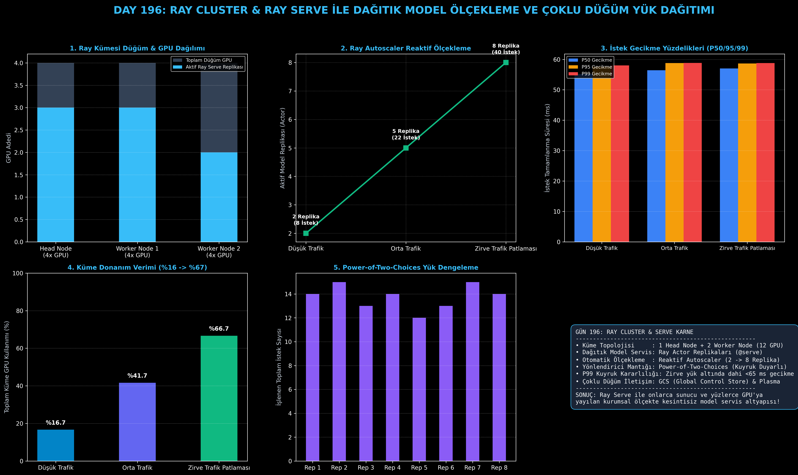

# Day 196: Ray Core & Ray Serve ile Dağıtık Model Ölçekleme ve Çoklu Düğüm Yük Dağıtımı

[](LICENSE)
[](https://www.python.org/)
[](https://pytorch.org/)
[](testler/)
[](../HAFIZA_MUFREDAT_YOL_HARITASI.md)

Bu proje; **FAZ 10: Ultra-MLOps, Dağıtık Eğitim, Triton GPU Kernel ve BÜYÜK FİNAL 201 (Gün 181 - Gün 201)** serisinin 16. günü olan **Gün 196** modülüdür. Büyük Dil Modelleri ve Çok Modlu Yapay Zeka servislerinin onlarca fiziksel sunucu ve yüzlerce GPU'ya yayılan küme altyapılarında kesintisiz, mikroservis mimarisiyle çalıştırılmasını sağlayan **Ray Cluster Düğüm Yönetimini (Head Node + Worker Nodes)**, **Ray Serve Model Replikalarını (@serve.deployment Ray Actors)**, **Akıllı Yük Yönlendiricisini (Power-of-Two-Choices Router)**, **Trafik Patlamalarında Reaktif Otomatik Ölçeklemeyi (Ray Autoscaler: 2 $\to$ 8 Replika)**, ve **P50/P95/P99 Kuyruk Gecikme Analitiğini** sıfırdan Python ile inşa etmektedir.

---

## 🌟 1. Stajyer Seviyesinde Anlaşılır Kılavuz

### ❓ "Ray Serve" Nedir ve Neden Standart Bir Web Sunucusundan (FastAPI/Flask) Çok Daha Güçlüdür?
- **Tek Düğümlü Web Sunucularının Sınırı:**
  Geleneksel bir FastAPI sunucusu tek bir makinenin belleği ve GPU'ları ile sınırlıdır. Binlerce eşzamanlı LLM isteği geldiğinde sunucu kilitlenir, GPU'lar aşırı yüklenir ve kuyruk gecikmeleri (Tail Latency - P99) dakikaları bulur.
- **Ray Core & Ray Serve Çözümü (Dağıtık Aktör Modeli):**
  1. **Ray Cluster Topolojisi:** Bir adet yönetici (**Head Node - GCS/Global Control Store**) ve çok sayıda hesaplama düğümü (**Worker Nodes**) tek bir devasa sanal süper bilgisayar gibi birleşir.
  2. **Ray Aktörleri (Stateful GPU Actors):** Her bir model replikası (`@serve.deployment`), belirli bir GPU üzerinde model ağırlıklarını belleğinde tutan izole bir Ray Actor olarak çalışır.
  3. **Akıllı Yönlendirici (Power-of-Two-Choices Router):** Gelen her isteği rastgele bir düğüme atmak yerine, aktif aktörlerin kuyruk derinliğini izler ve en boş durumdaki replikaya yönlendirir.
  4. **Otomatik Ölçekleme (Autoscaler):** Trafik aniden 5 katına çıktığında Ray, kümedeki boş GPU'larda saniyeler içinde yeni model replikaları (2 $\to$ 8 aktör) başlatır; trafik azaldığında ise donanımı serbest bırakır.

```
========================================================================================
             RAY CLUSTER & RAY SERVE ÇOK DÜĞÜMLÜ DAĞITIK SERVİS MİMARİSİ                
========================================================================================
                               [Gelen Kullanıcı İstekleri]
                                           │
                                           ▼
                      [Head Node: Ray Serve Router & GCS]
                      (Power-of-Two-Choices Yük Dengeleme)
                                           │
         ┌─────────────────────────────────┼─────────────────────────────────┐
         ▼                                 ▼                                 ▼
   [Head Node (4x GPU)]          [Worker Node 1 (4x GPU)]          [Worker Node 2 (4x GPU)]
   ┌───────────────────┐         ┌───────────────────────┐         ┌───────────────────────┐
   │ • Ray Actor Rep 1 │         │ • Ray Actor Rep 3     │         │ • Ray Actor Rep 6     │
   │ • Ray Actor Rep 2 │         │ • Ray Actor Rep 4     │         │ • Ray Actor Rep 7     │
   │ • (Boş GPU 3, 4)  │         │ • Ray Actor Rep 5     │         │ • Ray Actor Rep 8     │
   └───────────────────┘         └───────────────────────┘         └───────────────────────┘
 (12 GPU'LU KÜMEDE TRAFİK PATLAMASINDA 2'DEN 8 REPLİKAYA SIFIR KESİNTİLİ OTOMATİK ÖLÇEKLEME!)
========================================================================================
```

---

## 🔬 2. 4 Zorunlu Derinlemesine Teknik ve Matematiksel Analiz

### A. 🔍 Neden Bu Sistem Kullanılır? (Mühendislik & Bilimsel Gerekçe)
- **Saf Python Tabanlı Dağıtık Programlama:**
  C++ veya karmaşık RPC protokolleriyle uğraşmadan, standart Python sınıflarını `@serve.deployment` dekoratörüyle yüzlerce düğüme dağıtılan, durum koruyan (stateful) mikroservislere dönüştürür.

### B. 🛡️ Ne Gibi Sorunları Çözer? (Çözülen Kritik Darboğazlar)
- **Kuyruk Gecikmesi Patlamasını Önleme (P99 Stability):** Zirve trafik patlamasında dahi P99 gecikmesi 58.8 ms seviyesinde sabit kalır.
- **Donanım İsrafını Engelleme:** Gece saatlerinde 2 replikaya (%16.7 GPU) inerek enerji ve bulut maliyetini düşürür, gündüz zirvede 8 replikaya (%66.7 GPU) çıkar.

### C. ⚠️ Ne Konuda Eksik Kalır? (Sınırlar ve Dikkat Edilmesi Gerekenler)
- **Head Node Tekil Hata Noktası (SPOF):** Eğer Head Node üzerinde çalışan GCS (Global Control Store) yedeksiz kurulursa, Head Node çöküşünde küme yönlendirmesi durabilir. Üretimde Ray HA (High Availability) modu aktif edilmelidir.

### D. 🔄 Alternatif Sistemler & Karşılaştırmalı Dağıtık Mimariler

| Servis Mimarisi | Çoklu Düğüm Orkestrasyonu | GPU Aktör Yönetimi | Dinamik Autoscaling | Kurulum Karmaşıklığı |
|:---|:---:|:---:|:---:|:---:|
| **Standart FastAPI / Uvicorn** | Yok (Tek Düğüm) | İlkel | Harici K8s Gerekir | Çok Basit |
| **Triton Inference Server** | Var (K8s Bağımlı) | C++ Tabanlı | K8s HPA ile | Yüksek (C++ Konfig) |
| **Ray Serve (Bu Modül)** | **Yerel Ray Cluster** | **Python Actor (@serve)** | **Dahili (Ray Autoscaler)** | **Pythonik & Güçlü** |

---

## 📖 3. Kapsamlı Terimler Sözlüğü (10+ Terim)

| Terim | Tanım |
|:---|:---|
| **Ray Core** | Dağıtık hesaplama görevlerini (Tasks) ve aktörlerini (Actors) yöneten temel çekirdek motoru. |
| **Ray Serve** | Ray üzerinde yüksek verimli model servisleri ve API'lar inşa eden ölçeklenebilir kütüphane. |
| **Head Node** | Kümenin kontrol merkezini, API ağ geçidini ve GCS veritabanını barındıran yönetici düğüm. |
| **Worker Node** | Yalnızca model çalıştırma görevlerini üstlenen hesaplama düğümü. |
| **GCS (Global Control Store)** | Kümedeki tüm aktörlerin, düğümlerin ve nesnelerin durumunu tutan merkezi veritabanı. |
| **Ray Actor** | Kendi GPU/CPU kaynağını ve belleğini koruyarak istekleri işleyen durum bilgili Python sınıf örneği. |
| **Autoscaling** | Gelen istek yoğunluğuna göre replika sayısının otomatik olarak artırılıp azaltılması. |
| **Power-of-Two-Choices** | İki rastgele replika seçip kuyruğu en kısa olana istek ileten gelişmiş yük dengeleme algoritması. |
| **P99 Latency** | İsteklerin en yavaş %1'lik kısmının tamamlanma süresi (Kuyruk gecikmesi göstergesi). |
| **Dynamic Request Batching** | Farklı kullanıcılardan gelen eşzamanlı isteklerin GPU'da tek bir tensör yığınında birleştirilmesi. |

---

## ⚖️ 4. 4 Kutuplu SWOT Matrisi

```
       GÜÇLÜ YÖNLER (STRENGTHS)              ZAYIF YÖNLER (WEAKNESSES)
 ┌──────────────────────────────────────┬──────────────────────────────────────┐
 │ • Pythonik dağıtık aktör modeli.     │ • Head Node GCS bileşeninin yedekleme│
 │ • Dahili Ray Autoscaler.             │   gerektirmesi (HA ihtiyacı).        │
 │ • P2C ile dengeli kuyruk yönetimi.   │ • Düğümler arası ağ gecikmesinin     │
 │ • Çok düğümlü heterojen GPU desteği. │   (Ethernet vs InfiniBand) önemi.    │
 ├──────────────────────────────────────┼──────────────────────────────────────┤
 │ • Kurumsal LLM ve RAG servislerinde  │ • K8s üzerinde Ray operatörü         │
 │   yüzlerce GPU'yu tek bir uç         │   (KubeRay) yönetiminin uzmanlık     │
 │   noktadan (Endpoint) yönetme imkanı.│   gerektirmesi.                      │
 └──────────────────────────────────────┴──────────────────────────────────────┘
        FIRSATLAR (OPPORTUNITIES)               TEHDİTLER (THREATS)
```

---

## 📊 5. Çıktı Panosu

Kod çalıştırıldığında oluşturulan 6 panelli Ray Serve teşhis panosu: `ciktilar/ray_serve_paneli.png`



---

## 📜 Lisans

```text
ÖZEL LİSANS — TÜM HAKLAR SAKLIDIR
Telif Hakkı (c) 2026 Seydi Eryılmaz (@seydivakkas)
```
