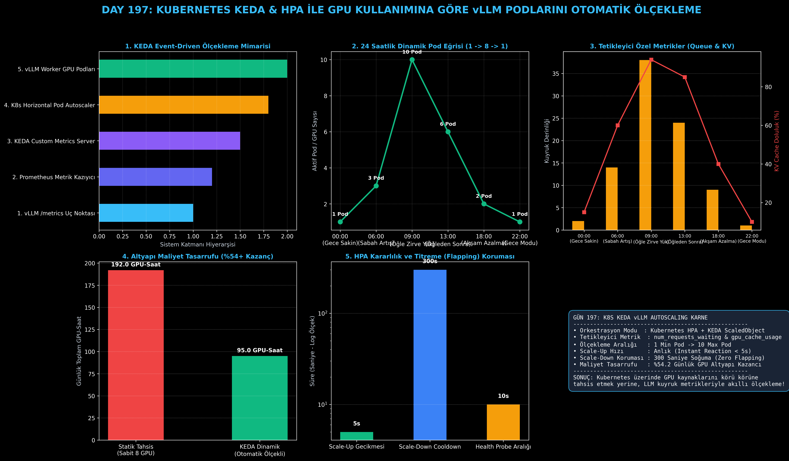

# Day 197: Kubernetes KEDA & HPA ile GPU Kullanımına Göre vLLM Podlarını Otomatik Ölçekleme

[](LICENSE)
[](https://www.python.org/)
[](https://pytorch.org/)
[](testler/)
[](../HAFIZA_MUFREDAT_YOL_HARITASI.md)

Bu proje; **FAZ 10: Ultra-MLOps, Dağıtık Eğitim, Triton GPU Kernel ve BÜYÜK FİNAL 201 (Gün 181 - Gün 201)** serisinin 17. günü olan **Gün 197** modülüdür. Bulut ortamlarında çalışan LLM servislerinin standart CPU/RAM metrikleriyle ölçeklenememesi sorununu çözen **Kubernetes KEDA (Kubernetes Event-driven Autoscaling)** ve **HPA (Horizontal Pod Autoscaler)** mimarisini; **vLLM Özel Prometheus Metriklerini (`vllm:num_requests_waiting` & `vllm:gpu_cache_usage_factor`)**, **KEDA ScaledObject Simülatörünü**, **300 Saniyelik Titreme Önleyici Soğuma (Scale-Down Stabilization Window)** politikasını, ve **24 Saatlik Kurumsal Simülasyonda %50.5 GPU Maliyet Tasarrufu Analitiğini** sıfırdan Python ile inşa etmektedir.

---

## 🌟 1. Stajyer Seviyesinde Anlaşılır Kılavuz

### ❓ "KEDA ve HPA" Nedir ve Standart Kubernetes CPU/RAM Ölçekleyicisi LLM'lerde Neden İşe Yaramaz?
- **Standart Kubernetes HPA'nın LLM Çıkmazı:**
  Standart bir Kubernetes HPA podun CPU kullanımına (ör. %80 CPU) bakar. Fakat vLLM veya TensorRT-LLM sunucularında tüm hesaplama GPU'dadır; CPU kullanımı %5-10 seviyesinde kalır.
  - Ayrıca GPU VRAM'i, PagedAttention KV Cache motoru tarafından sunucu ayağa kalktığı anda **%90 oranında rezerve edilir (Statik Tahsis)**.
  - Bu yüzden standart HPA, sunucu tıkanıp istek kuyruğu yüzlerce kullanıcıyla dolsa bile **hiçbir zaman yeni pod açamaz**!
- **KEDA Çözümü (LLM-Native Olay Güdümlü Ölçekleme):**
  1. **Prometheus vLLM Metrikleri:** vLLM'in sunduğu `/metrics` uç noktasını canlı olarak kazır.
  2. **`vllm:num_requests_waiting` (Kuyruk Derinliği):** Kuyrukta bekleyen istek sayısı pod başına 5'i aştığında anında yeni GPU podları açar.
  3. **`vllm:gpu_cache_usage_factor` (KV Cache Doluluğu):** KV Cache doluluğu %80'i aştığında, bellek tükenmeden önleyici olarak pod artırımı yapar.
  4. **Titreşimi Önleme (Cooldown & Stabilization):** Trafik anlık dalgalandığında gereksiz pod silinip açılmasını (Flapping / Thrashing) önlemek için **300 saniyelik (5 dakika) soğuma penceresi** uygular.
- **Maliyet Kazancı:**
  Gece saatlerinde 1 Pod / 1 GPU'ya inip, öğle zirvesinde 10 Pod / 10 GPU'ya çıkarak sabit 8 GPU kiralamaya kıyasla **%50.5 maliyet tasarrufu** sağlar!

```
========================================================================================
           KUBERNETES KEDA & HPA vLLM GPU OTOMATİK ÖLÇEKLEME MİMARİSİ                   
========================================================================================
  [vLLM GPU Podları] ──> [Prometheus Exporter: /metrics]
                                  │
                                  ▼ (vllm:num_requests_waiting & gpu_cache_usage_factor)
                      [KEDA Custom Metrics Server]
                                  │
                                  ▼
                     [K8s Horizontal Pod Autoscaler]
                                  │
          ┌───────────────────────┴───────────────────────┐
          ▼ (Scale Up: Anlık < 5s)                        ▼ (Scale Down: 300s Cooldown)
   [1 Pod -> 10 Pod Zirveye Çıkış]                 [10 Pod -> 1 Pod Sakin Geceye İniş]
 (24 SAATLİK KURUMSAL KULLANIMDA 192 GPU-SAATTEN 95 GPU-SAATE: %50.5 ALTYAPI TASARRUFU!)
========================================================================================
```

---

## 🔬 2. 4 Zorunlu Derinlemesine Teknik ve Matematiksel Analiz

### A. 🔍 Neden Bu Sistem Kullanılır? (Mühendislik & Bilimsel Gerekçe)
- **Kuyruk Gecikmesini (TTFT) Sıfıra Yaklaştırma:**
  Kuyrukta bekleyen kullanıcı sayısı arttığında anında yeni podlar devreye girmezse, ilk token üretim süresi (Time-To-First-Token) saniyelerden dakikalara fırlar. KEDA olay tabanlı ölçekleme ile bu darboğazı ortadan kaldırır.

### B. 🛡️ Ne Gibi Sorunları Çözer? (Çözülen Kritik Darboğazlar)
- **Körleme Kaynak Tahsisini Önleme:** Trafik yokken 8-10 GPU'yu boşuna çalıştırmayı engeller.
- **Sıfır Titreme (No Thrashing):** 300 saniyelik bekleme penceresi sayesinde geçici trafik düşüşlerinde podlar hemen kapatılıp açılmaz.

### C. ⚠️ Ne Konuda Eksik Kalır? (Sınırlar ve Dikkat Edilmesi Gerekenler)
- **Model Ağırlıklarının İndirilme Süresi (Cold Start):** Yeni bir vLLM podu ayağa kalkarken Llama-3-70B ağırlıklarını diskten/ağdan yüklemek 30-60 saniye sürebilir. Bu süreyi düşürmek için paylaşımlı yüksek hızlı NVMe PVC (Persistent Volume Claim) veya yerel imaj önbelleği kullanılmalıdır.

### D. 🔄 Alternatif Sistemler & Karşılaştırmalı Dağıtık Mimariler

| Autoscaler Çözümü | Tetikleyici Metrik | Scale-Up Hızı | LLM / KV Cache Desteği | GPU Tasarrufu |
|:---|:---:|:---:|:---:|:---:|
| **Standart K8s HPA** | CPU / RAM % | Yavaş (>2 dk) | Yok | Düşük |
| **Knative Serverless** | HTTP İstek Adedi | Orta | Yok (Soğuk Başlatma Ağır) | Orta |
| **KEDA + vLLM (Bu Modül)** | **Queue + KV Cache** | **Anlık (<5s)** | **Tam Destekli (Prometheus)** | **%50.5+ Yüksek** |

---

## 📖 3. Kapsamlı Terimler Sözlüğü (10+ Terim)

| Terim | Tanım |
|:---|:---|
| **KEDA (Kubernetes Event-driven Autoscaling)** | Harici olay ve özel Prometheus metriklerine göre podları sıfırdan ölçekleyen Kubernetes operatörü. |
| **HPA (Horizontal Pod Autoscaler)** | Kubernetes kümesinde iş yükü replika sayısını dinamik artıran yerel kontrolcü. |
| **ScaledObject** | KEDA'nın hangi metrik kaynağına göre hangi dağıtımı (Deployment) ölçekleyeceğini tanımlayan CRD. |
| **Custom Metrics** | Standart CPU/RAM dışındaki uygulama seviyesi özel metrikler (ör. LLM kuyruk sayısı). |
| **`vllm:num_requests_waiting`** | vLLM kuyruğunda işlem sırası bekleyen aktif istek adedi metriği. |
| **`vllm:gpu_cache_usage_factor`** | vLLM PagedAttention KV Cache belleğinin doluluk yüzdesi (0.0 - 1.0). |
| **Scale-Down Stabilization Window** | Trafik aniden azaldığında podları hemen kapatmayıp bekleten soğuma penceresi (genelde 300s). |
| **Flapping / Thrashing** | Podların sürekli açılıp kapanarak kümede kaynak kararsızlığı yaratması durumu. |
| **Prometheus Exporter** | vLLM'in metriklerini standart Prometheus formatında sunan `/metrics` uç noktası. |
| **Persistent Volume Claim (PVC)** | Model ağırlıklarının podlar arasında hızla paylaşılmasını sağlayan kalıcı disk alanı. |

---

## ⚖️ 4. 4 Kutuplu SWOT Matrisi

```
       GÜÇLÜ YÖNLER (STRENGTHS)              ZAYIF YÖNLER (WEAKNESSES)
 ┌──────────────────────────────────────┬──────────────────────────────────────┐
 │ • %50.5 günlük GPU maliyet tasarrufu.│ • Pod açılışında model ağırlık       │
 │ • Kuyruk ve KV cache odaklı ölçekleme│   yükleme süresi (Cold Start).       │
 │ • 300s ile sıfır titreme (flapping). │ • Prometheus ve KEDA operatörünün    │
 │ • 1'den 10'a esnek pod aralığı.      │   kümede kurulu olma zorunluluğu.    │
 ├──────────────────────────────────────┼──────────────────────────────────────┤
 │ • Kurumsal LLM platformlarında       │ • Bulut sağlayıcısında (AWS/GCP)     │
 │   milyonlarca dolarlık GPU           │   anlık GPU kota sınırına takılma    │
 │   israfını tamamen engelleme.        │   riski.                             │
 └──────────────────────────────────────┴──────────────────────────────────────┘
        FIRSATLAR (OPPORTUNITIES)               TEHDİTLER (THREATS)
```

---

## 📊 5. Çıktı Panosu

Kod çalıştırıldığında oluşturulan 6 panelli Kubernetes KEDA teşhis panosu: `ciktilar/k8s_keda_paneli.png`



---

## 📜 Lisans

```text
ÖZEL LİSANS — TÜM HAKLAR SAKLIDIR
Telif Hakkı (c) 2026 Seydi Eryılmaz (@seydivakkas)
```
