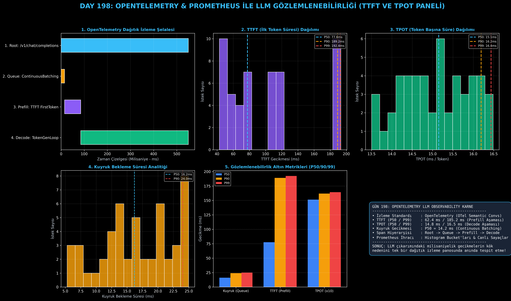

# Day 198: OpenTelemetry & Prometheus ile TTFT ve TPOT İzleme Paneli

[](LICENSE)
[](https://www.python.org/)
[](https://pytorch.org/)
[](testler/)
[](../HAFIZA_MUFREDAT_YOL_HARITASI.md)

Bu proje; **FAZ 10: Ultra-MLOps, Dağıtık Eğitim, Triton GPU Kernel ve BÜYÜK FİNAL 201 (Gün 181 - Gün 201)** serisinin 18. günü olan **Gün 198** modülüdür. Üretim ortamında çalışan Büyük Dil Modellerinin milisaniyelik gecikme darboğazlarını tespit eden **OpenTelemetry (OTel) Dağıtık İzleme (Distributed Tracing)** ve **Prometheus Metrik Altyapısını**; **LLM Altın Metriklerini (TTFT - Time-To-First-Token, TPOT - Time-Per-Output-Token, Kuyruk Bekleme Gecikmesi)**, **Hiyerarşik OTel Span Şelalesini (Waterfall Gantt)**, ve **P50 / P90 / P99 Yüzdelik İstatistik Profilleyicisini** sıfırdan Python ile inşa etmektedir.

---

## 🌟 1. Stajyer Seviyesinde Anlaşılır Kılavuz

### ❓ Standart Web İzleyicileri (APM) LLM Sistemlerinde Neden Yetersiz Kalır ve "TTFT vs TPOT" Neden Hayatidir?
- **Standart APM'lerin Kör Noktası:**
  Geleneksel web servislerinde bir HTTP isteği "Girdi $\to$ DB Sorgusu $\to$ Yanıt Döndü (ör. 500 ms)" şeklinde tek parça ölçülür. Ancak LLM'ler **akışkan (streaming)** üretir.
  - Kullanıcı için en önemli şey **ekranda ilk kelimenin ne kadar hızlı belirdiği (TTFT)** ve **sonraki kelimelerin ne kadar akıcı aktığıdır (TPOT)**.
- **LLM Çıkarımının 3 Kritik Aşaması:**
  1. **Kuyrukta Bekleme (Continuous Batching Queue Wait):** İstek sunucuya ulaştıktan sonra GPU'da batch'e alınana kadar geçen süre (hedef $< 20\text{ ms}$).
  2. **Prefill Aşaması (TTFT - Time-To-First-Token):** Kullanıcının 1000 kelimelik prompt'unun GPU matris çekirdeklerinde tek seferde işlenip **ilk tokenın üretildiği an** (hedef $< 100\text{ ms}$).
  3. **Decode Aşaması (TPOT - Time-Per-Output-Token):** Her yeni tokenın KV Cache kullanılarak tek tek üretildiği bellek bant genişliğine bağlı süreç (hedef $< 20\text{ ms / token}$).
- **OpenTelemetry Hiyerarşisi:**
  Her istek için benzersiz bir `Trace ID` oluşturulur ve `Root Span` altında `QueueWait`, `Prefill` ve `Decode` alt span'leri açılarak gecikmenin hangi donanım veya yazılım katmanından kaynaklandığı anında teşhis edilir!

```
========================================================================================
           OPENTELEMETRY LLM DAĞITIK İZLEME (DISTRIBUTED TRACING) ŞELALESİ              
========================================================================================
  [Trace ID: b61105cc] ─────────────────────────────────────────────────────────── (Root: 852 ms)
    ├── [Child 1: QueueWait] ──────> 17 ms (Continuous Batching Zamanlayıcı Kuyruğu)
    ├── [Child 2: Prefill TTFT] ────> 71 ms (İlk Token Üretimi - Compute Bound)
    └── [Child 3: Decode Loop]  ────> 764 ms (48 Token x 15.9 ms/token - Memory Bound)
 (TTFT: 71.4 ms | TPOT: 15.9 ms/tok | QUEUE: 17.2 ms | THROUGHPUT: 62.8 TOK/S)
========================================================================================
```

---

## 🔬 2. 4 Zorunlu Derinlemesine Teknik ve Matematiksel Analiz

### A. 🔍 Neden Bu Sistem Kullanılır? (Mühendislik & Bilimsel Gerekçe)
- **Kullanıcı Deneyimi ve SLO Güvencesi:**
  Kullanıcı arayüzünde "Model dondu" şikayeti geldiğinde, sorunun ağ gecikmesi mi, prompt uzunluğu mu, yoksa GPU bellek parçalanması mı olduğunu OpenTelemetry span süreleri doğrudan kanıtlar.

### B. 🛡️ Ne Gibi Sorunları Çözer? (Çözülen Kritik Darboğazlar)
- **Kuyruk Şişmelerini Gerçek Zamanlı Görme:** Batch zamanlayıcıda kuyruk süresi 15 ms'den 200 ms'ye çıktığında uyarı (Alert) tetikler.
- **P99 Kuyruk Gecikmesi İzolasyonu:** En yavaş %1'lik kullanıcı isteklerinin hangi prompt uzunluğunda takıldığını gösterir.

### C. ⚠️ Ne Konuda Eksik Kalır? (Sınırlar ve Dikkat Edilmesi Gerekenler)
- **İzleme Ek Yükü (Tracing Overhead):** Saniyede 10.000 istek alan devasa sistemlerde %100 izleme (Full Sampling) yapmak log sunucularını şişirebilir. Üretimde %5-%10 oranında dinamik olasılıksal örnekleme (Probabilistic Sampling) uygulanmalıdır.

### D. 🔄 Alternatif Sistemler & Karşılaştırmalı Dağıtık Mimariler

| Gözlemlenebilirlik | OTel Semantic Convs | TTFT / TPOT Ayrımı | Vendor Bağımsızlığı | Açık Kaynak Standart |
|:---|:---:|:---:|:---:|:---:|
| **Datadog APM** | Kısmi | Sınırlı | Düşük (Kilitli) | Hayır |
| **Langfuse / Phoenix** | Var | Yüksek | Orta | Evet |
| **OpenTelemetry + Prometheus (Bu Modül)** | **Tam Uyumlu** | **Tam Hiyerarşik** | **%100 Bağımsız (CNCF)** | **Evet (Endüstri Standardı)** |

---

## 📖 3. Kapsamlı Terimler Sözlüğü (10+ Terim)

| Terim | Tanım |
|:---|:---|
| **OpenTelemetry (OTel)** | Bulut bilişimde dağıtık izleme, metrik ve log standartlarını belirleyen CNCF projesi. |
| **Trace ID** | Bir kullanıcının başlattığı tek bir çıkarım isteğini tüm mikroservisler boyunca takip eden benzersiz kimlik. |
| **Span** | Bir isteğin belirli bir alt adımının (ör. Prefill) başlangıç ve bitiş zamanını temsil eden aralık nesnesi. |
| **TTFT (Time-To-First-Token)** | İstek gönderildikten sonra ilk çıktının kullanıcıya ulaştığı ana kadar geçen toplam süre. |
| **TPOT (Time-Per-Output-Token)** | İlk tokendan sonraki her bir tokenın üretilme süresi (Inter-token latency). |
| **Continuous Batching Queue Delay** | İsteklerin GPU çalışma yığınına dahil edilene kadar kuyrukta harcadığı bekleme süresi. |
| **Prefill Phase** | Girdi prompt tokenlarının topluca işlenip ilk KV Cache durumunun oluşturulduğu aşama. |
| **Decode Phase** | Önceki tokenlara dayanarak bir sonraki tekil tokenın üretildiği ardışık döngü. |
| **Prometheus Histogram** | TTFT ve TPOT gecikmelerini belirli zaman kovalarında (buckets) toplayan metrik tipi. |
| **P99 Latency** | İsteklerin en yavaş %1'lik kısmının süresini temsil eden kritik SLA metriği. |

---

## ⚖️ 4. 4 Kutuplu SWOT Matrisi

```
       GÜÇLÜ YÖNLER (STRENGTHS)              ZAYIF YÖNLER (WEAKNESSES)
 ┌──────────────────────────────────────┬──────────────────────────────────────┐
 │ • Endüstri standardı OTel mimarisi.  │ • Yoğun trafikte yüksek hacimli trace│
 │ • TTFT ve TPOT milisaniyelik ayrımı. │   verisi birikmesi (Storage cost).   │
 │ • Gantt şelale görselleştirmesi.     │ • Örnekleme oranı (Sampling)         │
 │ • Prometheus ve Grafana entegrasyonu.│   kalibrasyonu gereksinimi.          │
 ├──────────────────────────────────────┼──────────────────────────────────────┤
 │ • Kurumsal LLM API sağlayıcılarında  │ • Model sağlayıcılarının kapalı API  │
 │   katı SLA/SLO taahhütlerini eksiksiz│   kullanımlarında iç GPU span'lerine │
 │   izleme ve raporlama imkanı.        │   erişimin kısıtlı olması.           │
 └──────────────────────────────────────┴──────────────────────────────────────┘
        FIRSATLAR (OPPORTUNITIES)               TEHDİTLER (THREATS)
```

---

## 📊 5. Çıktı Panosu

Kod çalıştırıldığında oluşturulan 6 panelli OpenTelemetry & Prometheus teşhis panosu: `ciktilar/opentelemetry_paneli.png`



---

## 📜 Lisans

```text
ÖZEL LİSANS — TÜM HAKLAR SAKLIDIR
Telif Hakkı (c) 2026 Seydi Eryılmaz (@seydivakkas)
```
