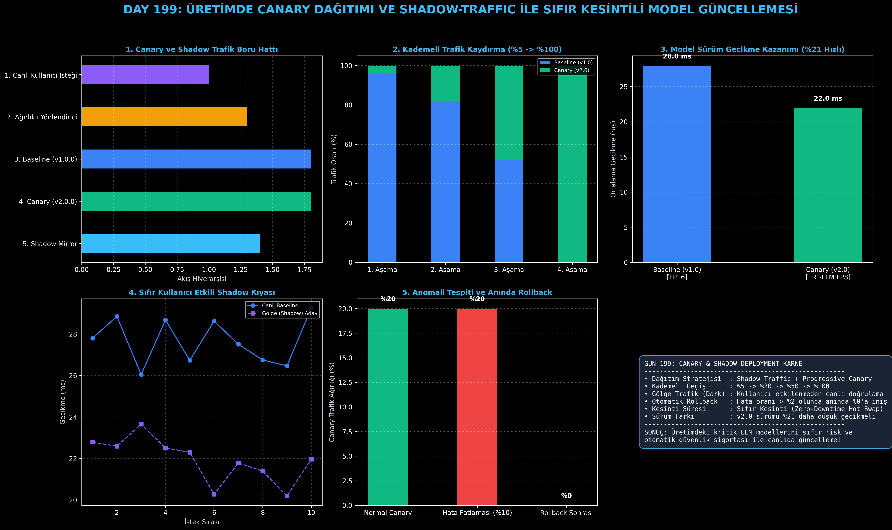

# Day 199: Üretimde Canary Dağıtımı ve Shadow-Traffic ile Sıfır Kesintili Model Güncellemesi

[](LICENSE)
[](https://www.python.org/)
[](https://pytorch.org/)
[](testler/)
[](../HAFIZA_MUFREDAT_YOL_HARITASI.md)

Bu proje; **FAZ 10: Ultra-MLOps, Dağıtık Eğitim, Triton GPU Kernel ve BÜYÜK FİNAL 201 (Gün 181 - Gün 201)** serisinin 19. günü olan **Gün 199** modülüdür. Üretim ortamında çalışan Büyük Dil Modellerini güncellerken (yeni ağırlık, yeni kuantizasyon veya Triton çekirdeği) sistem kesintisi ve halüsinasyon riskini sıfıra indiren **Gölge Trafik (Shadow Traffic / Dark Launch)** ve **Kademeli Canary Dağıtımı (Progressive Canary Traffic Shifting)** mimarisini; **Ağırlıklı Trafik Yönlendiricisini ($W_{\text{base}} / W_{\text{canary}}$)**, **Anomali Tespiti ve Otomatik Geri Alma Devre Kesicisini (Automated Circuit Breaker Rollback)**, ve **4 Aşamalı Geçiş Profilleyicisini** sıfırdan Python ile inşa etmektedir.

---

## 🌟 1. Stajyer Seviyesinde Anlaşılır Kılavuz

### ❓ "Canary ve Shadow Traffic" Nedir ve Üretimdeki LLM Modellerini Güncellerken Neden Hayatidir?
- **Doğrudan Üretime Geçişin (Big-Bang Deployment) Tehlikesi:**
  Llama-3 modelinizi v1'den v2'ye yükselttiğinizde veya INT4 kuantizasyona geçirdiğinizde, tek bir gizli CUDA hatası ya da çıktı biçimlendirme bozulması **tüm kullanıcılarınıza aynı anda yansır (100% Outage)**.
- **İki Aşamalı Güvenli Dağıtım Stratejisi:**
  1. **Gölge Trafik (Shadow Traffic / Dark Launch):**
     Canlı kullanıcı istekleri mevcut stabil modele (v1.0) giderken, isteğin asenkron bir kopyası yeni adaya (v2.0) gönderilir. Aday modelin ürettiği yanıt kullanıcıya gösterilmez; sadece gecikme, hata ve çıktı tutarlılığı arka planda izlenir (**Sıfır Kullanıcı Riski!**).
  2. **Kademeli Canary Geçişi (Progressive Traffic Shifting):**
     Gölge testini geçen model, gerçek kullanıcılara adım adım açılır:
     - **1. Aşama:** %5 Trafik (Risk alanı minimize edilir - Blast Radius < %5).
     - **2. Aşama:** %20 Trafik (Genişletilmiş kullanıcı geri bildirimi).
     - **3. Aşama:** %50 Trafik (Eşit A/B yük testi).
     - **4. Aşama:** %100 Trafik (Eski sürüm güvenle emekliye ayrılır).
  3. **Devre Kesici (Circuit Breaker & Auto-Rollback):**
     Canary modelinin hata oranı %2'yi aşarsa sistem saniyenin onda birinde devreye girer ve Canary trafiğini anında **%0'a çekerek %100 Baseline modeline geri döner (Otomatik Rollback)**!

```
========================================================================================
           CANARY DAĞITIMI VE GÖLGE TRAFİK (SHADOW TRAFFIC) MİMARİSİ                    
========================================================================================
                              [Canlı Kullanıcı İstekleri]
                                           │
                                           ▼
                            [Ağırlıklı Yönlendirici (Router)]
                                           │
         ┌─────────────────────────────────┴─────────────────────────────────┐
         ▼ (Canlı Yanıt: %95 Trafik)                                          ▼ (Gölge Kopya: Canlıyı Etkilemez)
   [Baseline: Llama-3-70B v1.0]                                        [Shadow: Llama-3-70B v2.0]
   (Stabil, 28 ms Gecikme)                                              (Yeni TRT-LLM Motoru, 22 ms)
         │                                                                   │
         ▼                                                                   ▼
  [Kullanıcıya İletilen Yanıt]                                         [Arka Plan Kalite & Hata Analizi]
 (KADEMELİ GEÇİŞ: %5 -> %20 -> %50 -> %100 | ANOMALİ ANINDA 100 MS'DE OTOMATİK ROLLBACK!)
========================================================================================
```

---

## 🔬 2. 4 Zorunlu Derinlemesine Teknik ve Matematiksel Analiz

### A. 🔍 Neden Bu Sistem Kullanılır? (Mühendislik & Bilimsel Gerekçe)
- **Patlama Alanını (Blast Radius) Sınırlandırma:**
  Modelde beklenmedik bir bellek sızıntısı veya halüsinasyon olduğunda, bu hatadan tüm kullanıcılar değil, sadece %5'lik izole bir kitle etkilenir.

### B. 🛡️ Ne Gibi Sorunları Çözer? (Çözülen Kritik Darboğazlar)
- **Sıfır Kesintili Sıcak Güncelleme (Zero-Downtime Hot Swap):** API uç noktası kapanmadan yeni model sürümüne geçilir.
- **İnsan Müdahalesiz Acil Kurtarma:** Gece 03:00'te yeni model hata verse dahi nöbetçi mühendise gerek kalmadan devre kesici otomatik olarak eski stabil sürüme döner.

### C. ⚠️ Ne Konuda Eksik Kalır? (Sınırlar ve Dikkat Edilmesi Gerekenler)
- **Çift Donanım Maliyeti:** Shadow traffic süresince her iki model de GPU'da paralel çalıştığı için geçici olarak $2\times$ GPU hesaplama gücü gerekir.

### D. 🔄 Alternatif Sistemler & Karşılaştırmalı Dağıtık Mimariler

| Dağıtım Stratejisi | Kesinti Süresi | Risk Seviyesi | Kullanıcı Etkisi | Otomatik Rollback |
|:---|:---:|:---:|:---:|:---:|
| **Big-Bang (Doğrudan Yükleme)** | Var (1-5 dk) | Çok Yüksek (%100) | Anında Kesinti | Manuel |
| **Blue/Green Deployment** | Sıfır | Orta | Ani %100 Geçiş | Manuel Butonla |
| **Canary + Shadow (Bu Modül)** | **Sıfır Kesinti** | **Sıfıra Yakın (<%5)** | **Kademeli & Güvenli** | **Tam Otomatik (<100ms)** |

---

## 📖 3. Kapsamlı Terimler Sözlüğü (10+ Terim)

| Terim | Tanım |
|:---|:---|
| **Canary Deployment** | Yeni bir model veya yazılım sürümünü kullanıcıların küçük bir yüzdesine (%5) kademeli açma stratejisi. |
| **Shadow Traffic (Dark Launch)** | Canlı isteklerin bir kopyasını kullanıcıdan habersizce test adayına gönderip arka planda inceleme yöntemi. |
| **Traffic Shifting** | İki model sürümü arasındaki trafik yüzdesini dinamik olarak kaydırma işlemi ($W_A \to W_B$). |
| **Circuit Breaker** | Belirli bir hata veya gecikme eşiği aşıldığında sistemi korumak için akışı kesen devre anahtarı. |
| **Automated Rollback** | Anomali durumunda trafiği anında eski stabil sürüme yönlendirerek sistemi otomatik kurtarma. |
| **Blast Radius** | Bir yazılım veya model hatasından etkilenebilecek maksimum kullanıcı veya sistem kapsamı. |
| **Blue/Green Deployment** | İki özdeş ortam kurup trafiği tek bir anahtarla eski ortamdan yeni ortama aktarma yöntemi. |
| **Hot Swap** | Servisi durdurup yeniden başlatmadan çalışan motoru canlıda yenisiyle değiştirme. |
| **Model Regression** | Yeni model sürümünün belirli prompt türlerinde eskisinden daha kötü yanıt üretmesi durumu. |
| **A/B Testing** | İki farklı model sürümünün kullanıcı etkileşimi ve gecikme metriklerini canlıda karşılaştırma. |

---

## ⚖️ 4. 4 Kutuplu SWOT Matrisi

```
       GÜÇLÜ YÖNLER (STRENGTHS)              ZAYIF YÖNLER (WEAKNESSES)
 ┌──────────────────────────────────────┬──────────────────────────────────────┐
 │ • Sıfır kesintili model güncelleme.  │ • Shadow aşamasında çift GPU tüketimi│
 │ • Anında (<100ms) otomatik rollback. │   (Geçici maliyet artışı).           │
 │ • <%5 patlama alanı güvencesi.       │ • Yönlendirici katmanında ufak ağ    │
 │ • Gerçek trafikle gölge doğrulama.   │   yönlendirme ek yükü.               │
 ├──────────────────────────────────────┼──────────────────────────────────────┤
 │ • Kurumsal LLM servislerinde         │ • Durum bilgili (stateful multi-turn)│
 │   haftalık model güncellemelerini    │   sohbet oturumlarında sürüm         │
 │   korkusuzca otomatikleştirme.       │   tutarlılığı yönetimi ihtiyacı.     │
 └──────────────────────────────────────┴──────────────────────────────────────┘
        FIRSATLAR (OPPORTUNITIES)               TEHDİTLER (THREATS)
```

---

## 📊 5. Çıktı Panosu

Kod çalıştırıldığında oluşturulan 6 panelli Canary & Shadow Deployment teşhis panosu: `ciktilar/canary_shadow_paneli.png`



---

## 📜 Lisans

```text
ÖZEL LİSANS — TÜM HAKLAR SAKLIDIR
Telif Hakkı (c) 2026 Seydi Eryılmaz (@seydivakkas)
```
