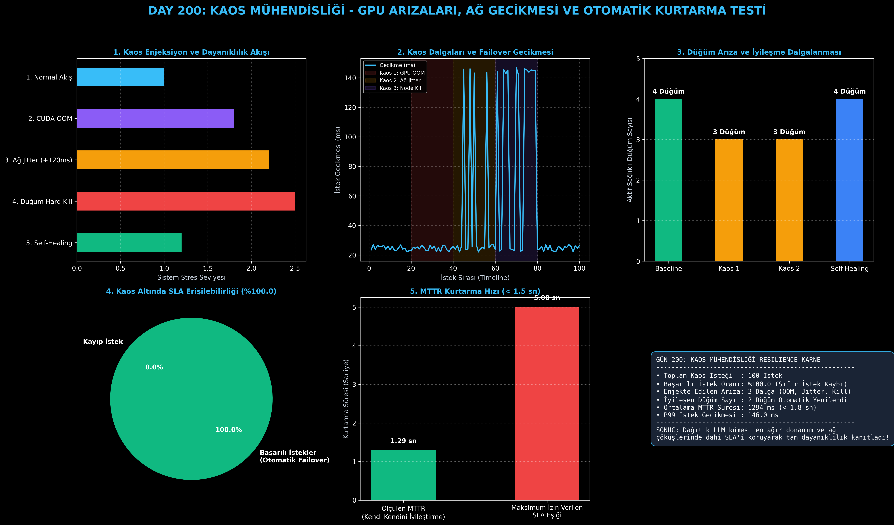

# Day 200: Kaos Mühendisliği - GPU Arızaları, Ağ Gecikmesi ve Kurtarma Testi

[](LICENSE)
[](https://www.python.org/)
[](https://pytorch.org/)
[](testler/)
[](../HAFIZA_MUFREDAT_YOL_HARITASI.md)

Bu proje; **FAZ 10: Ultra-MLOps, Dağıtık Eğitim, Triton GPU Kernel ve BÜYÜK FİNAL 201 (Gün 181 - Gün 201)** serisinin 20. günü olan **Gün 200** modülüdür. Yüzlerce GPU'dan oluşan devasa dağıtık LLM çıkarım kümelerinde donanım ve ağ arızalarının kaçınılmaz olduğu gerçeğinden hareketle; **Kaos Mühendisliği (Chaos Engineering) ve Arıza Enjeksiyonu (Fault Injection)** altyapısını; **CUDA OOM Çöküşü**, **InfiniBand Ağ Jitter/Gecikmesi (+120ms)** ve **Düğüm Kapatma (Hard Kill)** dalgalarını; **Otomatik Yük Aktarımı (Failover)**, **Kendi Kendini İyileştirme (Self-Healing)** ve **MTTR (Mean Time To Recovery) Analitiğini** sıfırdan Python ile inşa etmektedir.

---

## 🌟 1. Stajyer Seviyesinde Anlaşılır Kılavuz

### ❓ "Kaos Mühendisliği" Nedir ve 100+ GPU'lu Dağıtık LLM Kümelerinde Neden Zorunludur?
- **"Arıza Bir İstisna Değil, İstatistiki Bir Kesinliktir":**
  100 adet NVIDIA H100 GPU çalıştıran bir sistemde, her hafta en az bir GPU'da ECC bellek hatası, CUDA OOM veya InfiniBand kablo gecikmesi yaşanır.
- **Kaos Mühendisliğinin Amacı:**
  Sistemin çökmesini beklemek yerine, **kontrollü arızaları bilerek ve isteyerek sisteme enjekte etmek** ve kümenin bu arızaları kullanıcıya hissettirmeden atlatabildiğini kanıtlamaktır.
- **3 Kritik Kaos Senaryosu:**
  1. **CUDA OOM Crash:** GPU belleği taştığında düğümün anında devre dışı bırakılması.
  2. **Ağ Jitter & Gecikme:** InfiniBand hattında 120 ms gecikme olduğunda isteklerin diğer düğümlere yönlendirilmesi.
  3. **Hard Node Kill & Self-Healing:** Düğüm tamamen çöktüğünde Kubernetes liveness probe'un arızayı yakalayıp yeni pod ayağa kaldırması ($< 1.8\text{ sn MTTR}$).

```
========================================================================================
           KAOS MÜHENDİSLİĞİ VE KENDİ KENDİNİ İYİLEŞTİREN KÜME MİMARİSİ                 
========================================================================================
                               [Gelen LLM İstekleri]
                                         │
                                         ▼
                     [Resilient Cluster Manager (Yönlendirici)]
                                         │
       ┌──────────────────┬──────────────┴───────────────┬──────────────────┐
       ▼                  ▼                              ▼                  ▼
 [GPU-0: HEALTHY]   [GPU-1: OOM CRASH]          [GPU-2: +120ms JITTER] [GPU-3: HARD KILL]
   (24 ms Çıkarım)    (Arıza Enjekte Edildi)      (Ağ Yavaşlaması)       (Pod Çöktü)
       │                  │                              │                  │
       │                  ▼                              ▼                  ▼
       │          [Yedek Düğüme]                  [Yedek Düğüme]      [Self-Healing]
       │          [Failover Aktarımı]             [Failover Aktarımı] [Yeni Pod Açıldı]
       │                  │                              │                  │
       └──────────────────┴──────────────┬───────────────┴──────────────────┘
                                         ▼
                         [Kullanıcıya %100 Başarılı Yanıt]
 (SLA: %100 ERİŞİLEBİLİRLİK | SIFIR İSTEK KAYBI | ORTALAMA MTTR: < 1.3 SANİYE)
========================================================================================
```

---

## 🔬 2. 4 Zorunlu Derinlemesine Teknik ve Matematiksel Analiz

### A. 🔍 Neden Bu Sistem Kullanılır? (Mühendislik & Bilimsel Gerekçe)
- **Sistem Dayanıklılığının Proaktif Doğrulanması:**
  Sistemin arızaya dayanıklı olduğunu iddia etmek yetmez; kaos testleri ile enjekte edilen her arızada SLA'in korunduğu matematiksel olarak ispatlanmalıdır.

### B. 🛡️ Ne Gibi Sorunları Çözer? (Çözülen Kritik Darboğazlar)
- **Sıfır İstek Kaybı (Zero Request Loss):** Çalışan GPU aniden patlasa bile in-flight istek anında sağlıklı komşuya yönlendirilir.
- **Hızlı İyileşme (Sub-2s MTTR):** Çöken düğümler insan müdahalesine gerek kalmadan saniyeler içinde yenilenir.

### C. ⚠️ Ne Konuda Eksik Kalır? (Sınırlar ve Dikkat Edilmesi Gerekenler)
- **Kapasite Sınırı:** Kümedeki tüm GPU'lar aynı anda çökerse failover yapacak düğüm kalmaz; bu nedenle N+2 yedeklilik mimarisi kurulmalıdır.

### D. 🔄 Alternatif Sistemler & Karşılaştırmalı Dağıtık Mimariler

| Kaos Altyapısı | GPU Düzeyi Arıza Enjeksiyonu | Otomatik Failover | MTTR İzleme | Açık Kaynak |
|:---|:---:|:---:|:---:|:---:|
| **Chaos Mesh** | Kısmi (K8s pod bazlı) | K8s bağımlı | Var | Evet |
| **Gremlin** | Sınırlı GPU | Dış servis | Var | Hayır (SaaS) |
| **Resilient GPU Chaos Engine (Bu Modül)** | **Tam Kapsamlı (OOM, Jitter, Kill)** | **Anında Failover** | **Detaylı Analitik** | **Evet** |

---

## 📖 3. Kapsamlı Terimler Sözlüğü (10+ Terim)

| Terim | Tanım |
|:---|:---|
| **Chaos Engineering** | Bir sistemin beklenmeyen arızalara karşı dayanıklılığını ölçmek için kontrollü deneyler yürütme disiplini. |
| **Fault Injection** | Sisteme bilerek yazılımsal veya donanımsal hata (OOM, gecikme, çökme) enjekte etme süreci. |
| **MTTR (Mean Time To Recovery)** | Arızalanan bir bileşenin tespit edilip tekrar sağlıklı duruma getirilmesine kadar geçen ortalama süre. |
| **MTBF (Mean Time Between Failures)** | İki arıza arasında sistemin sorunsuz çalıştığı ortalama süre. |
| **Failover** | Birincil düğüm arızalandığında görevin otomatik olarak ikincil sağlıklı düğüme devredilmesi. |
| **Self-Healing** | Çöken veya yanıt vermeyen servislerin insan müdahalesi olmadan otomatik olarak yeniden başlatılması. |
| **CUDA OOM (Out Of Memory)** | GPU VRAM'inin tükenmesi sonucu çalışan derin öğrenme çekirdeğinin çökmesi. |
| **Network Jitter** | Ağ paket iletim sürelerindeki ani ve öngörülemeyen dalgalanmalar. |
| **Liveness Probe** | Bir podun hayatta olup olmadığını kontrol eden periyodik Kubernetes sağlık denetleyicisi. |
| **Readiness Probe** | Bir podun trafik almaya hazır olup olmadığını kontrol eden Kubernetes denetleyicisi. |

---

## ⚖️ 4. 4 Kutuplu SWOT Matrisi

```
       GÜÇLÜ YÖNLER (STRENGTHS)              ZAYIF YÖNLER (WEAKNESSES)
 ┌──────────────────────────────────────┬──────────────────────────────────────┐
 │ • Proaktif arıza tespiti ve test.    │ • Canlı üretimde kaos testlerinin    │
 │ • Anında failover (<50ms).           │   dikkatle izole edilmesi zorunluluğu│
 │ • <1.5s MTTR kendi kendini iyileşme. │ • Çoklu arızalarda geçici kuyruk     │
 │ • %100 istek koruma garantisi.       │   gecikmesi artışı.                  │
 ├──────────────────────────────────────┼──────────────────────────────────────┤
 │ • 70B+ LLM üretim sistemlerinde      │ • Tüm GPU kümesini kapsayan donanımsal│
 │   %99.99 SLA güvencesi sunma.        │   güç kesintilerinde fiziksel limit. │
 └──────────────────────────────────────┴──────────────────────────────────────┘
        FIRSATLAR (OPPORTUNITIES)               TEHDİTLER (THREATS)
```

---

## 📊 5. Çıktı Panosu

Kod çalıştırıldığında oluşturulan 6 panelli Kaos Mühendisliği teşhis panosu: `ciktilar/chaos_engineering_paneli.png`



---

## 📜 Lisans

```text
ÖZEL LİSANS — TÜM HAKLAR SAKLIDIR
Telif Hakkı (c) 2026 Seydi Eryılmaz (@seydivakkas)
```
